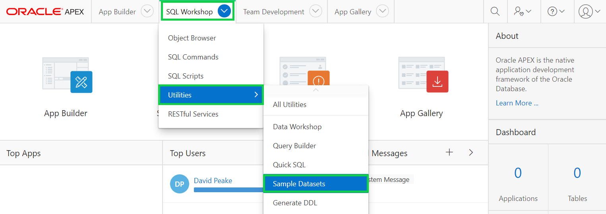
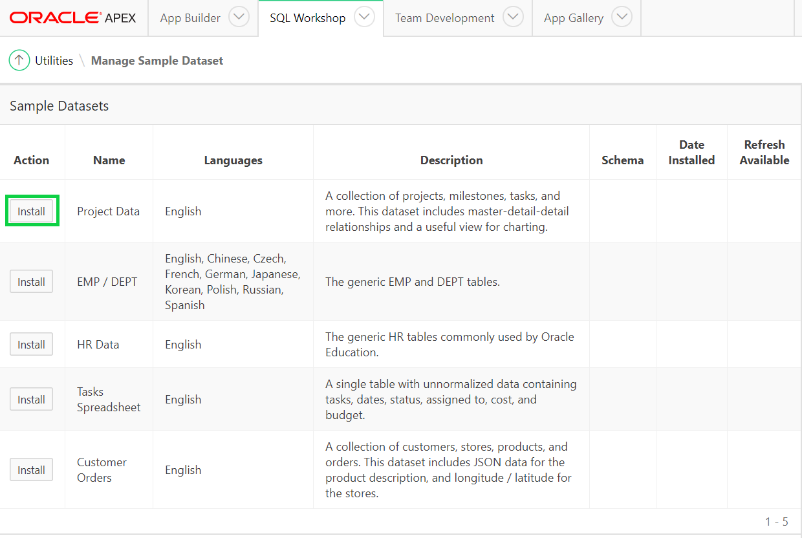
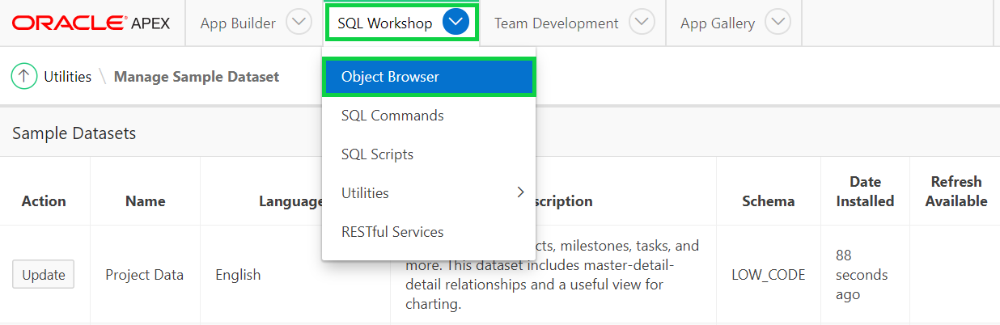
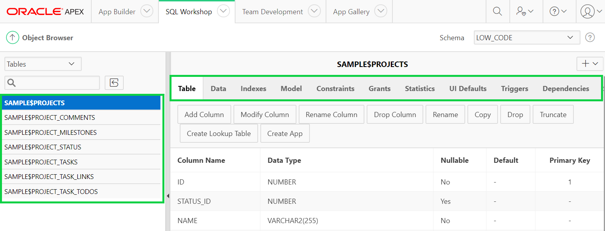

# Module 1: Building your tables and view - Installing Sample Tables
In this module, you will install your first sample datasets and review the datasets.
### **Part 1**: Create EMP and DEPT Tables
TODO.
1. In the main menu, select **SQL Workshop**, select **Utilities**, and then click **Sample Datasets**.  

    

2. On the Project Data row, click **Install**.  

3. Now, click **Next**, click **Install Dataset**, and then click **Exit**.   
    *We do not want to create an application directly on the tables*

### **Part 2**: Review Database Objects
TODO.
- In the App Builder Menu, select **SQL Workshop**, and click **Object Browser**.  

- Click on the tables and the various tabs (such as Data, Constraints, etc.) to review the table details.  

## Summary

TODO. [Click here to navigate to Module 2](2-building-your-app-using-the-create-application-wizard.md)  
