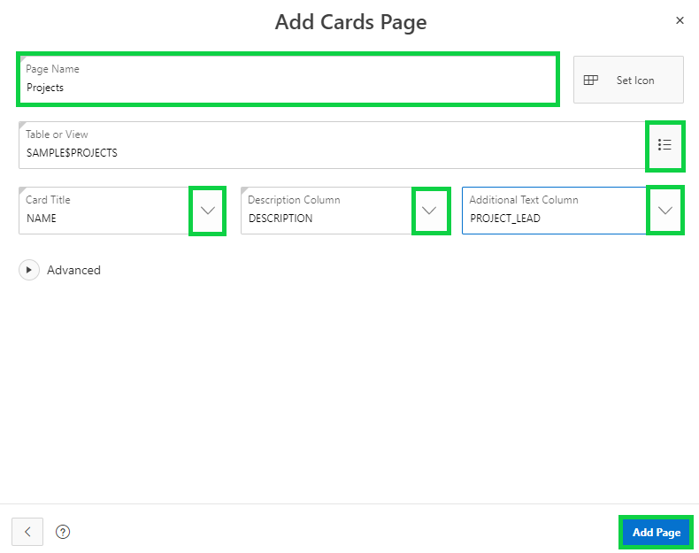

# Module 2: Building your app - Using the Create Application Wizard
TODO.

### **Part 1: Creating an Application**
TODO.
1. In the App Builder menu, click **App Builder** and then click **Create**.
    

2. Click **New Application**.
    
3. For Name enter **Projects**, and then click **Appearance Icon**.  
    
- For Theme Style select **Vita – Slate**. Click **Choose New Icon**, select the icon color and an icon, click **Set Application Item**, and then click **Save Changes**.

    

### **Part 2: Adding the Dashboard Page**

1. Click **Add Page**, and then click **Dashboard**.
    

2. For Chart 1, select **Bar**, and then enter the following:

    | Property | Enter or Select | Value |
    | --- | --- | --- |
    | Chart Name | enter |**Budget versus Cost** |
    | Table or View | select | **SAMPLE$PROJECTS_V** |
    | Label Column | select | **Name** |
    | Value Column | select | **BUDGET_V_COST** |

     

- For Chart 2, select **Pie**, and then enter the following:
    | Property | Enter or Select | Value |
    | --- | --- | --- |
    | Chart Name | enter |**Project Status** |
    | Table or View | select | **SAMPLE$PROJECTS_V** |
    | Label Column | select | **Status** |
    | Type | select | **Count** |

      

- For Chart 3, select **Bar**, and then enter the following:
    | Property | Enter or Select | Value |
    | --- | --- | --- |
    | Chart Name | enter |**Project Leads** |
    | Table or View | select | **SAMPLE$PROJECTS_V** |
    | Label Column | select | **PROJECT_LEAD** |
    | Type | select | **Count** |

     
- Click **Add Page**.  
    

### **Part 3: Adding the Project Page**

1. Click **Add Page**, and then click **Cards**.
    
2. Enter the following:
    | Property | Enter or Select | Value |
    | --- | --- | --- |
    | **Page Name** | enter | **Projects** |
    | **Table** | select | **SAMPLE$PROJECTS** |
    | **Card Title** | select | **NAME** |
    | **Description** | select | **Description** |
    | **Additional Text** | select | **PROJECT_LEAD** |
3. Click **Add Page**.

     

### **Part 4: Adding the Milestone Page**

1. Click **Add Page**, and then click **Report**.
2. Enter the following:
  - Page Name - enter **Milestones**.
  - Table - select **SAMPLE$PROJECT_MILESTONES**.
  - Check **Include Form**. 
  - Lookup Key 1 - select **PROJECT_ID**.
  - Display Col 1 - select **SAMPLE$PROJECTS.NAME**.
3. Click **Add Page**.  
    

### **Part 5: Adding the Task Page**

1. Click **Add Page**, and then click **Report**.
2.  Enter the following:
  - Page Name - enter **Tasks**. 
  - Table - select **SAMPLE$PROJECT_TASKS**.
  - Check **Include Form**. 
  - Lookup Key 1 - select **PROJECT_ID**.
  - Display Col 1 - select **SAMPLE$PROJECTS.NAME**.
  - Lookup Key 2 - select **MILESTONE_ID**. 
  - Display Col 2 - select **SAMPLE$PROJECT_MILESTONES.NAME**.
3. Click **Add Page**.  
    

### **Part 6: Adding the Calendar Page**

1. Click **Add Page**, and then click **Calendar**.
- Enter the following:
  - Page Name - enter **Tasks Calendar**.
  - Table - select **SAMPLE$PROJECT_TASKS**.
  - Display Column - select **NAME**.
  - Start Date Column - select **START_DATE**.
  - End Date Column - select **END_DATE**.
3. Click **Add Page**.  
    

### **Part 7: Including All Features**

1. Next to Features, click **Check All**, and then click **Create Application**. 
    
    Once, you click **Create Application**, your new application will be displayed in Page Designer.
2. Click **Run Application**.
    
3. Enter your user credentials, and play around with your new application.

    

TODO. [Click here to navigate to Module 3](3-recreating-the-app-improving-the-generated-app.md)  
