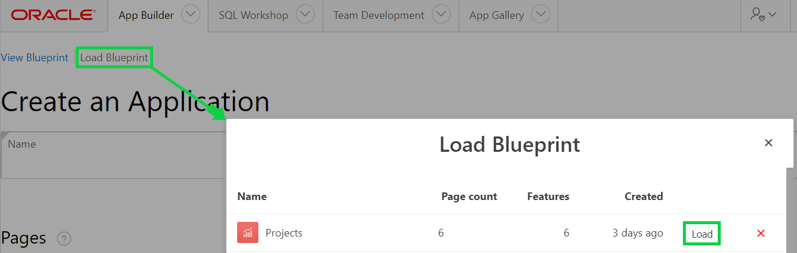

# Module 3: Recreating the App - Improving the Generated App
In this module, you will learn how to review the forms and make necessary changes by deleting an app and recreating with different settings to make form more interactive and user friendly. 

### **Part 1**: Reviewing Form, Deleting an app and loading a blueprint

1. In the runtime environment, within the menu, click **Milestones**.
2. Click the edit icon for a Milestone.  
*Notice that there are only a few items – An Interactive Grid may work better.*
    

3. In the runtime environment, within the developer toolbar, click **Application xxxxx**.  
      
    *Note: The Developer Toolbar is only shown to developers who run the application from the App Builder. End users will never be shown the Developer Toolbar.*

4. From the App Home Page, under Tasks, click **Delete this application** and then click **Permanently Delete Now**. 
      
    

5. From the App Builder Home Page, click **Create** and then click **New Application**. 
     

6. Click **Load Blueprint** and then click **Load** where you see **Projects** for the **Name** column.  
      
*The previously defined app definition will be displayed*.

### **Part 2**: Modifying the Blueprint and creating an app

1. In the list of pages, for Milestones, click **Edit** and then click **Delete**.  
    

2. Click **Add Page** and then click **Interactive Grid**.
3. Enter the following and click **Add Page**.

    | Property | Enter or Select | Value |
    | --- | --- | --- |
    | **Page Name** | enter | **Milestones** |
    | **Table or View** | select | **SAMPLE$PROJECT_MILESTONES** |

 
    

4. In the list of Pages, for the Milestones page, select the hamburger and drag the page up until it is under the Projects page and drop.
    
5. Click **Create Application**.

### **Part 3**: Reviewing the Milestone Page

1. Your new application will be displayed in Page Designer.
2. Click **Run Application** and enter your user credentials.
3. Navigate to **Milestones**.
    

TODO. [Click here to navigate to Module 4](4-using-page-designer-updating-the-milestones-page.md)  
