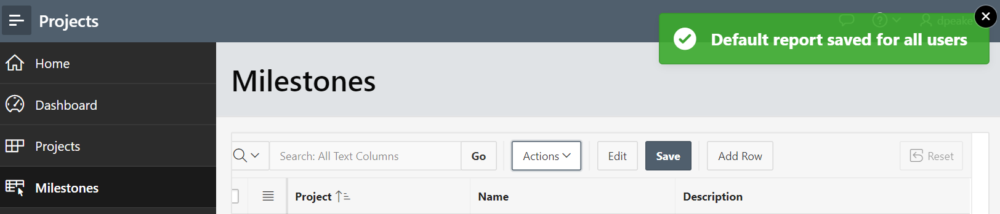

# Module 4: Using Page Designer - Updating the Milestones Page
Now, that you have created a new app with a new milestone page with an interactive grid. You will now update the columns and save report in the application itself. 

### **Part 1: Freezing and Resizing the Columns**

1. Click the column heading **Name** and click **Freeze**.  
    
2. Hover between the **Project** and **Name** columns until a bar displays.
3. Drag to the right until the **Project** resizes to a suitable size. Repeat for other columns.  
    

### **Part 2**: Saving the Report

- Click **Actions**, select **Report**, click **Save**.
    
    

To be added. [Click here to navigate to Module 5](5-creating-a-page-to-update-project-records-add-the-project-form-page.md)
