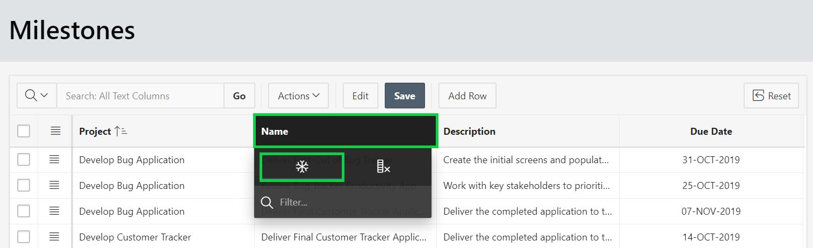

# Module 4: Using Page Designer - Updating the Milestones Page
Now, that you have created a new app with a new milestone page with an interactive grid. 
### **Part 1**: Updating Project Id
1. To replace the Project Id with the Project Name, define an LOV.
  - In the runtime environment, within the developer toolbar, click **Edit Page 4**
- Page Designer will be displayed for the Milestones page
   - In the Rendering tree (left pane), click **Columns**, click **PROJECT_ID**. 

       

- In the Property Editor (right pane), enter the following:
   - Identification > Type – select **Select List**.
   - Heading – enter **Project**.
   - List of Values > Type – select **SQL Query**.
   - SQL Query enter:
   ```   
   select name, id
   from sample$projects
   order by 1
   ```
  - Display Extra Values – select **No**.
  - Null Display Value – enter **- Select Project -**.
- Click **Save**.

     
- Run the application.

### **Part 2**: Manage Columns

- In the runtime environment, click **Actions**, click **Columns**.  
     
- Uncheck **Created**, **Created By**, **Updated**, and **Updated By**.
- Select **Due Date**, click the Up Arrow.
- Click **Save**.  
     

### **Part 3**: Freeze and Resize Columns

- Click the column heading **Name**.
- Click **Freeze**.  
    
- Hover between the **Project** and **Name** columns until a bar displays.
- Drag to the right until the **Project** resizes to a suitable size.
- Repeat for other columns.  
    

### **Part 4**: Save the Report

- Click **Actions**, select **Report**, click **Save**.
    

To be added. [Click here to navigate to Module 5](5-creating-a-page-to-update-project-records-add-the-project-form-page.md)
