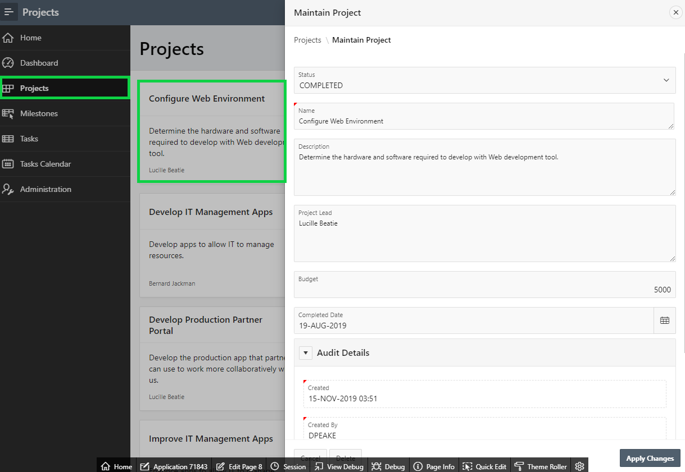

# Module 5: Creating a page to update project records - Add the Project Form Page

### **Part 1: Adding a Page**

There is no form page to manage Projects details.
1. In the runtime environment, within the developer toolbar, click **Application xxxxx**.
2. In the Application Home Page, click **Create Page**.
    

3. In the wizard, click **Form**. 
    
4. Click **Form**.  
    

5. Enter the following and click **Next**.

    | Property | Enter or Select | Value |
    | --- | --- | --- |
    | **Page Name** | enter | **Maintain Project** |
    | **Page Mode** | select | **Modal Dialog** |
    | **Breadcrumb** | select | **Breadcrumb** |
    | **Parent Entry** | select | **Projects (Page 3)** |

    
6. For Navigation Preference, select **Identify an existing navigation menu entry for this page**. For Existing Navigation Menu Entry, select **Projects**, and then click **Next**.  

    

7. For Table/ View Name, select **SAMPLE$PROJECTS (table)**, and then click **Next**.

      

8. For Primary Key Column, select **ID (Number)**, and then click **Create**. 

    
 

### **Part 2: Updating the Status Item**

1. In Page Designer, in the Rendering tree (left pane), select **P8_STATUS_ID**.
2. In the Property Editor (right pane), enter the following:
   - Identification > Type select **Select List**.
   - Label > Label enter **Status**.
   - List of values > Type select **SQL Query**.
   - SQL Query enter:
   ```
   select code, id 
   from sample$project_status
   order by display_order
   ```
    - Display Extra Values click **No**.
    - Null Display Value enter **– Select Status -**.  
    

### **Part 3: Creating the Audit Details Region**

The Created, Created By, Updated, and Updated By columns should be moved into a collapsible region and made display only as they maintained by a trigger on the table.
1. In Page Designer, in the Rendering Tree (left pane), under **Content Body**, right-click on **Maintain Project**, and then click **Create Sub Region**.

    

2. In the Property Editor (right pane), enter the following:
   - Identification > Name enter **Audit Details**.
   - Appearance > Template select **Collapsible**.

    

### **Part 4: Moving the audit columns**

1. In Layout (center pane), select **P8_CREATED**, hold the **< Shift >** key and click **P8_CREATED_BY**, click **P8_UPDATED,** and click **P8_UPDATED_BY**.
2. In the Property Editor (right pane), enter the following and click **Save**.
   - Identification > Type select **Display Only**.
   - Layout > Region select **..Audit Details**.
 
    

### **Part 5: Linking to Projects Page**

1. In the Application Toolbar, click the page selector in front of the page number (8), and then click **3**, for the Projects page.

    

1. In the Rendering tree (left pane), under **Content Body** select **Projects**.
2. In the Property Editor (right pane), under **Source** click **Code Editor** icon.
3. For the CARD_LINK selection, input the following, click **OK**, and then click **Save**.  
**apex_util.prepare_url( 'f?p='||:APP_ID||':8:'||:APP_SESSION||'::::P8_ID:'||id ) CARD_LINK,**  
*{f?p= is the call to an APEX page; :APP_ID is the Application Id; 8 is the target page (Project form page); :APP_SESSION is the current user’s session; P8_ID is an item on the target page; id is the primary key from the Projects table}*

    

### **Part 6: Test the Project Pages**
Refresh the browser first.
1. In the runtime environment, within the Navigation Menu (left-side) click **Projects**.
2. Click a card record to display the corresponding record in the form page.
3. Make changes and click **Apply Changes**, or click **Cancel**.

    

TODO. [Click here to navigate to Module 6](6-improving-usability-updating-the-task-pages.md)
