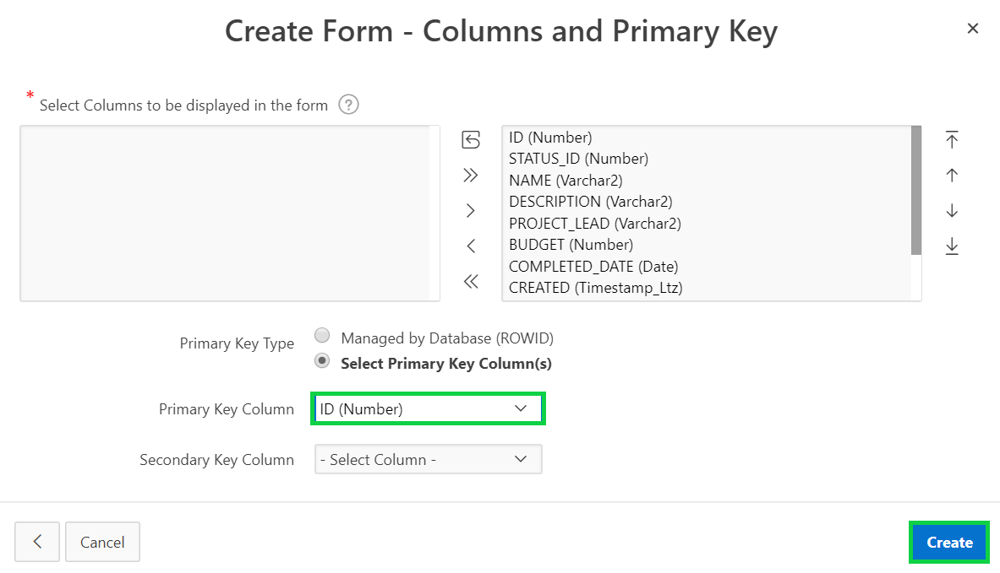

# Module 5: Creating a page to update project records - Add the Project Form Page

### **Part 1**: Add a Page

- There is no form page to manage Projects details.
   - In the runtime environment, within the developer toolbar, click **Application xxxxx**.
   -  In the Application Home Page, click **Create Page**.
    

- In the wizard, click **Form**.  
    
- Click **Form**.  
    

- Enter the following:
   - Page Name – enter **Maintain Project**.
   - Page Mode – select **Modal Dialog**.
   - Breadcrumb – select **Breadcrumb**.
   - Parent Entry – select **Projects (Page 3)**.
- Click **Next**. 

    
- For Navigation Preference, select **Identify an existing navigation menu entry for this page**.
- For Existing Navigation Menu Entry, select **Projects**.
- Click **Next**.  

    

- For Table/ View Name, select **SAMPLE$PROJECTS (table)**.
- Click **Next**.

      

- For Primary Key Column, select **ID (Number)**.

    
- Click **Create**.  

### **Part 2**: Update the Status Item

- In Page Designer, in the Rendering tree (left pane), select **P8_STATUS_ID**.
- In the Property Editor (right pane), enter the following:
   - Identification > Type select **Select List**.
   - Label > Label enter **Status**.
   - List of values > Type select **SQL Query**.
   - SQL Query enter:
   ```
   select code, id 
   from sample$project_status
   order by display_order
   ```
  - Display Extra Values click **No**.
  - Null Display Value enter **– Select Status -**.  
    

### **Part 3**: Create the Audit Details Region

- The Created, Created By, Updated, and Updated By columns should be moved into a collapsible region and made display only as they maintained by a trigger on the table.
  - In Page Designer, in the Rendering Tree (left pane) right-click on **Create Form**.
  - Click **Create Sub Region**.

    

- In the Property Editor (right pane), enter the following:
   - Identification > Name enter **Audit Details**.
   - Appearance > Template select **Collapsible**.

    

### **Part 4**: Move the audit columns

- In Layout (center pane), select **P8_CREATED**.
- Hold the **< Shift >** key and click **P8_CREATED_BY**, click **P8_UPDATED,**
and click **P8_UPDATED_BY**.
- In the Property Editor (right pane), enter the following:
   - Identification > Type select **Display Only**.
   - Layout > Region select **..Audit Details**.
- Click **Save**.  
    

### **Part 5**: Link to Projects Page

- In the Application Toolbar, click the page selector in front of the page number (8).
- Click **3**, for the Projects page.

    

- In the Rendering tree (left pane), select **Projects**.
- In the Property Editor (right pane), click **Code Editor**.
- For the CARD_LINK selection, input the following:  
**apex_util.prepare_url( 'f?p='||:APP_ID||':8:'||:APP_SESSION||'::::P8_ID:'||id ) CARD_LINK,**  
*{f?p= is the call to an APEX page; :APP_ID is the Application Id; 8 is the target page (Project form page); :APP_SESSION is the current user’s session; P8_ID is an item on the target page; id is the primary key from the Projects table}*
- Click **OK**.
- Click **Save**.  
    

### **Part 6**: Test the Project Pages

- In the runtime environment, within the Navigation Menu (left-side) click **Projects**.
- Click a card record to display the corresponding record in the form page.
- Make changes and click **Apply Changes**, or click **Cancel**.

    

TODO. [Click here to navigate to Module 6](6-improving-usability-updating-the-task-pages.md)
