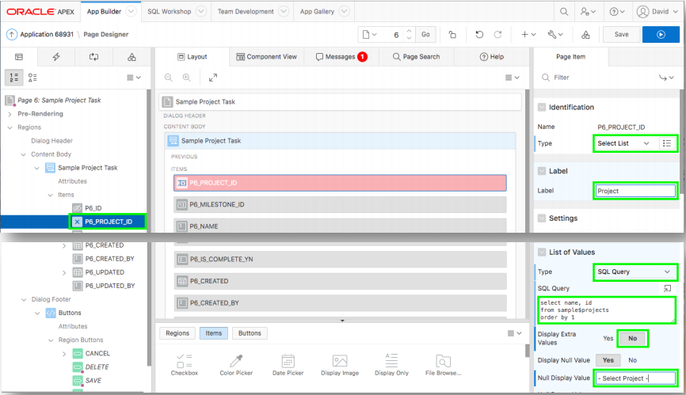
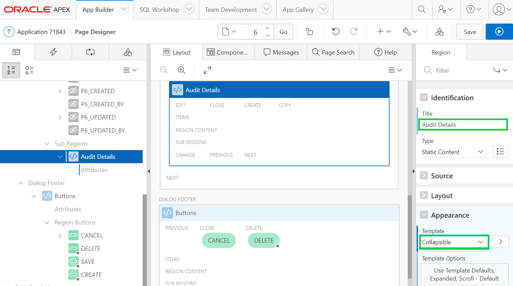

# Module 6: Improving Usability - Updating the Task Pages

### **Part 1**: Improving the Report

- In the runtime environment, within the Navigation Menu, click **Tasks**.
- In the Develop Toolbar (bottom of the screen), click **Edit Page 5**.

    

- In Page Designer, within the Rendering tree (left panel), under Sample Project Tasks region, click **Columns**.
- Click **PROJECT_ID_L$1**.
- In the Property Editor (right pane), for Heading enter **Project**.

    

- In the Rendering tree (left pane), click **MILESTONE_ID_L$2**.
- In the Property Editor (right pane), for Heading enter **Milestone**.
- In the Rendering tree (left panel), click **IS_COMPLETE_YN**.
- In the Property Editor (right pane), for Heading enter **Complete?**.
- Click **Save**.

    

### **Part 2**: Adding Select Lists

- In the runtime environment, click the edit icon for a Task.
- In the Develop Toolbar (bottom of the screen), click **Edit Page 6**.

    

- In Page Designer, within the Rendering tree (left pane), click **P6_PROJECT_ID**.
- In the Property Editor (right pane), enter the following:
   - Identification > Type select **Select List**.
   - Label > Label enter **Project**.
   - List of values > Type select **SQL Query**.
   - SQL Query enter:
   ```
   select name, id from sample$projects
   order by 1
   ```
   - Display Extra Values click **No**.
   - Null Display Value enter **– Select Project -**.

    

- In Page Designer, within the Rendering tree (left pane), click **P6_MILESTONE_ID**.
- In the Property Editor (right pane), enter the following:
   - Identification > Type select **Select List**.
   - Label > Label enter **Milestone**.
   - List of values > Type select **SQL Query**.
   - SQL Query enter:
   ```
   select name, id from sample$project_milestones
   order by 1
   ```
   - Display Extra Values click **No**.
   - Null Display Value enter **– Select Milestone -**.

### **Part 3**: Updating Is Complete

- In the Rendering tree (left panel), click **P6_IS_COMPLETE_YN**.
- In the Property Editor (right pane), enter the following:
   - Identification > Type select **Switch**.
   - Label > Label enter **Complete?**.

    

### **Part 4**: Create the Audit Details Region

- The Created, Created By, Updated, and Updated By columns should be moved into a collapsible region and made display only as they maintained by a trigger on the table.
   - Right-click on **Sample Project Tasks**.
   - Click **Create Sub Region**.

    

- In the Property Editor (right pane), enter the following:
   - Identification > Name enter **Audit Details**.
   - Appearance > Template select **Collapsible**.

    

### **Part 5**: Move the audit columns

- In Layout (center pane), select **P6_CREATED**.
- Hold the **< Shift >** key and click **P6_CREATED_BY**, click **P6_UPDATED**, and click **P6_UPDATED_BY**.
- In the Property Editor (right pane), enter the following:
   - Identification > Type select **Display Only**.
   - Layout > Region select **..Audit Details**.
- Click **Save**.

    

### **Part 6**: Review the Page

- Navigate back to the runtime environment, and refresh the browser.
- Click the edit icon for a Task.  
*Note: The date items include a date picker and the numeric item (Cost) gives an error when saving if non-numeric values are entered*

    

TODO. [Click here to navigate to Module 7](7-linking-pages-link-the-calendar-to-the-tasks-form-pages.md)
