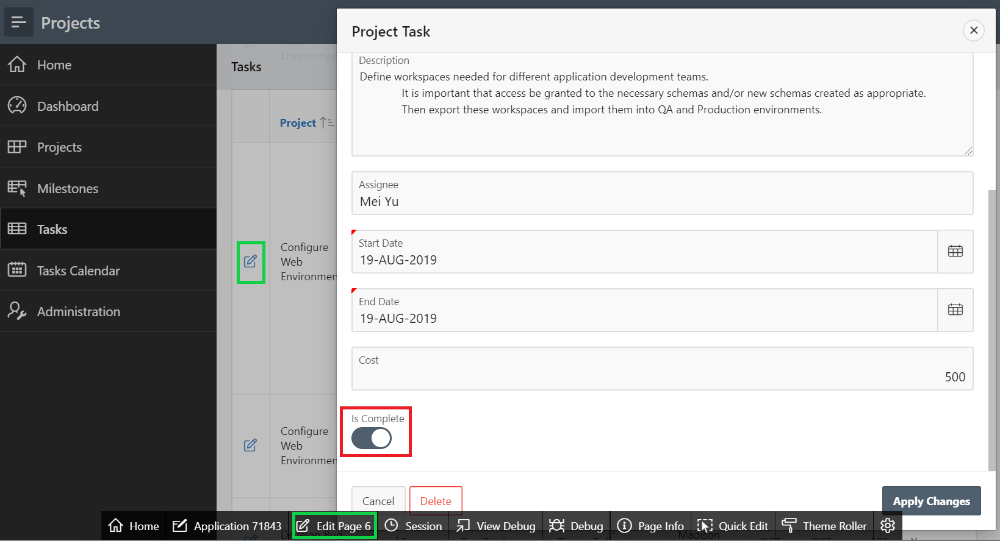

# Module 6: Improving Usability - Updating the Task Pages

### **Part 1: Improving the Report**

1. In the runtime environment, within the Navigation Menu, click **Tasks**.
2. In the Development Toolbar (bottom of the screen), click **Edit Page 5**.

    

3. In Page Designer, within the Rendering tree (left panel), under **Project Tasks** region, click **Columns**, and then click **IS_COMPLETE_YN**.
4. In the Property Editor (right pane), for Heading enter **Complete?**, and then click **Save**.
    
5. Click **Run** icon. Your **Tasks** page should look like this.
    

### **Part 2: Updating Is Complete**
1. In the runtime environment, click the edit icon for a Tasks, and in the Development Toolbar (bottom of the screen), click **Edit Page 6**.
    

2. In the Rendering tree (left panel), click **P6_IS_COMPLETE_YN**.
3. In the Property Editor (right pane), for Label > Label enter **Complete?**.

    

### **Part 3: Creating the Audit Details Region**

- The Created, Created By, Updated, and Updated By columns should be moved into a collapsible region and made display only as they maintained by a trigger on the table.
   - Right-click on **Sample Project Tasks**.
   - Click **Create Sub Region**.

    

- In the Property Editor (right pane), enter the following:
   - Identification > Name enter **Audit Details**.
   - Appearance > Template select **Collapsible**.

    

### **Part 5: Moving the audit columns**

- In Layout (center pane), select **P6_CREATED**.
- Hold the **< Shift >** key and click **P6_CREATED_BY**, click **P6_UPDATED**, and click **P6_UPDATED_BY**.
- In the Property Editor (right pane), enter the following:
   - Identification > Type select **Display Only**.
   - Layout > Region select **..Audit Details**.
- Click **Save**.

    

### **Part 6: Reviewing the Page**

- Navigate back to the runtime environment, and refresh the browser.
- Click the edit icon for a Task.  
*Note: The date items include a date picker and the numeric item (Cost) gives an error when saving if non-numeric values are entered*

    

TODO. [Click here to navigate to Module 7](7-linking-pages-link-the-calendar-to-the-tasks-form-pages.md)
