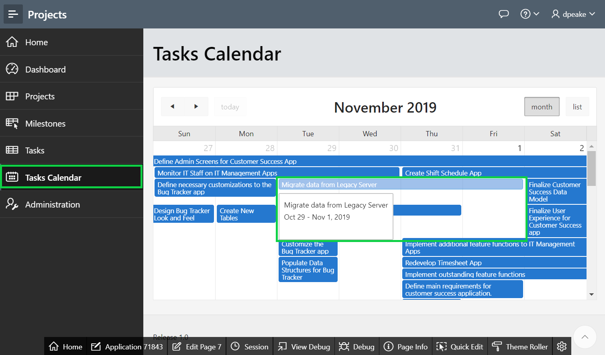
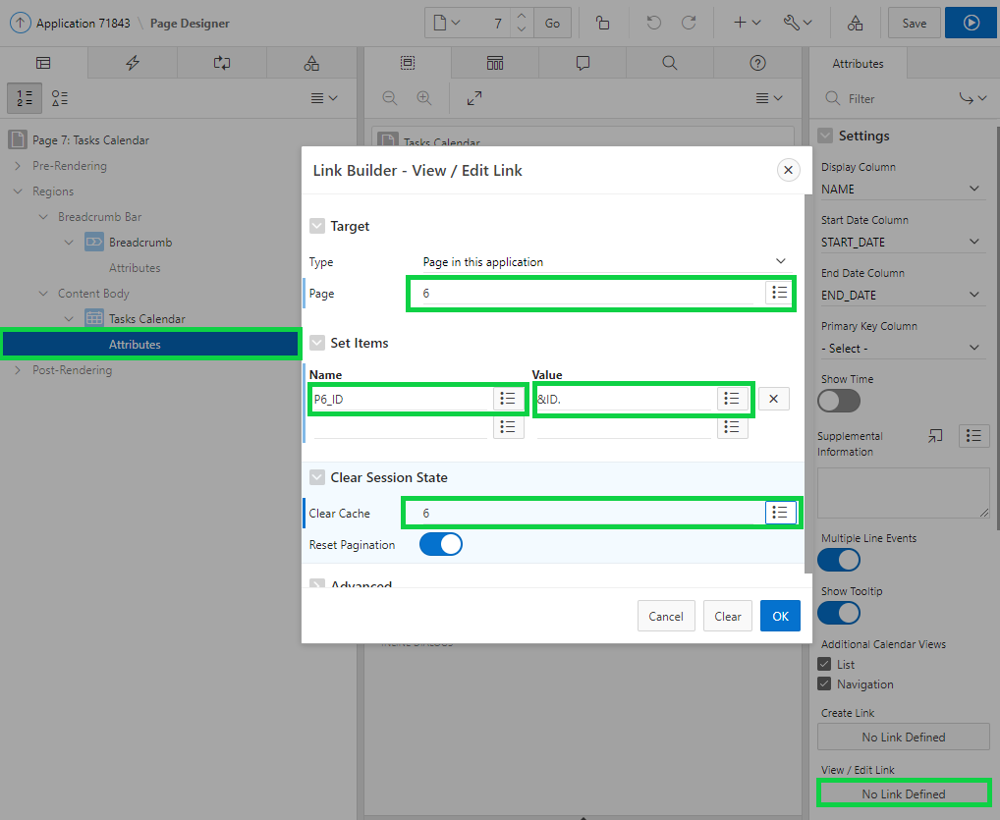
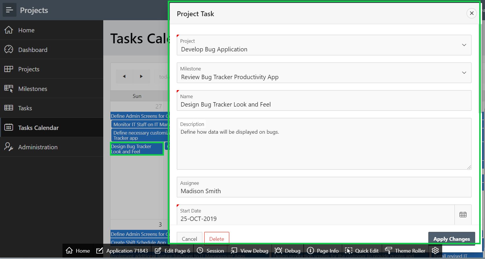

# Module 7: Linking pages - Link the Calendar to the Tasks Form Page

### **Part 1: Adding a Link**

1. In the runtime environment, within the Navigation Menu, click **Tasks Calendar**.
2. Clicking on any entry simply displays the event details.

    

3. In the Developer Toolbar (bottom of page), click **Edit Page 7**.
4. In Page Designer, within the Rendering tree (left pane), under **Tasks Calendar** region, click **Attributes**.
5. For Settings > View / Edit Link click **No Link Defined**.
6. In the Link Builder, enter the following:
   - Target > Page select **6**.
   - Set Items > Name select **P6_ID**.
   - Set Items > Value select **ID**. {Returns **&ID**.}
   - Clear Cache enter **6**.
7. Click **OK**, and then click **Save**.

    

### **Part 2: Run the Application**

1. Navigate back to the runtime environment, and refresh the browser.
2. Click a calendar entry.

    
    *Note: The form page pops up when you click a calendar entry.*

## Summary

TODO.

- APEX on Autonomous  https://apex.oracle.com/autonomous
- APEX Collateral  http://apex.oracle.com
- Tutorials  https://apex.oracle.com/en/learn/tutorials
- Community  http://apex.oracle.com/community
- External Site + Slack  http://apex.world
