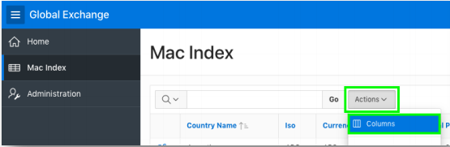
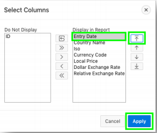
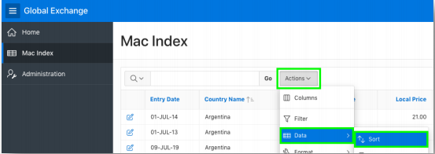
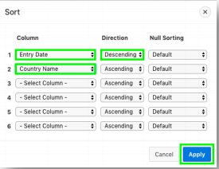
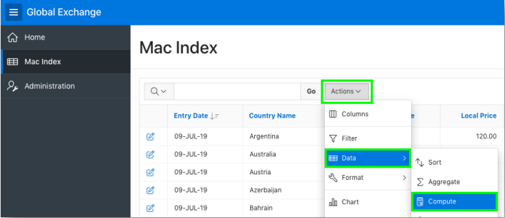
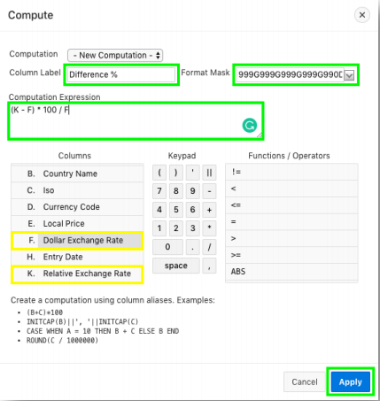
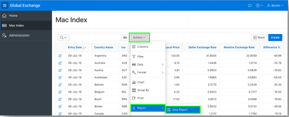
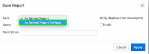
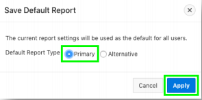

# Module 5: Updating the Report in the Runtime environment - Updating the Report View

### **Part 1**: Resequencing the columns

1. In the Runtime environment, click **Actions**, and then click **Columns**.

    

2. Select **Entry Date**, click **Top** icon, and then click **Apply**.  
    

### **Part 2**: Sorting the Records

1. Click **Actions**, select **Data**, and then click **Sort**.
    
2. **1 - for Column** select **Entry Date**, and for **Direction** select **Descending**. **2 - for Column** select **Country Name**, and then click **Apply**.  
    

### **Part 3**: Adding a Computation

1. Click **Actions**, select **Data**, and then click **Compute**.

    

2. Enter the following and then click **Apply**.

    | Property | Enter or Select | Value |
    | --- | --- | --- |
    | Column Name | Enter | **Difference%** |
    | Format Mask | Select | **5,234.10** |
    | Computation Expression | Enter | **(K – F) * 100 / F** |

      
    *Note: **K** references Relative Exchange Rate and **F** references Dollar Exchange Rate as listed under Columns*

### **Part 4**: Saving the Report

1. Click **Actions**, select **Report**, and then click **Save Report**.  
     
2. For Save, select **As Default Report Settings**. (This option is only available to Developers). 
      
3. For Default Report Type, select **Primary**, and then click **Apply**. 
    

## Summary

This completes Module 5. TODO. [Click here to navigate to Module 6.](6-adding-a-chart-for-a-single-country-adding-a-chart.md)