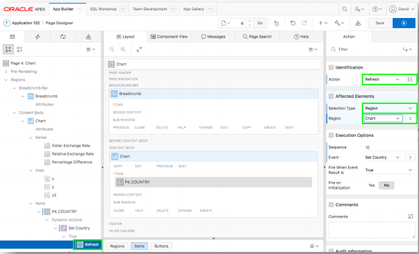

# Module 8: Adding a Page Item and List of Values - Adding a Country List

### Information

The chart currently has the ISO code for Australia (AUS) hardcoded. By adding a select list with a list of the countries, and then modifying the chart series to utilize this page item you can easily make it easy to review the exchange rate history for any country.

To refresh the chart whenever the country in the select list is changed you need to utilize a Dynamic Action. A Dynamic Action defines client-side interactivity, and based on a specific action
(change in the select list) performs specified functions (refreshes the chart region).

In order for the chart to properly utilize the updated value in the select list, then it is necessary to submit that page item when rendering the chart.

### **Part 1**: Returning to App Builder

1. From the Runtime environment, in the Developer Toolbar (bottom of the screen), click **Edit Page 4**.

    

### **Part 2**: Adding a Page Item

1. From the Property Editor, in the Gallery (center pane, below Layout), click **Items**.
2. Click **Select List** and hold the mouse down and drag the item up until it is in the **Items** section within Chart region.
3. Once the Items section expands and the dark yellow box appears, release the mouse.

    

### **Part 3**: Updating the Page Item

1. From the Property Editor, in the Property Editor (right pane), update the following:
    - Identification > Name, enter **P4_COUNTRY**.
    - List of Values > Type, select **SQL Query**.
    - List of Values > SQL Query, enter 

    ```
    select distinct country_name d, iso r  
    from big_mac_index  
    order by 1
    ```

    - List of Values > Display Extra Values, click **No**.
    - List of Values > Null Display Value, enter **- Select Country -**.

    

### **Part 4**: Adding a Dynamic Action

1. In the Rendering tree (left pane), right click on **P4_COUNTRY**, select **Create Dynamic Action**.  
    

2. In the Property Editor (right pane), for Identification > Name, enter **Set Country**. 

    
3. In the Rendering tree (left pane), under Dynamic Actions > True, click **Show**.
4. In the Property Editor (right pane), for Identification > Action, select **Refresh**.
    - For Affected Elements > Selection Type, select **Region**.
    - For Affected Elements > Region, select **Chart**.
    

### **Part 5**: Updating the Chart

1. In the Rendering tree (left pane), under Content Body, click **Chart**.
2. In the Property Editor (right pane), for Source > Page Items to Submit, select **P4_COUNTRY**.

    

### **Part 6**: Updating the Chart Series

1. In the Rendering tree (left pane), under Series, click **Dollar Exchange Rate**.
2. In the Property Editor (right pane), for Source > SQL Query, replace **'AUS'** with :**P4_COUNTRY**.

    

3. In the Rendering tree (left pane), under Series, click **Relative Exchange Rate**.
4. In the Property Editor (right pane), for Source > SQL Query, replace **'AUS'** with :**P4_COUNTRY**.
5. In the Rendering tree (left pane), under Series, click **Percentage Difference**.
6. In the Property Editor (right pane), for Source > SQL Query, replace **'AUS'** with :**P4_COUNTRY**.

### **Part 7**: Running the Chart

1. In Page Designer, within the Toolbar, click **Save and Run**.
2. In the Runtime environment, select different Countries.

    

## Summary

TODO.

### **Learn More** *Useful Links*

- APEX Collateral http://apex.oracle.com
- Tutorials https://apex.oracle.com/en/learn/tutorials
- Community http://apex.oracle.com/community
- External Site + Slack http://apex.world