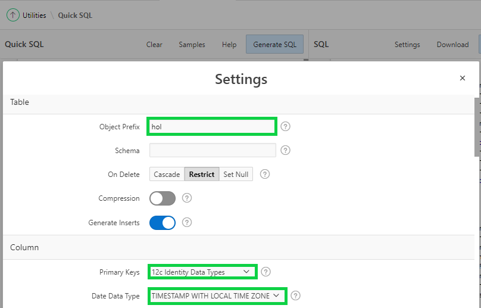

# Module 1: Defining new data structures - Using Quick SQL

## Oracle Spreadsheet Table


## Napkin Design: Improved data model for Projects


### **Part 1: Opening Quick SQL**
1. Log into your workspace.
2. Click **SQL Workshop**, and then click **SQL Scripts**.
    
3. Click **Quick SQL**.
    

### **Part 2: Entering Quick SQL for Team Members table** 
1. Enter the Table Name **Team Members**.
2. Indent 2 or more spaces and enter the following column names.

    | Column names |
    | --- |
    | username |
    | full name |
    | email |
    | phone_number |
    | profile |
    | photo file |

    ```
    username 
    full name 
    email 
    phone_number 
    profile 
    photo file 
    ```

      
    *Note: You don’t need to enter all of the column names shown, as you will load a complete script later in this lesson*

### **Part 3: Entering Quick SQL for Projects table**
1. Enter the Table Name in the first column **Project**.
2. Indent 2 or more spaces and enter the following column names.

    | Column names |
    | --- |
    | name |
    | project lead |
    | budget |
    | status |
    | completed_date |
    | description |

    

### **Part 4: Reviewing  Help**

1. Click **Help**, and then click **Table Directives** on **Help** wizard.

    
    *Review the row inside the box, as you will be using it to improve the Quick SQL in next part.*
2. Click **Column Directives**

    
    *Review the row inside the box, as you will be using it to improve the Quick SQL in next part.*
3. Click **Data Types**

    
    *Review the row inside the box, as you will be using it to improve the Quick SQL in next part.*

### **Part 5: Improving the Quick SQL**

1. Close **Help** and enter the following.
    - Enter **/insert xx** for tables.
    - Enter **/nn** for mandatory columns.
    - Enter **/references team_members** for project lead column.
    - Enter **num** for budget column.
    - Enter **/vc30** and **/check ASSIGNED, IN-PROGRESS, COMPLETED** for status column.

    

### **Part 6: Entering details for a child tables**

1. Enter the Table Name indented **Milestones**.

2. Indent 2 or more spaces and enter the column names. 
    

3. Enter the Table Name indented **Tasks**.
4. Indent 2 or more spaces and enter the column names.

    

### **Part 8: Complete the Quick SQL**

1. Copy the following URL into a new window in your browser:
*Remember you are on Part 8 if you click the link directly*.  
https://www.oracle.com/technetwork/developer-tools/apex/application-express/apex-beginner-quicksql-5095785.txt
2. Copy and paste the full script into the **Quick SQL pane**, and then click **Generate SQL**.

    
    

### **Part 9: Updating the Settings**

1. Click **Settings** and enter the following.
    - Object Prefix, enter **hol**
    - On Delete, select **Restrict**
    - Primary Keys, select **12c Identity Data Types**
    - Date Data Type, select **TIMESTAMP WITH LOCAL TIME ZONE**
    - Audit Columns, check Include
    - Row Version Number, check Include
2. Click **Save Changes**

    
    

### **Part 10: Saving, Reviewing, and Running the Script**

1. Click **Save SQL Script**
2. For Script Name, enter **hol**, click **Save Script**, and then click **Review and Run**.

      
*Note: The script will be displayed in the Script Editor within SQL Scripts*
- Click **Run**
- Click **Run Now**  
    

## Summary.

TODO. [Click here to navigate to Module 2](2-creating-an-app-on-the-tables-from-quick-sql-using-the-create-application-wizard.md)