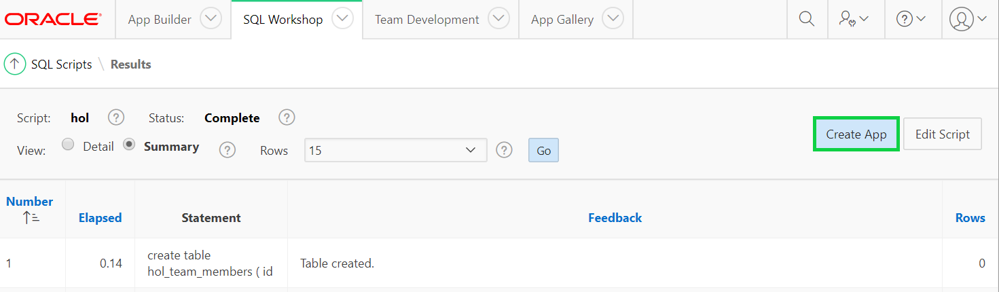
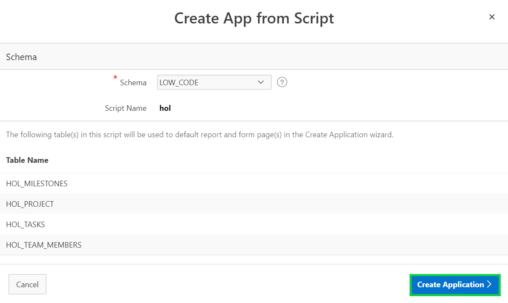
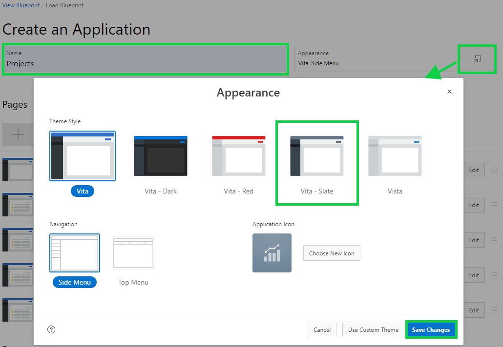
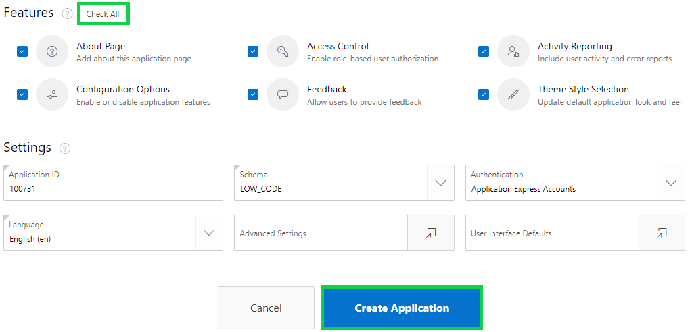
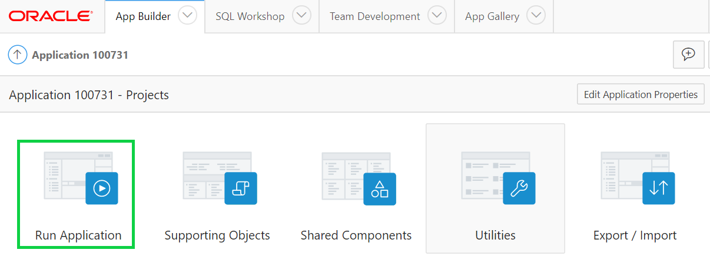
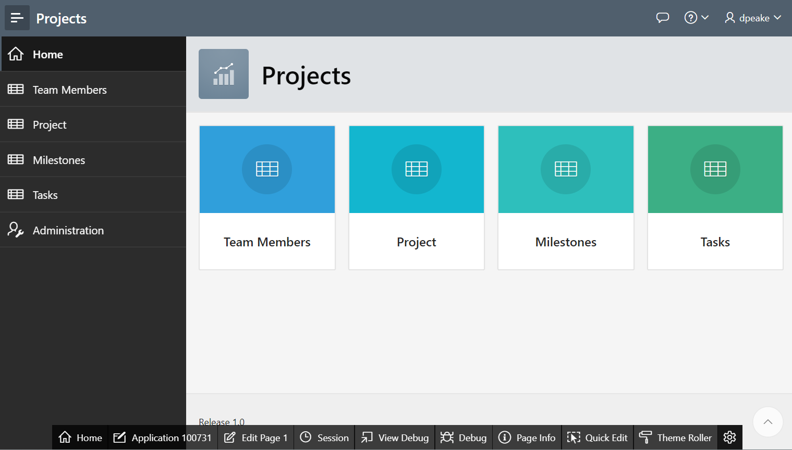

# Module 2: Creating an app on the tables from Quick SQL - Using the Create Application Wizard

### **Part 1: Creating Application from SQL Script**

Now, that you have ran the script. You will create application from it. If you are back on SQL Scripts, and don’t see the **“Create App”** button perform the following steps:
    - Within the Results column, click “1” for the script you just ran.
    - Under View Results, click the magnifying glass.
    *The results page shown above should now be displayed again*

1. Click **Create App**, and after that in the **Create App from Script** wizard click **Create Application**.

     
    

2. In **Create an Application**, enter the following and click **Save Changes**.
    - For Name, enter **Projects**.
    - Click **Appearance** and select **Vita-Slate**.

    

3. For Features, click **Check All**, and then click **Create Application**.

    

### **Part 2: Running App from Page Designer**

1. Your new application will be displayed in Page Designer
2. Click **Run Application**

    

### **Part 6: Runtime App**

1. Enter your **credentials**.
2. Your application should look like this. Browse around your application and review tables that were created with Quick SQL.

    

## Summary

TODO. [Click here to navigate to Module 3](3-improving-the-app-updating-a-page.md)