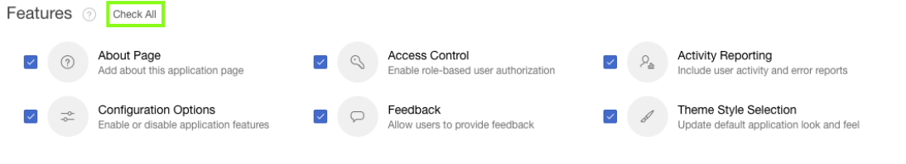

# Module 2: Creating an app on the tables from Quick SQL - Using the Create Application Wizard

### **Part 1: Creating Application from SQL Script**

Now, that you have ran the script. You will create application from it. If you are back on SQL Scripts, and don’t see the **“Create App”** button perform the following steps:
    - Within the Results column, click “1” for the script you just ran.
    - Under View Results, click the magnifying glass.
    *The results page shown above should now be displayed again*

1. Click **Create App**, and after that in the **Create App from Script** wizard click **Create Application**.

     
    
*Note: If you are back on SQL Scripts, and don’t see the “Create App from Script” button perform the following steps*:
1. *Within the Results column, click “1” for the script you just ran*.
2. *Under View Results, click the magnifying glass*.

*The results page shown above should now be displayed again*

2. In **Create an Application** wizard, enter the following.
    - For Name, enter **Projects**.
    - Click **Appearance** and select **Vita-Slate**.

### **Part 3**: Add Features

- For Features, click **Check All**

### **Part 4**: Create Application

- Click **Create Application**

### **Part 5**: App in Page Designer

- Your new application will be displayed in Page Designer
- Click **Run Application**

### **Part 6**: Runtime App

- Enter your **credentials**
- Play around with your new application

## Summary

TODO. [Click here to navigate to Module 3](3-improving-the-app-updating-a-page.md)