# Module 3: Improving the App - Updating a Page

### **Part 1**: Restart the Create App Wizard

- From the development environment, click **App Builder**, and then select **Create**  
    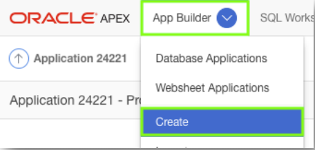

- Click **New Application**

### **Part 2**: Load Blueprint

- In the Create App Wizard, click **Load Blueprint**
- For Projects, click **Load**

    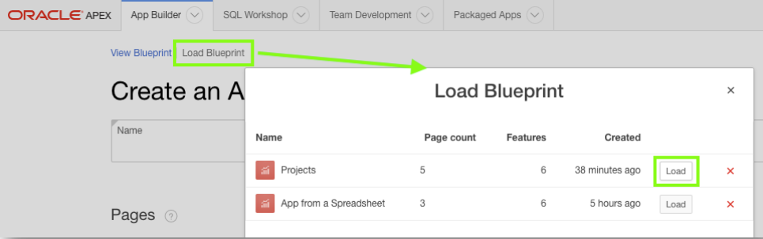

### **Part 3**: Add a Page

- Click **Add Page**
- Click **Interactive Grid**

    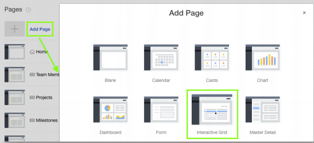

- For Page Name, enter **Milestones**
- For Table or View, select **HOL_MILESTONES**
- Click **Add Page**

    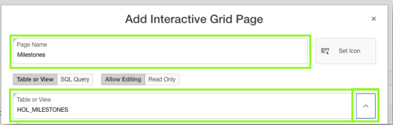

### **Part 4**: Reorder a Page

- Click and hold the mouse when hovering over the hamburger for
the **Milestones – Interactive Grid** page
- Move it up until the page is under Projects
- Release the mouse

    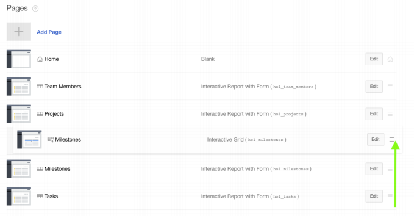

### **Part 5**: Delete a Page

- For **Milestones – Interactive Report with Form** page, click **Edit**
- Click **Delete**

    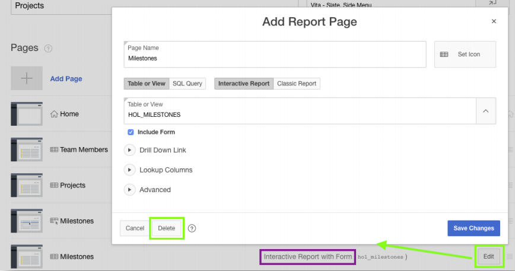

### **Part 6**: Create App and Run

- Click **Create Application**
- In Page Designer, click **Run Application**

    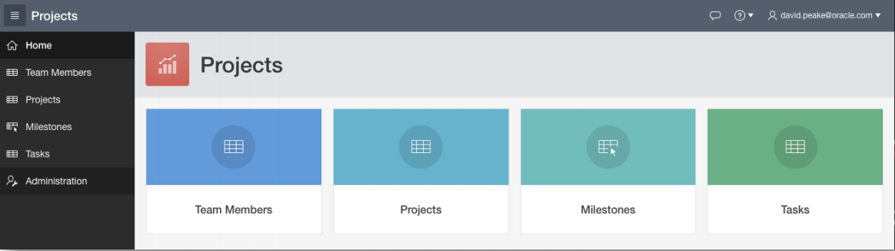

### **Part 7**: Navigate to Milestones

- In the runtime environment, click **Milestones**  
    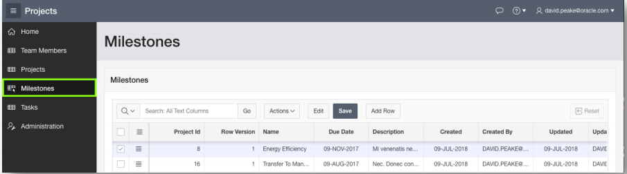
- In the Developer Toolbar, click **Edit Page 6**  
    

### **Part 8**: Update Project ID Column

- In Page Designer, under Milestones, click **Columns**
- Click **PROJECT_ID**

    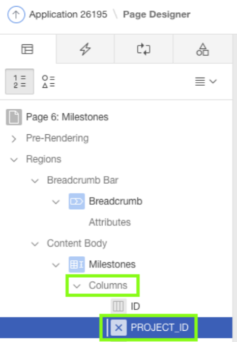

- In the Property Editor, update the following:
   - Identification: Type – select **Select List**
   - Heading: Heading – enter **Project**
   - List of Values: Type – select **Shared Component**
   - List of Values – select **HOL_TASKS.PROJECT_ID.LOOKUP**
   - Display Extra Values – click **No**
   - Display Null Value – click **No**  
      - #need a new picture
- Save and Run the App

- In the Property Editor, update the following:
  - Identification: Type – select **Select List**
  - Heading: Heading – enter **Project**
  - List of Values: Type – select **SQL Query**
  - List of Values – SQL Query enter 
  ~~~~sql
  select name d, id r 
  from hol_projects 
  order by 1
  ~~~~
  - Display Extra Values – click **No**
  - Display Null Value – click **No**   
    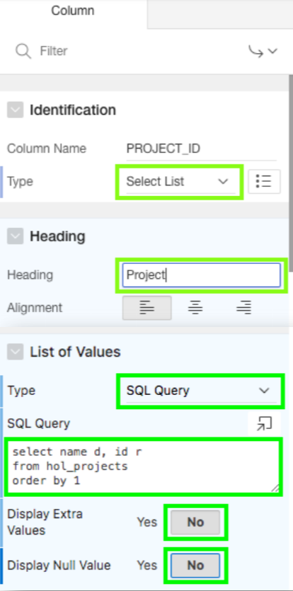
- Save and Run the App

### **Part 9**: Hide Columns

- In the runtime environment, click **Actions**, select **Columns**
- Uncheck Displayed for **Id, Row Version, Created, Created By,
Updated**, and **Updated By**
- Click **Save**

    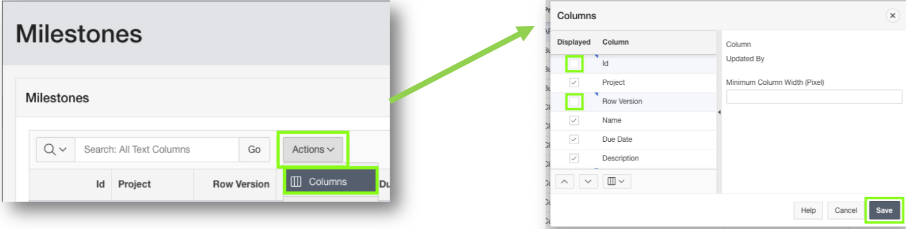

### **Part 10**: Save the Report

- In the runtime environment, click **Actions**, select **Report**,
select **Save**

    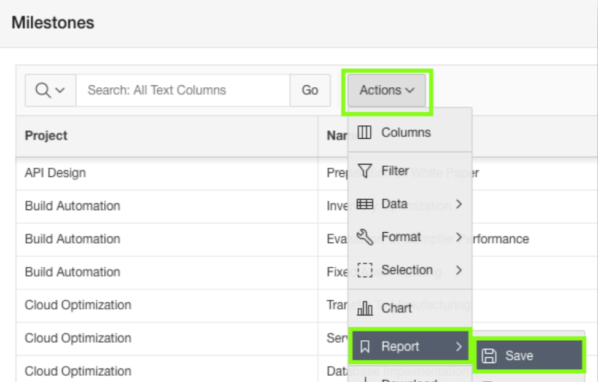

## **Learn More** *Useful Links*

- **APEX on Autonomous** https://apex.oracle.com/autonomous
- **APEX Collateral** https://apex.oracle.com
- **Tutorials** https://apex.oracle.com/en/learn/tutorials
- **Community** https://apex.oracle.com/community
- **External Site + Slack** http://apex.world