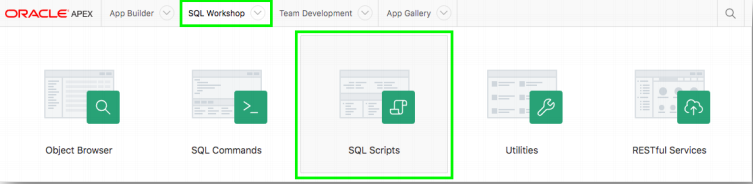
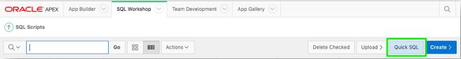
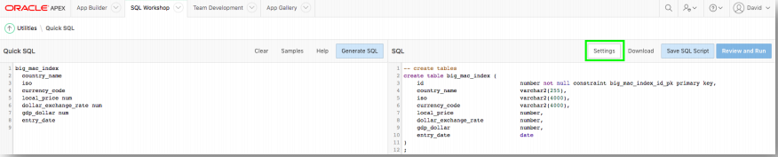
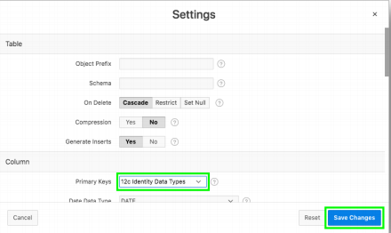
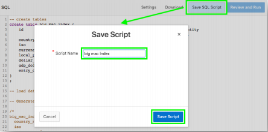
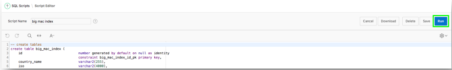

# Module 1: Building your table - Using Quick SQL

### **Part 1**: Using Quick SQL

1. Log into your workspace, click **SQL Workshop**, and then click **SQL Scripts**.  

    

2. Click **Quick SQL**.
    

3. Copy and paste the following into the editor on the left:
    ```
    big_mac_index  
     country_name  
     iso
     currency_code 
     local_price num 
     dollar_exchange_rate num 
     gdp_dollar num 
     entry_date
    ```

### **Part 2**: Adjusting Generation Settings

1. Click **Settings**. 
     
2. For Primary Keys select **12c Identity Data Types**, and then click **Save Changes**.   
    

### **Part 3**: Saving, Reviewing, and Running the Script

1. Click **Save SQL Script**, for Script Name, enter **big mac index**, and then click **Save Script**.
    
2. Click **Review and Run**. 
      
    *Note: The script will be displayed in the Script Editor within SQL Scripts*  
3. Click **Run**, and then click **Run Now**.
    

## Summary

This completes Module 1. TODO. [Click here to navigate to Module 2](2-creating-an-app-on-the-tables-from-quick-sql-using-the-create-application-wizard.md)