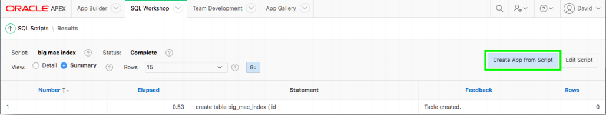
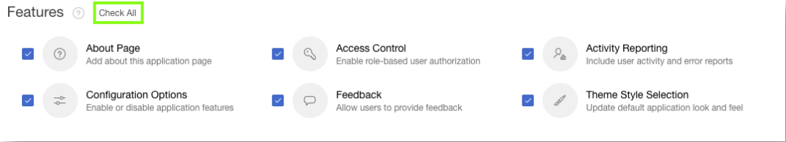
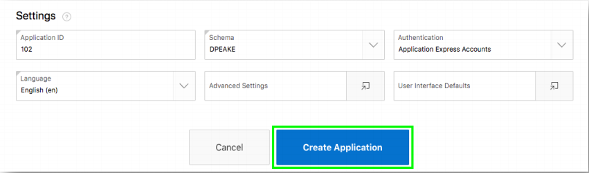
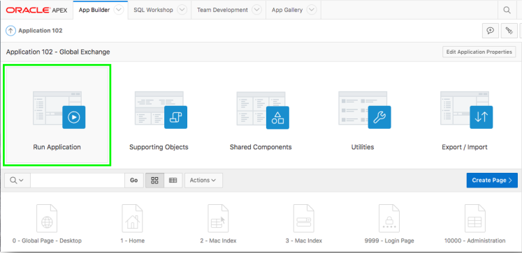
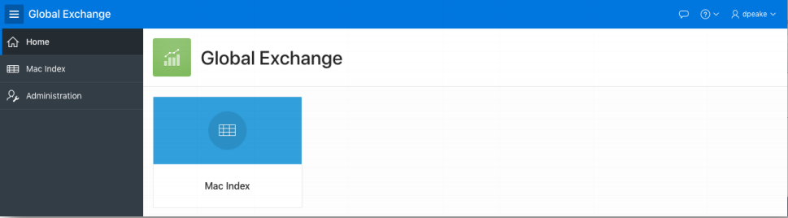

# Module 2: Creating an app on the tables from Quick SQL - Using the Create Application Wizard

### **Part 1**: Start the Create App Wizard

1. Click **Creating App from Script**.

       
    *Note: If you are back on SQL Scripts, and don’t see the “Create App from Script” button perform the following steps*:   
    1. *Within the Results column, click “1” for the script you just ran*.
    2. *Under View Results, click the magnifying glass*.  
    *The results page shown above should now be displayed again.*

### **Part 2**: Creating an Application

1. For Name, enter **Global Exchange**, and for Features, click **Check All**.

    

2. Click **Create Application**.

    
    Your new application will be displayed in Page Designer.
2. Click **Run Application**.

    

### **Part 3**: Running your application

1. Enter your credentials.
2. Review your new application.

      
    *Note: There is no data displayed in the Mac Index report*

## Summary

This completes Module 2. TODO. [Click here to navigate to Module 3.](3-using-the-apex-data-parser-populating-the-table.md)