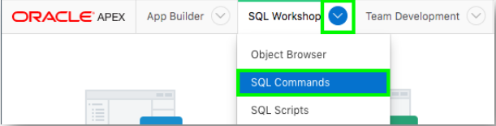
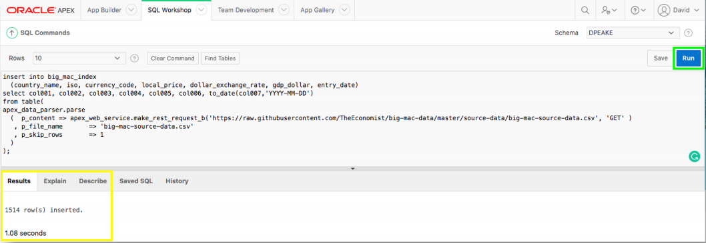
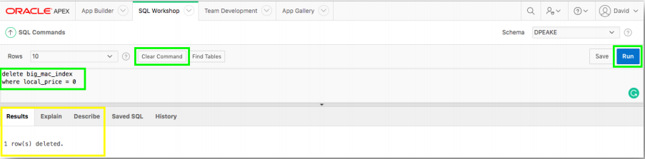

# Module 3: Using the APEX_DATA_PARSER - Populating the Table

### Information

The **apex_data_parser** is a PL/SQL package which provides an easy interface to parse files from various file formats, including comma-delimited (.csv). The parser is implemented as a table function - so the developer accesses parser results like a table. Therefore, the parser can utilize INSERT ... SELECT statements to insert rows directly into a table from the specified file.

The **apex_web_service.make_rest_request_b** is a PL/SQL function which invokes a RESTful style Web service and returns the results in a BLOB. Utilizing this function within apex_data_parser will allow you to load data from a REST API directly into your table.

### **Part 1**: Using SQL Commands

1. From the runtime environment, in the Developer Toolbar (bottom of screen), click **Home**.

    

2. Click **SQL Workshop**, and then click **SQL Commands**.

    

### **Part 2**: Runnig a SQL Command

1. Copy and paste the following into the SQL Commands:

    ```
    insert into big_mac_index  
      (country_name, iso, currency_code, local_price, dollar_exchange_rate, gdp_dollar, entry_date)
    select col001, col002, col003, col004, col005, col006, to_date(col007,'YYYY-MM-DD')  
    from table(  
    apex_data_parser.parse  
      ( p_content =>  apex_web_service.make_rest_request_b('https://raw.githubusercontent.com/TheEconomist/big-macdata/master/source-data/big-mac-source-data.csv', 'GET')  
       , p_file_name => 'big-mac-source-data.csv'  
       , p_skip_rows => 1  
      )  
    );
    ```
2. Click **Run**
3. In July 2019, Results should show **1514 row(s) inserted.**.  ## look into this

    

### **Part 3**: Deleting Bad Data

1. Click **Clear Command**.
2. Copy and paste the following into SQL Commands: 
    ```
    delete big_mac_index  
    where local_price = 0
    ```
3. Click **Run**.

    

4. In July 2019, Results should show **1 row(s) deleted**.   # look into this

## Summary

This completes Module 3. TODO. [Click here to navigate to Module 4](4-modifying-the-interactive-report-sql-improving-the-report.md)