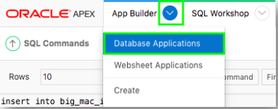
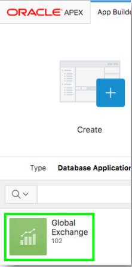
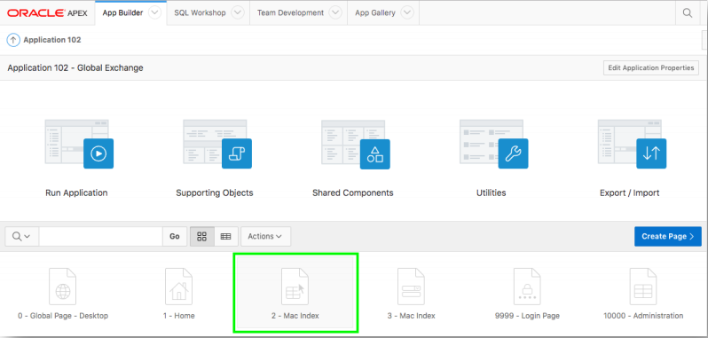
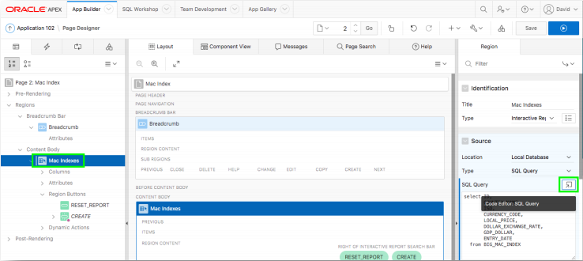
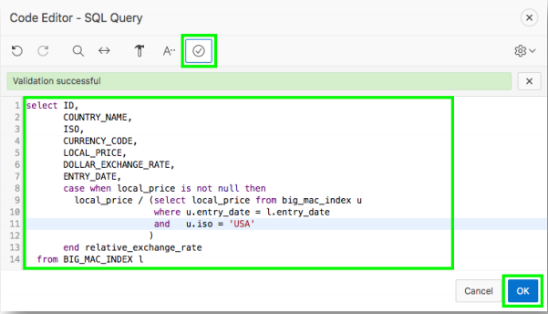
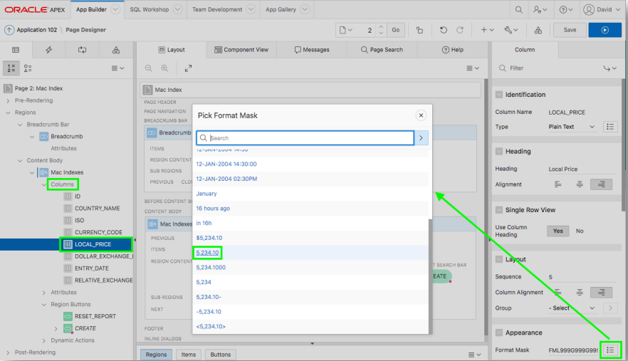
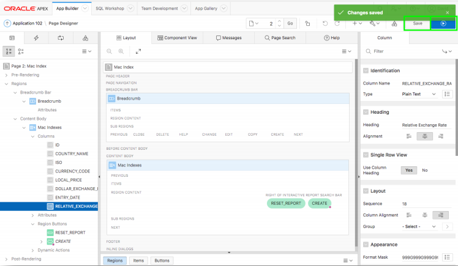
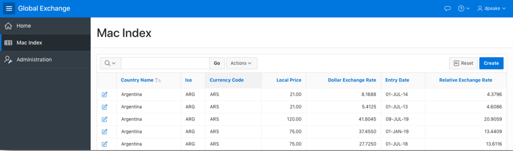

# Module 4: Modifying the Interactive Report SQL - Improving the Report

### Information

For any given country, if you divide the Local Price of a Big Mac by the Local Price of a Big Mac in the US, for the same time period, you can calculate the relative exchange rates between the countries based on the Big Mac prices.

If you then subtract the Dollar Exchange Rate from the relative exchange rate, and divide by the Dollar Exchange Rate, then you can determine if the currency is overvalued (positive) or undervalued (negative), against the US Dollar.

While this is not an exact determination of if a currency is overvalued or undervalued against the US Dollar, it is a good approximation using a product which is generally available in most
countries.

### **Part 1**: Navigating to the Application

1. In the Toolbar, click **App Builder**, and then select **Database Applications**.  
    

2. Click **Global Exchange**.  
    

3. From the app home page, click **2 - Mac Index**, which will take you to Page Designer and load Page 2, the report page.

    

### **Part 2**: Updating the Report Query

1. Within Page Designer, in the Rendering tree (left pane), under Content Body, click **Mac Indexes** (This is the report region)
2. In the Property Editor (right pane), for Source > Type select **SQL Query**, and then click the **Code Editor** icon.

    

3. For SQL Query enter the following:
    ```
    select ID,
           COUNTRY_NAME,
           ISO,
           CURRENCY_CODE,
           LOCAL_PRICE,
           DOLLAR_EXCHANGE_RATE,
           ENTRY_DATE,
           case when local_price is not null then
             local_price / (select local_price from big_mac_index u
                           where u.entry_date = l.entry_date
                           and   u.iso = 'USA'
                          )
           end relative_exchange_rate
      from BIG_MAC_INDEX l
    ```

4. Click **Validate** (Validation Successful will be displayed), and then click **OK**.

    
    *The **gdp_dollar** column was removed as it is not needed*.
    *The **case when … then** is to prevent errors if the **local_price** is null*.
    *The inner select is used to get the US price for the same date*.

### **Part 3**: Updating the Columns

1. In the Rendering tree (left pane), click **Columns**, and then click **LOCAL_PRICE**.
    - In the Property Editor (right pane), click the select icon for Appearance > Format Mask.
    - In the Pick Format Mask Pop-up List of Values, select **5,234.10**

    

2. In the Rendering tree (left pane), click **DOLLAR_EXCHANGE_RATE**.
    - In the Property Editor (right pane), click the select icon for Appearance > Format Mask.
    - In the Pick Format Mask Pop-up List of Values, select **5,234.1000**
3. In the Rendering tree (left pane), click **RELATIVE_EXCHANGE_RATE**.
    - In the Property Editor (right pane), click the select icon for Appearance > Format Mask.
    - In the Pick Format Mask Pop-up List of Values, select **5,234.1000**.

### **Part 4**: Running the Report

1. In the Page Designer Toolbar, click **Save**, and then click **Save and Run**.

    

2. The report page will be displayed in your application.

    
    *Note that the data is not ordered by Entry Date*.

## Summary

This completes Module 4. TODO. [Click here to navigate to Module 5.](5-updating-the-report-in-the-runtime-environment-updating-the-report-view.md)

