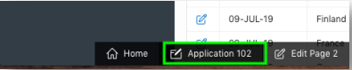
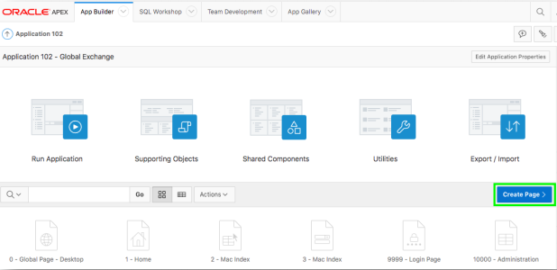
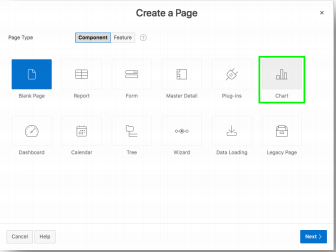
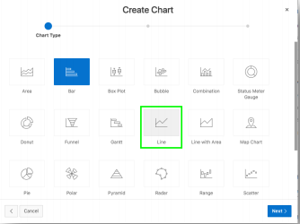
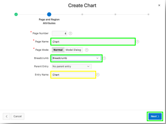
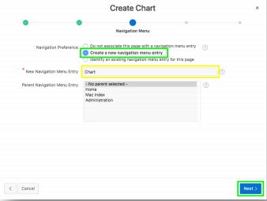
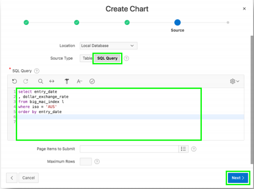
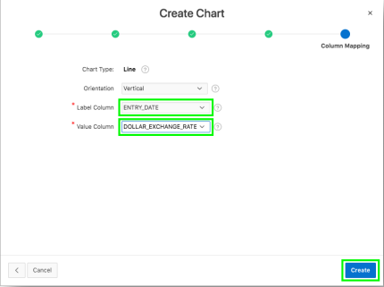
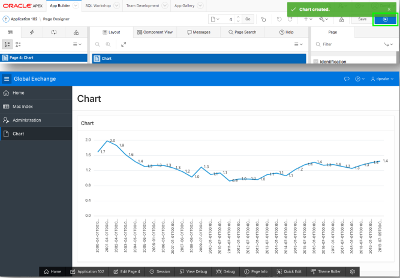

# Module 6: Adding a Chart for a single Country - Adding a Chart

### **Part 1**: Creating a New Page

1. From the Runtime environment, in The Developer Toolbar (bottom of the screen), click **Application xxxxx**. 

    

2. Click **Create Page**.  

     

3. For Page Type, click **Chart**, and then click **Next**. 

    

4.  For Chart Type, click **Line**, and then click **Next**.
    

5. Enter the following and click **Next**.

    | Property | Enter or Select | Value |
    | --- | --- | --- |
    | Page Name | Enter | **Chart** |
    | Breadcrumb | Select | **Breadcrumb** |

    
    *Note: For, Entry Date, it automatically populates page name i.e. **Chart**.*

6. For Navigation Preference, click **Create a new navigation entry**, and then click **Next**.

    

7. For Source Type, click **SQL Query**.

8.  Enter the following sql code, and then click **Next**.
    ```
    select entry_date
    , dollar_exchange_rate
    from big_mac_index l
    where iso = 'AUS'
    order by entry_date
    ```
     

9. For Label Column, select **ENTRY_DATE**. For Value Column, select **DOLLAR_EXCHANGE_RATE**, and then, click **Create**.

    

### **Part 2**: Running the Page 

1. In Page Designer, within the Toolbar, click **Save and Run**.

    

## Summary

This completes Module 6. TODO. [Click here to navigate to Module 7.](7-updating-chart-attributes-improving-the-chart.md)