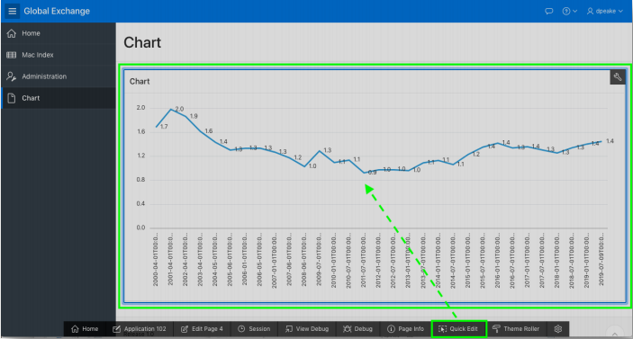
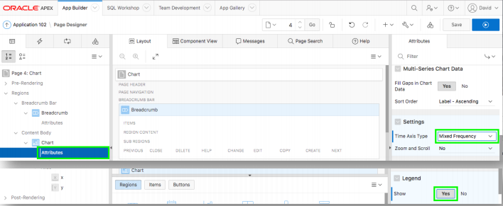
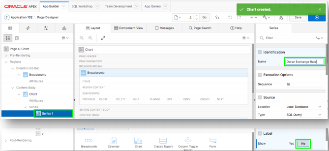
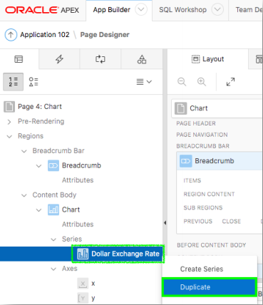
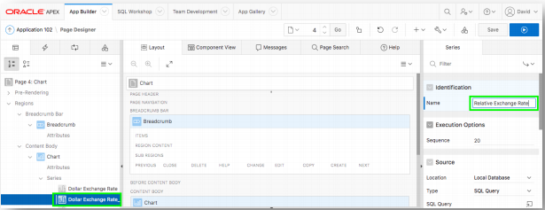
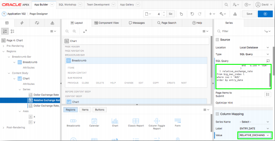
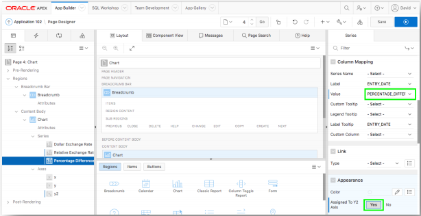
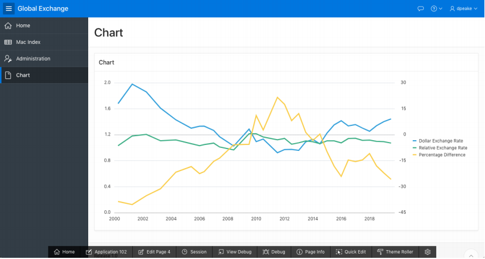

# Module 7: Updating chart attributes - Improving the Chart

### **Part 1**: Adjusting the Chart Attributes

1. From the Runtime environment, in the Developer Toolbar (bottom of the screen), click **Quick Edit**, and then click on the chart.
    
    *Hover over the chart region until it is surrounded by a blue box, after you click on the chart you will be directed to page designer*.

2. In the Rendering tree (left pane), under **Chart**, click **Attributes**.
3. In the Property Editor (right pane), for Settings > Time Axis Type, select **Mixed Frequency**, and for Legend > Show, click **Yes**.  

    

### **Part 2**: Updating the Chart Series

1. From Page Designer, in the Rendering tree (left pane), under **Chart**, click **Series 1**.
2. In the Property Editor (right pane), for Identification > Name, enter **Dollar Exchange Rate** and for Label > Show, click **No**.  
    

### **Part 3**: Duplicating the Chart Series

1. In the Rendering tree (left pane), under **Chart**, right-click **Dollar Exchange Rate**, click **Duplicate**. (Repeat the step above to create a third series). 
      
    *You should now have Dollar Exchange Rate, Dollar Exchange Rate_1, and Dollar Exchange Rate_2 or Dollar Exchange Rate_1_1, depending on which one you duplicate to create the third series*.

### **Part 4**: Updating the Second Chart Series

1. In the Rendering tree (left pane), under **Chart**, click **Dollar Exchange Rate_2**.
2. In the Property Editor (right pane), for Identification > Name, enter **Relative Exchange Rate**.

    

3. For Source > SQL Query, enter the following:
    ```
    select entry_date
    , (local_price / (select local_price from big_mac_index u
                      where u.entry_date = l.entry_date
                      and u.iso = 'USA'
                     )
      ) relative_exchange_rate
    from BIG_MAC_INDEX l
    where iso = 'AUS'
    order by entry_date
    ```
4. For Column Mapping > Value, select **RELATIVE_EXCHANGE_RATE**.  
    

### **Part 5**: Updating the Third Chart Series

1. In the Rendering tree (left pane), under **Chart**, click **Dollar Exchange Rate_1**.
2. In the Property Editor (right pane), for Identification > Name, enter **Percentage Difference**.
3. For Source > SQL Query, enter the following:
    ```
    select entry_date
    , ((local_price / (select local_price from big_mac_index u
                      where u.entry_date = l.entry_date
                      and u.iso = 'USA'
                     )
       - dollar_exchange_rate) * 100 / dollar_exchange_rate
      ) percentage_difference
    from BIG_MAC_INDEX l
    where iso = 'AUS'
    order by entry_date
    ```

4. For Column Mapping > Value, select **PERCENTAGE_DIFFERENCE**.
5. For Appearance > Assigned To Y2 Axis, check **Yes**.  
      
    *Note: If you do not check ‘Assigned to Y2 Axis’ then the chart will not display well, and not look like the following page.*

### **Part 6**: Running the Chart

1. In Page Designer, within the Toolbar, click **Save and Run**.

    

## Summary

This completes Module 7. TODO. [Click here to navigate to Module 8.](8-adding-a-page-item-and-list-of-values-adding-a-country-list.md)