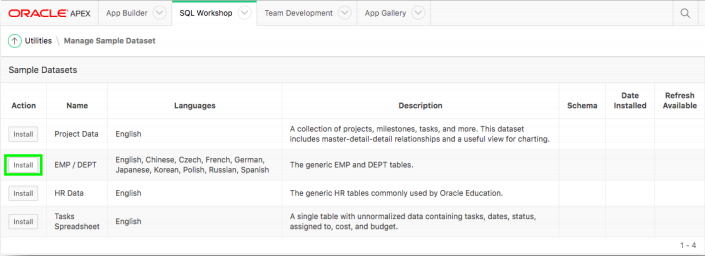

# Module 1: Building your Rest Endpoints - Creating a Sample Tables and REST Enabling

In this Module, you will create a sample dataset, import data into datasets and create REST Endpoints. Review the REST Endpoints, as we will use its URL to create web source modules.
### **Part 1**: Creating EMP and DEPT table in your first workspace

1. Log into your first workspace.
2. In the main menu, select **SQL Workshop**, select **Utilities**, and then click **Sample Datasets**.

    

3. On the EMP / DEPT row, click **Install**.  
    
4. Click **Next**, click **Install Dataset**, and then click **Exit**.  
    *We do not want to create an application directly on the tables.*

### **Part 2**: REST Enabling the tables

1. In the main menu, select **SQL Workshop**, click **SQL Scripts**.  
    
2. Click **Create**.  
    
3. Copy the following URL into a new window in your browser:
http://www.oracle.com/technetwork/developer-tools/apex/application-express/apex-hol-rest-enable-5478504.txt

4. In the Script Editor:
    - Enter Script Name = **Manual REST on EMP and DEPT**.
    - Paste the contents of the file into the body.
    - Click **Run**.

    
    - Click **Run Now**.
    *Results should show 4 statements processed successfully.*

    

### **Part 3**: Reviewing the REST Services

1. In the main menu, select **SQL Workshop**, click **RESTful Services**.
2. Expand **Modules**; Expand **emp.rest**; Expand **hol/**, and then click on **GET**.
    
3. Copy the Full URL into your clipboard.
4. Open a new tab / window in your browser and paste the Full URL.

    

## Information
Running the SQL Script in Part 2 above REST Enables the schema and also creates modules for the EMP and DEPT tables and the EMP_DEPT_V view, together with the appropriate handlers.

Alternatively, you could have gone directly to SQL Workshop > RESTful Services and REST enabled the schema. Then gone to SQL Workshop > Object Browser, clicked on each table / view and then selected REST to define the REST services. However, the handlers created will utilize Data Dictionary lookups each time they are called. This is less efficient than the manually created services created in Part 2, especially on services such as apex.oracle.com which has over 20,000 schemas and an extremely large data dictionary.

## Summary

This completes Module 1. You now know how to create a sample EMP and DEPT table, and build REST endpoint in your first workspace to render data later on in the upcoming modules. [Click here to navigate to Module 2.](2-building-your-app-which-will-be-based-on-the-rest-endpoints-creating-the-app.md)