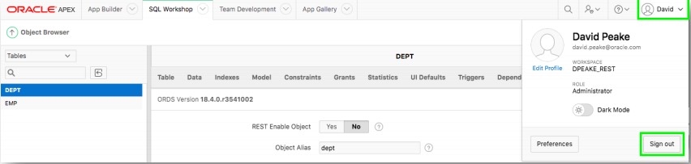
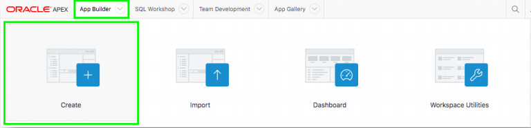
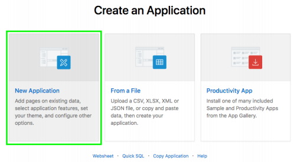
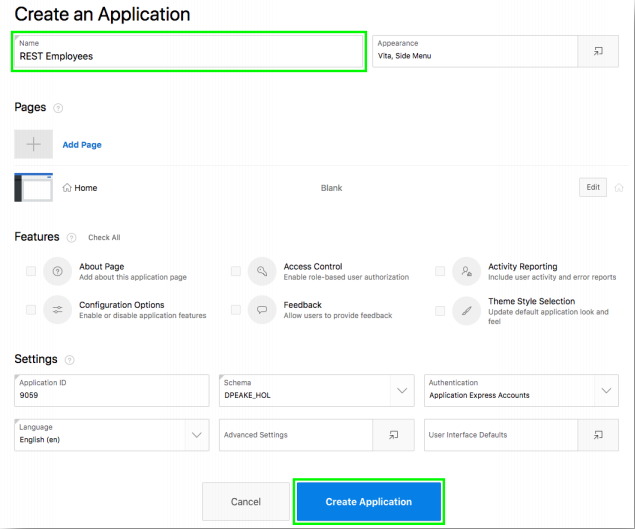

# Module 2: Building your App which will be based on the REST Endpoints - Creating the App
In this Module, you will log into your second workspace and create an app. 
### **Part 1**: Log into your Second Workspace

1. In the top toolbar, click your user name, then click **Sign Out**. 
    
2. Go back to your Oracle cloud account, and navigate to second autonomous database that you created in the beginning of this lab.
3. Navigate to Oracle APEX, and Log into your Second Workspace.
*Note: This is the second Autonomous Database, and you are logging in to workspace with its credentials.

### **Part 2**: Create an App  

1. Click **App Builder**, and click **Create**. 
    
2. Click **New Application**. 
    
3. For Name, enter **REST Employees**.
4. Click **Create Application**.

    

## Summary

This completes Module 2. You have logged off from the first workspace where you had created EMP and DEPT table and imported data into datasets. You had also reviewed your REST Endpoints. Now that you have created app in your second workspace in this module, you will go ahead and link the REST Service in next module to enhance your application. [Click here to navigate to Module 3.](3-linking-the-rest-service-defined-in-the-first-workspace-adding-a-web-source-for-emp.md)