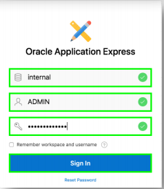
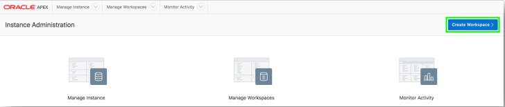
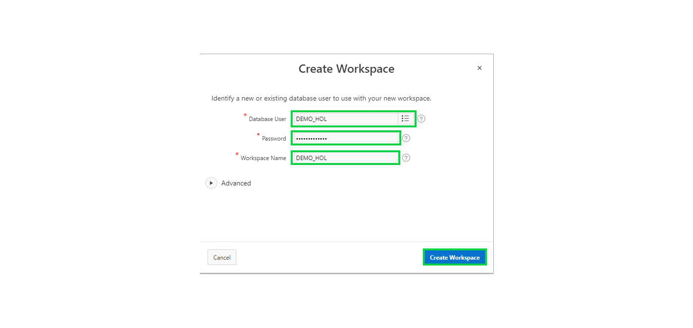
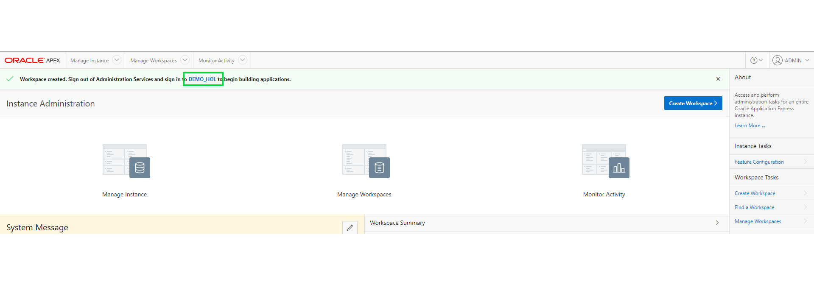
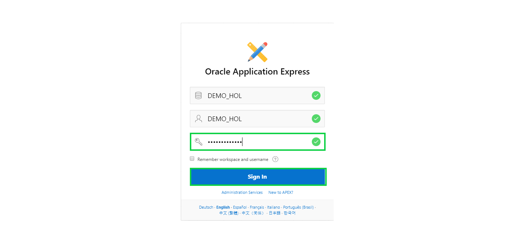

# Module 2: Building your App which will be based on the REST Endpoints - Creating the App
In this Module, you will log into your second workspace and create an application. 
### **Part 1**: Creating and Logging into your Second Workspace

1. In the top toolbar, click your user name (top right), click **Sign Out**, and then click **Return to Sign In Page**. 
    

2. Sign back into Internal Administration. Enter the following details, and then click **Sign In**.

    | Property | Value |
    | --- | --- |
    | Workspace | internal |
    | Username | ADMIN |
    | Password | **`Secretpassw0rd`** |

    

3. Click **Create Workspace**.

    

4. Enter the following details and click **Create Workspace**.

    | Property | Value |
    | --- | --- |
    | Database User | DEMO_HOL |
    | Password | **`SecretPassw0rd`** |
    | Workspace Name | DEMO_HOL |
    
    

6. Click the **DEMO_HOL** link in the success message. This will log you out of APEX administration so that you can log into your new workspace.

    

7. Enter **``SecretPassw0rd``** for the password, check the **Remember workspace and username** checkbox, and then click **Sign In**.

    

### **Part 2**: Creating an App  

1. Click **App Builder**, and click **Create**. 
    
2. Click **New Application**. 
    
3. For Name, enter **REST Employees**.
4. Click **Create Application**.

    

## Summary

This completes Module 2. You have logged off from the first workspace where you had created EMP and DEPT table and imported data into datasets. You had also reviewed your REST Endpoints. Now that you have created  your second workspace and an application inside, you will go ahead and link the REST Service in next module to enhance your application. [Click here to navigate to Module 3.](3-linking-the-rest-service-defined-in-the-first-workspace-adding-a-web-source-for-emp.md)