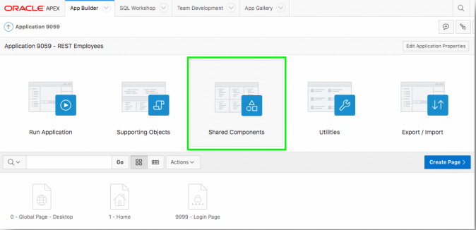
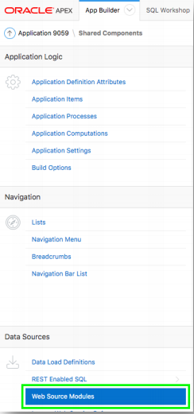
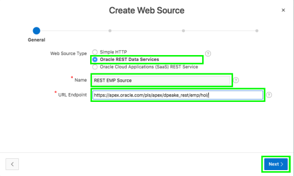
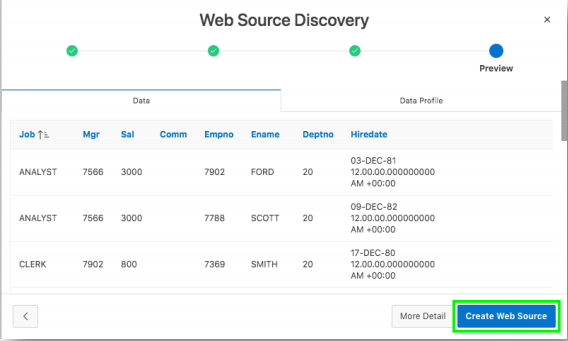
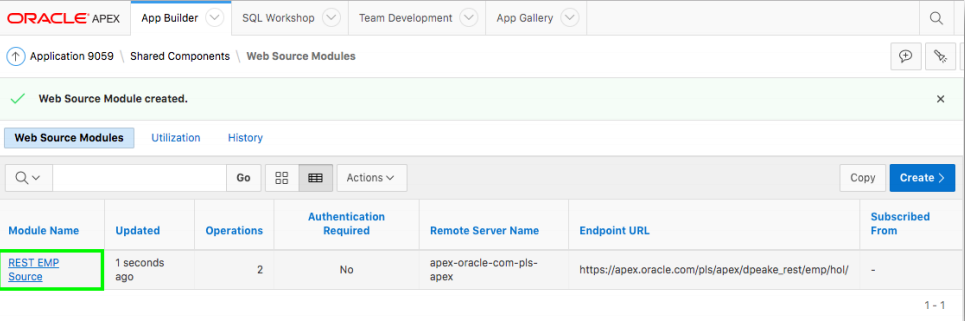
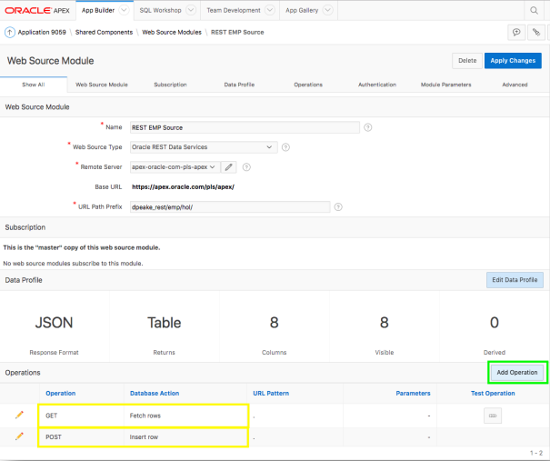
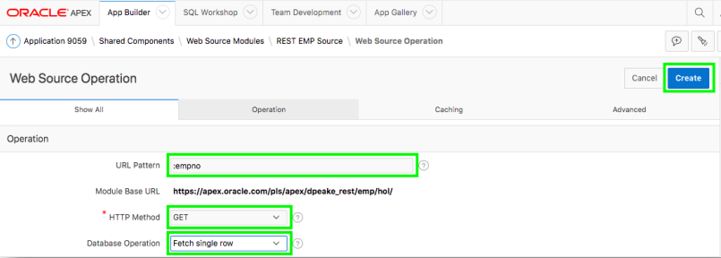
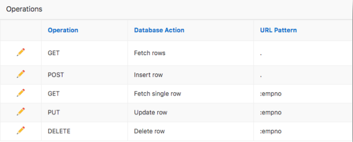

# Module 3: Linking the REST Service defined in the first workspace - Adding a Web Source for EMP

### **Part 1**: Adding Web Source for EMP 

1. Click **Shared Components**.  
    
2. Under **Data Sources**, click **Web Source Modules**.  
    
3. Click **Create**, and then click **Next**. 
    *Default: From Scratch.*
5. For Web Source Type, select **ORACLE REST Data Services**.
6. For Name enter **REST EMP Source**.
7. For URL Endpoint, enter the REST URI you tested previously, click **Next**.
    *Similar to https://<< your service >>/dpeake_rest/emp/hol/*

    

8. Review the Base URL and Service URL Path.
9. Click **Next**.
10. Click **Discover**.
    *Authentication Required = No*
11. Click **Create Web Source**.

    

### **Part 2**: Adding Operations

1. Click **REST EMP Source**.

    

2. Notice only the GET and POST Operations have been added.

    

3. Click **Add Operation** and enter following:

    | Property | Type or Select | Value |
    | --- | --- | --- |
    | URL Pattern | type | **:empno** |
    | HTTP Method | select | **GET** |
    | Database Operation | select | **Fetech single row** |
    - Click **Create** 

    

4.  Click **Add Operation**

    | Property | Type or Select | Value |
    | --- | --- | --- |
    | URL Pattern | type | **:empno** |
    | HTTP Method | select | **PUT** |
    | Database Operation | select | **update row** |
    - Click **Create**

5. Click **Add Operation**

    | Property | Type or Select | Value |
    | --- | --- | --- |
    | URL Pattern | type | **:empno** |
    | HTTP Method | select | **DELETE** |
    | Database Operation | select | **Delete row** |
    - Click **Create**  
    
    *This is how it should look after you have created additional three operations.*
    - Click **Apply Changes**
## Summary

TODO. [Click here to navigate to Module 4.](4-defining-the-report-and-form-on-emp-creating-pages.md)
