# Module 4: Defining the Report and Form on EMP - Creating Pages
In this Module, you will create a new page using web source that is already linked to your application. You will further update the page that you have created for better functionality.
### **Part 1**: Use the Create Page Wizard

1. Return to the Application Home Page.
2. Click **Create Page**.

    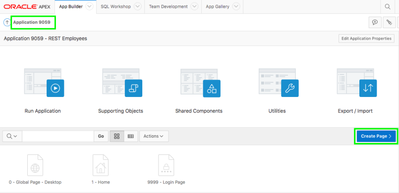

3. For Page Type, click **Report**  
    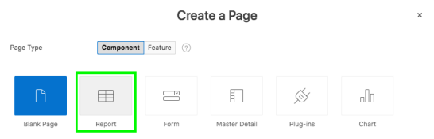
4. For Report Type, click **Report with Form**.  
    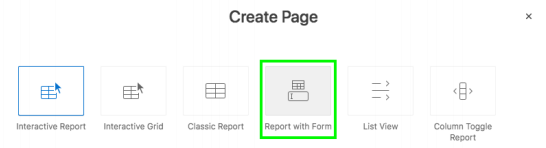
5. Enter the following and click **Next**.
    | Property | Enter or Select | Values |
    | --- |--- |--- |
    | Report Page Name | enter | **Employees** |
    | Form Page Name | enter | **Maintain Employee** |
    | Form Page Mode | select | **Modal Dialog** |
    | Breadcrumb | select | **Breadcrumb** |
    | Entry Name | enter | **Employees** |

    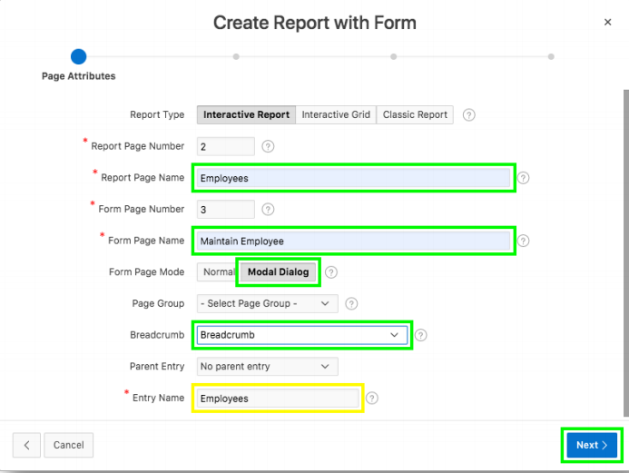

6. For Navigation Preference, click **Create a new navigation menu entry**, and then click **Next**.

    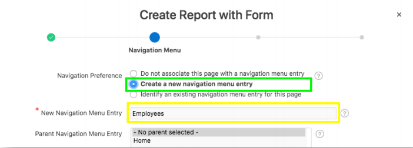
7. For Data Source, click **Web Source**.
8. For Web Source Module, select **REST EMP Source**, and then click **Next**.

    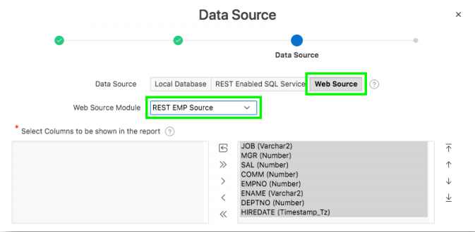
9. For Primary Key Column, select **EMPNO (Number)**, and then click **Create**. 

    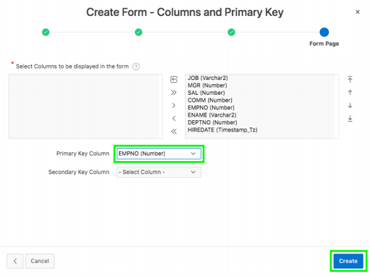

### **Part 2**: Run the Application

1. From Page Designer, click **Save and Run**.  
    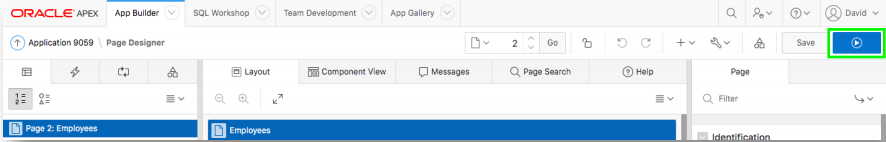

2. On the Login Page, enter your user credentials.  
    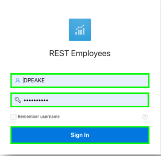

3. Review the Employees page.

    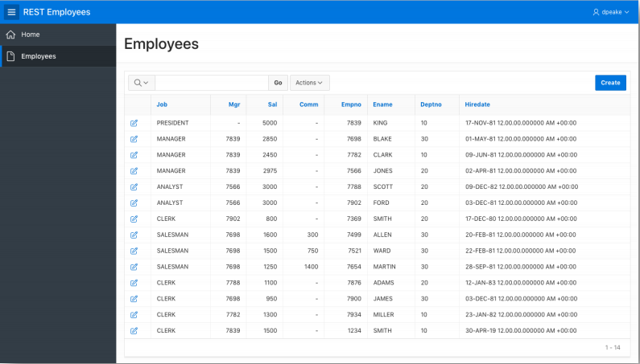

4. On the Employees report page, click **Actions**, and then  click **Columns**.  
    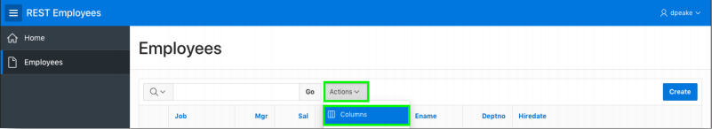
5. Shuffle the columns to put **EMPNO**, **ENAME**, and **DEPTNO** as the first three columns, by selecting the column and using the arrows. Click **Apply** after you are done sorting.
    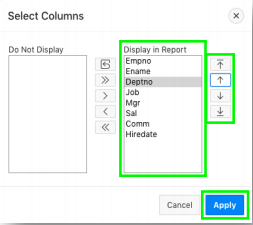

6. Click **Actions**, select **Report**, and click **Save Report**. 
    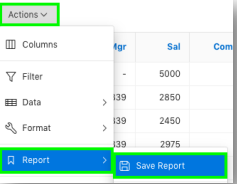

7. For Save, select **As Default Report Settings**.  
    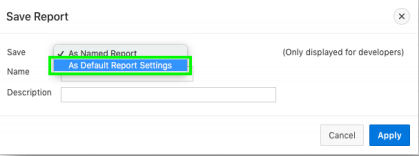
8. Click **Apply**.

    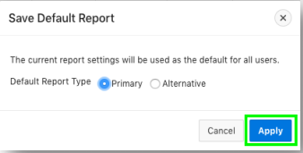
9. Click the edit icon on a row - The Form Page is displayed.
11. In the Developer Toolbar, click **Edit Page 3**. 
    
    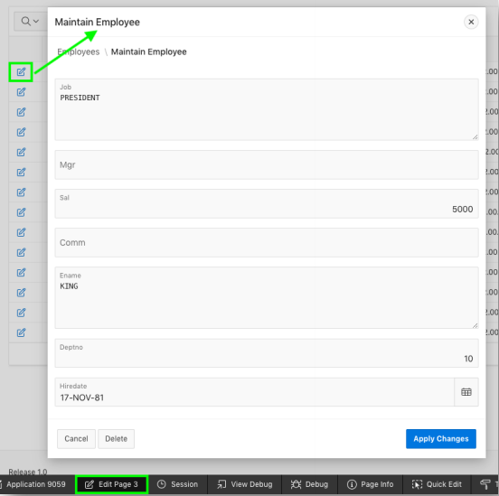 
    - Page Designer will be displayed for the current page. 
    *Note: The Developer Toolbar is only displayed when you run apps from App Builder, so is never visible to end users*.

### **Part 3**: Updating the Page

1. In the Rendering tab (left pane), click Column **P3_EMPNO**.
    - In the Property Editor (right pane):
        - For Type select **Number Field**.
        - For Label enter **Empno**.

    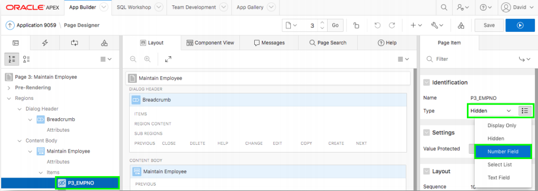
2. In the Rendering tab (left pane), click Column **P3_JOB**.
    - In the Property Editor (right pane), for Type select **Text Field**.
3. In the Rendering tab (left pane), click Column **P3_ENAME**.
    - In the Property Editor (right pane), for Type select **Text Field**.
4. In the Rendering tree, drag **P3_ENAME** up to be under **P3_EMPNO**.  
    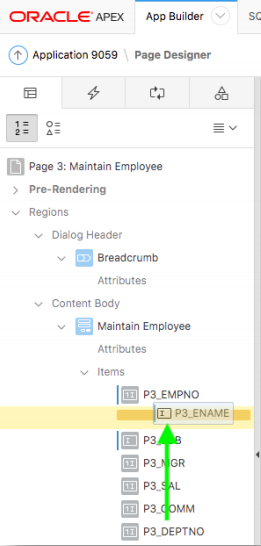
5. In the Rendering tab (left pane), click Column **P3_DEPTNO** and drag **P3_DEPTNO** up to be under **P3_ENAME**.
6. In Layout (middle pane), select **P3_COMM** and drag it up next to **P3_SAL**.
    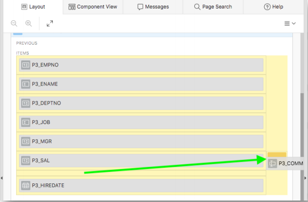
7. In the Toolbar, click **Save**.

### **Part 4**: Inserting a Record

1. Navigate back to the Runtime environment and refresh your browser.
2. Click **Create**, and enter the following:

    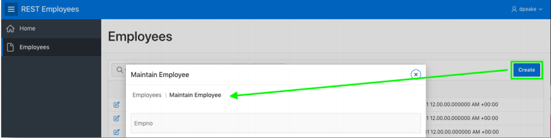

    | Property | Enter or Select | Values |
    | --- | --- | --- |
    | Empno | enter | **1234** |
    | Ename | enter | **SMITH** |
    | Deptno | enter | **10** |
    | Jpb | enter | **CLERK** |
    | Mgr | enter | **7839** |
    | Sal | enter | **1500** |
    | Hiredate | select | *any date* |
  
    - Click **Create**
    *Find the new entry on the Employees report page.*
    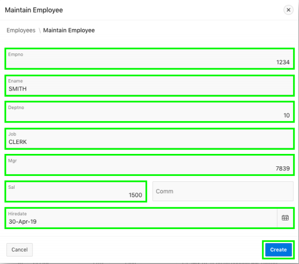

### **Part 5**: Updating a Record

1. In the report, find **Ward**, click the edit icon and enter new changes.

    | Property | Enter or Select | Values |
    | --- | --- | --- |
    | Sal | enter | **1500** |
    | Comm | enter | **750** |

    - Click **Apply Changes**
    - Review **Ward** in the report
    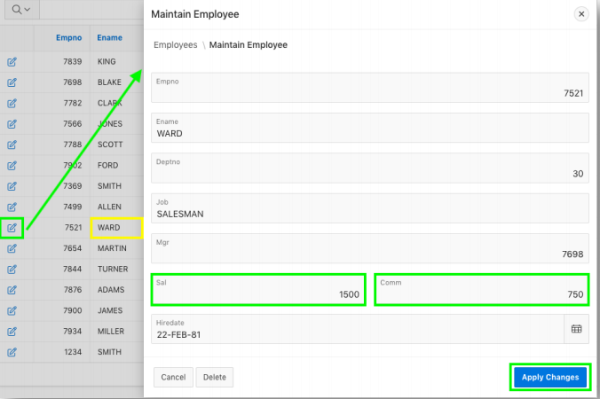

### **Part 6**: Deleting a Record

1. In the report, find **Turner**, and click the edit icon.
2. Click **Delete**, and then click **Ok**.
    *Review the report to ensure Turner is deleted*

    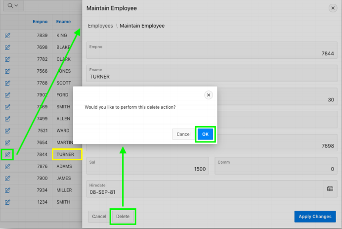

## Summary

This completes Module 4. You now know how to create a page using web source module.  [Click here to navigate to Module 5.](5-using-the-rest-service-on-dept-defining-list-of-values.md)