# Module 5: Using the REST Service on DEPT - Defining List of Values

### Information

When you ran the script in your first workspace you created a REST handler for the DEPT table. You can now utilize that REST URI within a PL/SQL Function by using the APEX_EXEC package.

In order to utilize the APEX_EXEC package you must first define a Web Source on the REST DEPT Service within this application.

Once fully implemented, you can utilize the function as the basis for a List of Values against the DEPT table.

Read this blog post for more details:  
https://blogs.oracle.com/apex/apex-181-early-adopter-2-rest-services-and-plsql

### **Part 1**: Add Web Source for DEPT

1. Return to the Application Builder
2. Go to the App Builder Home Page
3. Select your application
4. Click **Shared Components**
5. Click **Web Source Modules**
6. From Web Source Modules, click **Create**
7. Click **Next** {Default: From Scratch}
8. For Web Source Type, select **ORACLE REST Data Services**
9. For Name enter **REST DEPT Source**
10. For URL Endpoint, enter the REST URI for the dept.rest handler
*Similar to https://<< your service >>/dpeake_rest/**dept**/hol/*
11. Click **Next**

    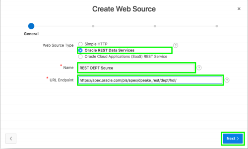

12. Review the Base URL and Service URL Path
13. Click **Next**
14. Click **Discover**
*Authentication Required = No*
15. Click **Create Web Source**

    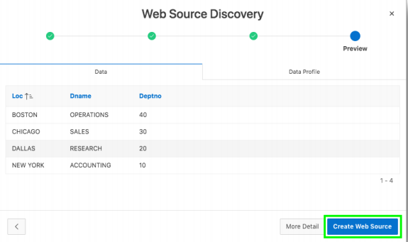

### **Part 2**: Adding a Function to call DEPT

1. In the main menu, select **SQL Workshop**, click **SQL Scripts**  
    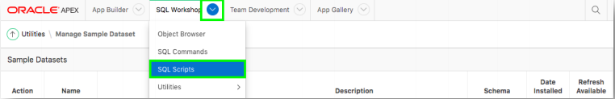

2. Click **Create**  
    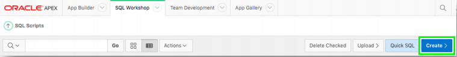

3. Copy the following URL into a new window in your browser:  
  *Remember you are on Slide 54 if you click the link directly*
  http://www.oracle.com/technetwork/developer-tools/apex/application-express/apex-hol-func-5478627.txt

4. In the Script Editor:
    - Enter Script Name = **DEPT Function**
    - Paste the contents of the file into the body
    - Click **Run**  
    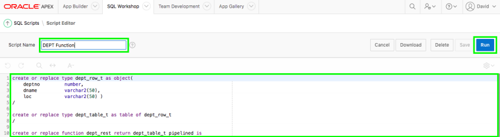

    - Click **Run Now**
    - Results should show 3 statements processed successfully
    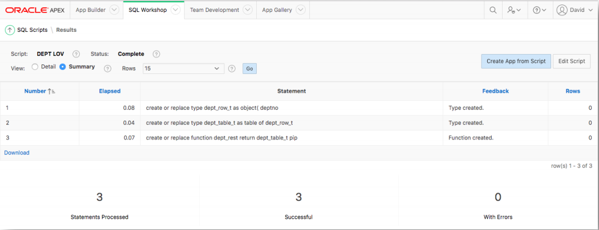

### **Part 3**: Add the List of Values

1. Return to App Builder
2. Select your application
3. Click **Shared Components**
4. Click **List of Values**

    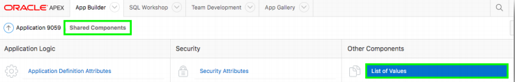

5. Click **Create**
6. Click **Next** 
*Default: From Scratch*
7. For Name, enter **DEPT LOV**
8. For Type, select **Dynamic**
9. Click **Next**

    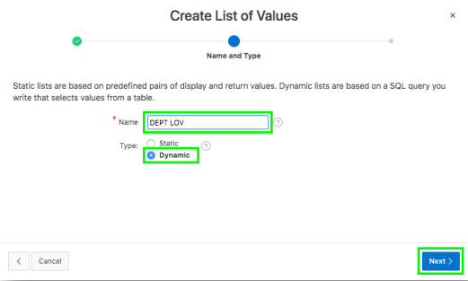

10. For Query enter  
    ```
      select dname as d,
             deptno as r
        from table ( dept_rest )
      order by 1
    ```

    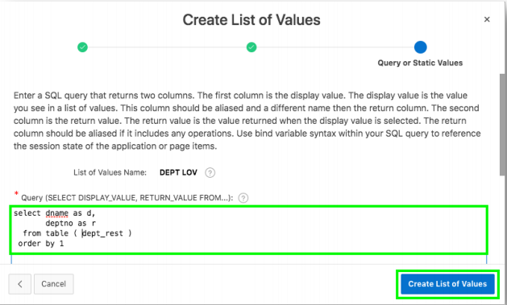  
    *Note: dept_rest is the name of the function created in the previous step*
11. Click **Create List of Values**

### **Part 4**: Update the EMP Pages

1. Click on **Application xxxxx** in the breadcrumbs
2. Click 2 - **Employees**

    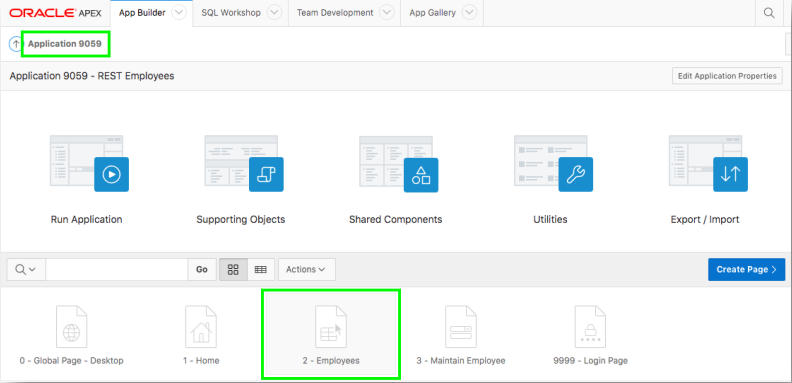


3. In the Rendering tree (left pane), click Columns, click **DEPTNO**  
4.  In the Property Editor (right pane)
    - For Type, select **Plain Text (based on List of Values)** 
    - For List of Values, select **DEPT LOV** 
    - For Heading > Alignment, click **Start** 
    - For Layout > Column Alignment, click **Start**
    - In the toolbar, click **Save**

    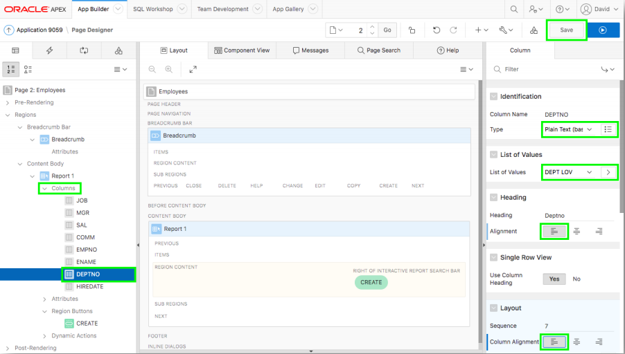

5. Navigate to Page 3

    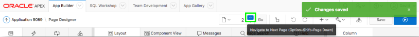
6. In the Rendering tree (left pane), click **P3_DEPTNO**
7. In the Property Editor (right pane)
    - For Type, select **Select List** 
    - For List of Values > Type, select **Shared Component** 
    - For List of Values, select **DEPT LOV** 
    - For Display Extra Values, click **No** 
    - For Display Null Value, click **No**
    - In the toolbar, click **Save**  

    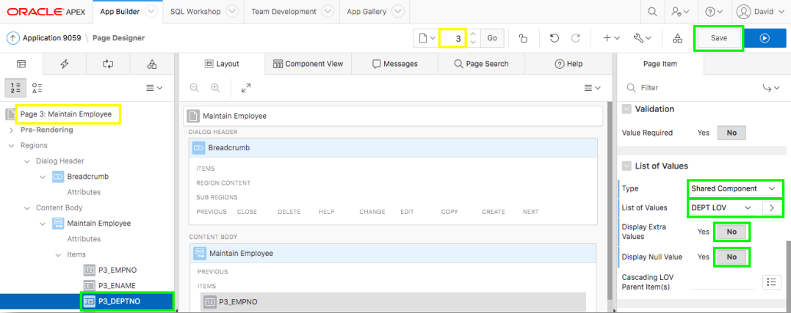

### **Part 5**: Run the Application

1. Navigate to the application Runtime Environment
2. Refresh your browser

    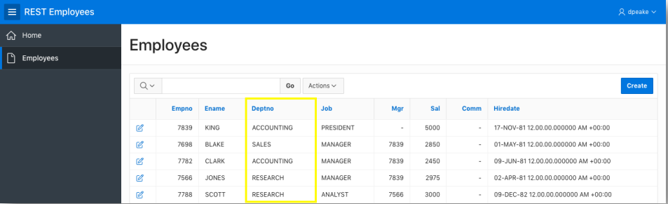

3. Click on the edit icon for any record
4. Select a department

    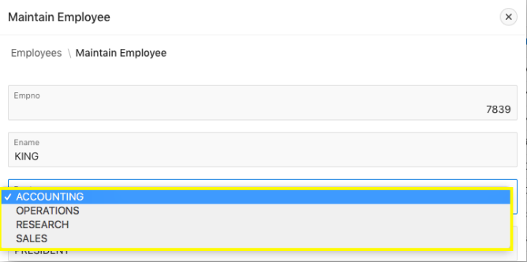

## Summary

TODO.

## **Learn More** - *Useful Links*

- APEX on Autonomous https://apex.oracle.com/autonomous
- APEX Collateral https://apex.oracle.com
- Tutorials https://apex.oracle.com/en/learn/tutorials
- Community https://apex.oracle.com/community
- External Site + Slack http://apex.world