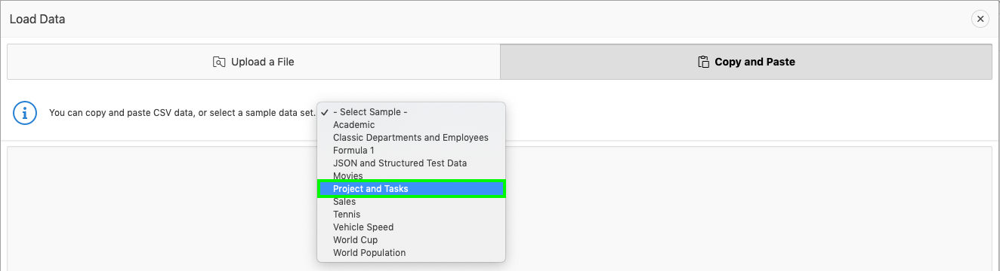

# Module 1: Creating an App from a Spreadsheet

In this module, you will learn how to create an APEX App on top of data imported from an excel spreadsheet. To simplify the lab, you will use sample data that's built into APEX. However, the sequence will be the same when uploading your own data.

### **Part 1**: Load project and tasks data  
 
1.  From your APEX workspace home page, click **App Builder**.
2.  Click **Create a New App**.

    

3.  Click **From a File**.

    

    When creating an application from a file, APEX allows you to upload CSV, XLSX, XML, or JSON files and then build apps based on their data. Alternatively, you can also copy and paste CSV data or load sample data.

4.  Within the Load Data wizard, click the **Copy and Paste** option at the top. Select **Project and Tasks** from the sample data set list and then click **Next**.

    

5.  Review the parsed data. Set Table Name to **SPREADSHEET** and click **Load Data**. Note that the Error Table Name defaults to the Table Name with a postfix of \_ERR$.

    
    
    After clicking **Load Data** you will see a spinner until the wizard finished loading. Continue to Part 2 at that point.

### **Part 2**: Create and run an application 

The Data Load wizard has created a new table and populated that table with the records from the sample data. Now you can create an app based on this new table.

1.  Verify that 73 rows have been loaded into the SPREADSHEET table, then click **Continue to Create Application Wizard**.

    

2.  Set Name to **App from a Spreadsheet**, click **Check All** for Features, and then click **Create Application**.

    
    

    When the wizard finishes creating the application, you will be redirected to the application's home page in the App Builder.

### **Part 3**: Explore the new app

1.  Click **Run Application**. This will open the runtime application in a new browser tab, allowing you to see how end users will view the app.

    

2.  Enter your user credentials and click **Sign In**.
3.  Explore the application a little. Click **Spreadsheet** (in the home menu or the navigation menu) to view the sample data in a "report" page, then click the edit icon for a record to display the details in an editable "form" page. Next, navigate to the **Dashboard** page and review the charts displayed there. Finally, review the options available under **Administration**.

    

## Summary

TODO [Click here to navigate to Module 2](2-using-the-runtime-environment-improving-the-report-and-form.md)
