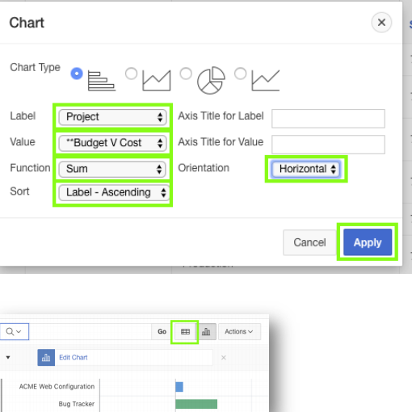
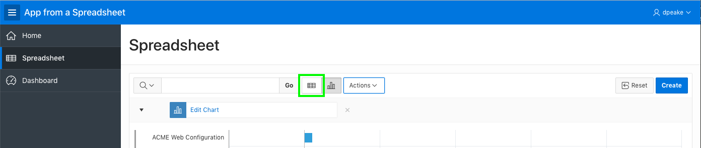

# Module 2: Improving the Report and Form

In this module, you will get first-hand expereience with managing the application by improving the interactive report user experience and form page.
### **Part 1**: Basic Interactive Report Enhancement
Now, that you have created an app. It is time to improve report page for better clarity of data visualization.
1. If already not on the runtime application, go ahead and click **run application** from the development environment and then, Click **Spreadsheet**.
2. Click **Actions**, select **Data**, and then select **Sort**.
3. For 1, select **Start Date**; For 2, select **End Date**; click **Apply**.

    

4. To save the report, click **Actions**, select **Report**, and then select **Save Report**.
5. For Save, select **As Default Report Settings** .

    
6. For, Default Report Type, select **Alternative**; For Name, enter **Date Review**, and then click **Apply**.
  

    

### **Part 2** - Additional Interactive Report Enhancement
In this part, you will further improve interactive report by adding new column by means of computation and you will also create a chart to review report.
1. Click **Actions**, select **Data**, select **Compute**.
2. Enter following data, and then click **Apply.**
    | Property | Value |
    | --- | --- |
    | Label | **Budget V Cost** |
    | Format Mask | **$5234.10** |
    | Computation Expression | **I - H** |

    
    This adds a new column **Budget V Cost** to your interactive report.

3. Now, to add a **Chart**, Click **Actions**, and then select **Chart**.
4. Enter the following data, and then click **Apply**.
    | Property | Value |
    | --- | --- |
    | Label | **Project** |
    | Value | ****Budget V Cost** |
    | Function | **Sum** |
    | Sort | **Label-Ascending** |
    | Orientation | **Horizontal** |

    
    After you click **Apply**, view chart will get activated and then you can toggle between view report and view chart.
    
5. Next, **Save report**. To save, repeat process from Step 4 to Step 6 from Part 1 of this module.
    
### **Part 3** - Enhance the Form
TODO.
1. In the Runtime environment, click the view report icon.
    
2. In the runtime environment, click the edit icon on a record.
    
3. A modal page will be displayed.
4. In the Developer Toolbar, click **Quick Edit**.

    
5. Hover over the **Status** item (until a blue outline appears) and click the mouse.
6. Page Designer displays with focus on the Status item.
7. In Page Designer, within the Property Editor (right pane), for Type select **Select List**.
8. Under List of Values, for Type select **SQL Query**.
9. Next to SQL Query, click **Code Editor**.

    

10. Within the Code Editor, enter the following:

    ```
    select distinct status d, status r
    from spreadsheet
    order by 1        
    ```

11. Click **Validate**, and then Click **OK**.

    
  
12. Display Extra Values, select **No**.
13. Null Value Display, enter **- Select Status -**.
14. Click **Save**.(In the toolbar - top right)  
    
15. Now, navigate back to the runtime environment and refresh the browser. Click the edit icon, and then click on **Status**.

    

## Summary

TODO.[Click here to navigate to Module 3](3-using-the-runtime-environment-adding-a-calendar.md)
