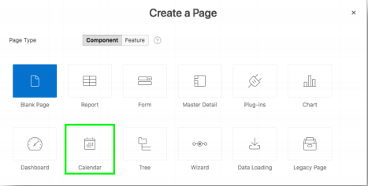
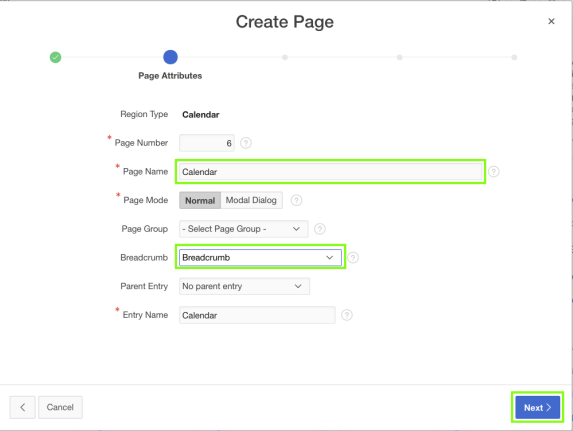
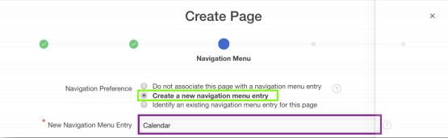
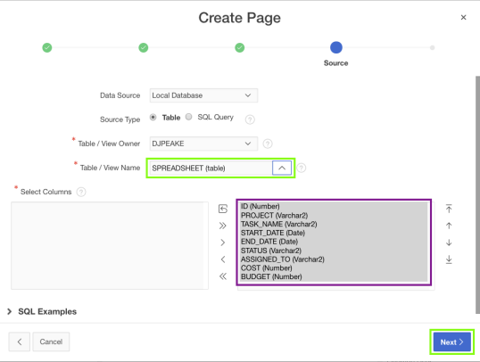
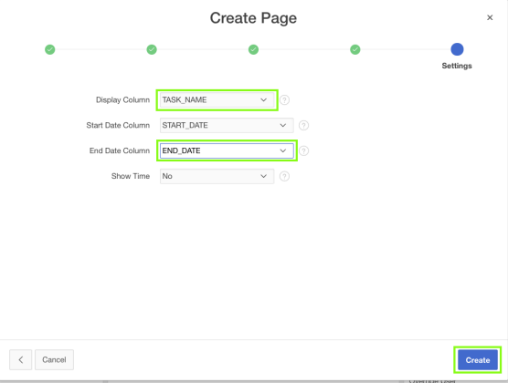
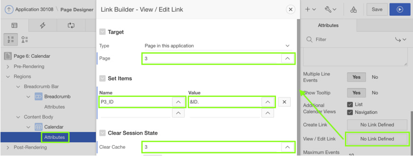
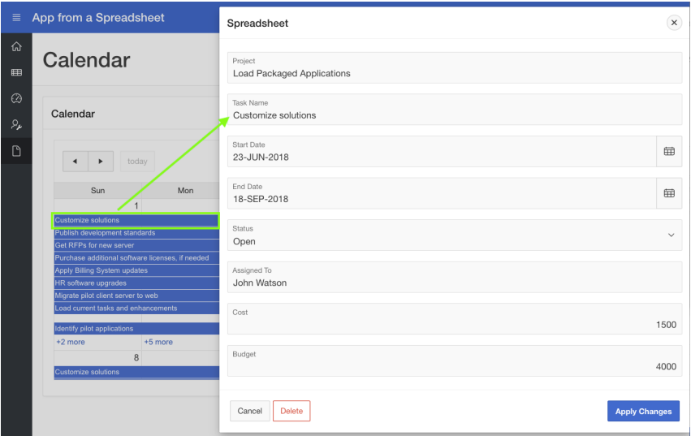

# Module 3: Adding a Calendar
In this module, you will create a new page to add calendar to your first application and link to other page to update calendar data.
### **Part 1** - Add a Calendar
TODO.
1. Navigate back to the development environment. In the App Builder, navigate to the App Home Page, and then click **Create Page**.

    

2. Click **Calendar**.
    

3. For, Page Name, enter **Calendar**; For Breadcrumb, select **Breadcrumb** and then click **Next**.  

    

4. Navigation Preference, click **Create a new navigation menu entry** and then click **Next**. 
     
5. For, Table / View Name, select **SPREADSHEET (table)** and then Click **Next**.  
    
6. For Display Column, select **TASK_NAME**; For End Date Column, select **END_DATE** and then click **Create**.  
    

### **Part 2** – Link the Calendar to the Update Form

1. In the Rendering tab, under Calendar, click **Attributes**.
2. In the Property Editor (right pane), click **View / Edit Link**.
3. Page, select **3**.
4. Set Items – Name, select **P3_ID**; Value, select **ID**.
5. Clear Cache, enter **3**.
6. Click **OK**, and then click **Save and Run**.

    

      
    *Note: You may need to navigate to the month of May to see calendar entries.*

## Summary

To be added.

- APEX on Autonomous  https://apex.oracle.com/autonomous
- APEX Collateral  http://apex.oracle.com
- Tutorials  https://apex.oracle.com/en/learn/tutorials
- Community  http://apex.oracle.com/community
- External Site + Slack  http://apex.world
