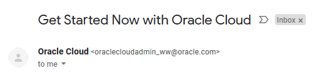
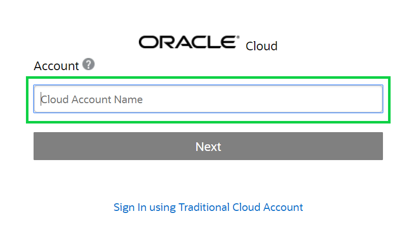
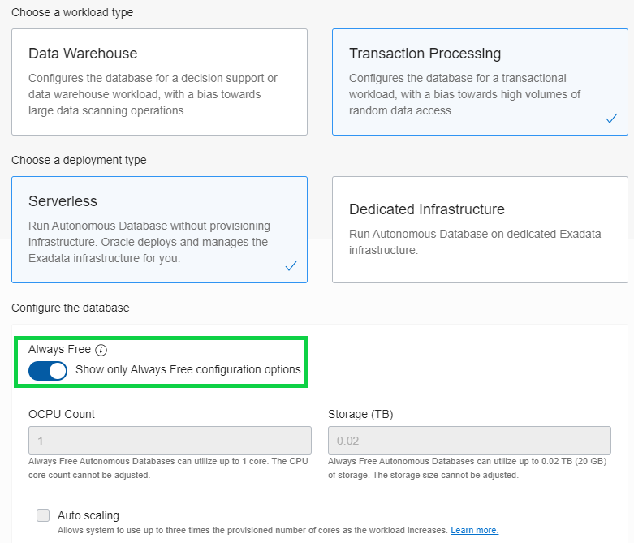
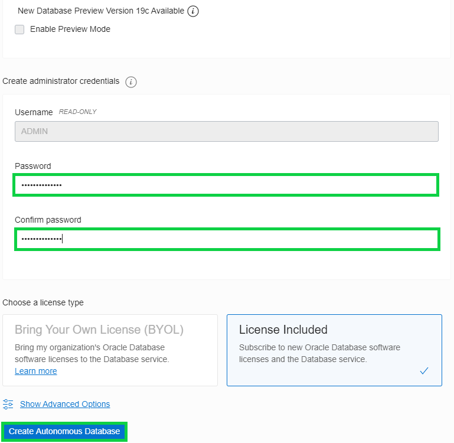
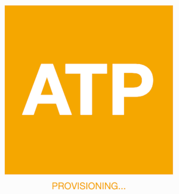
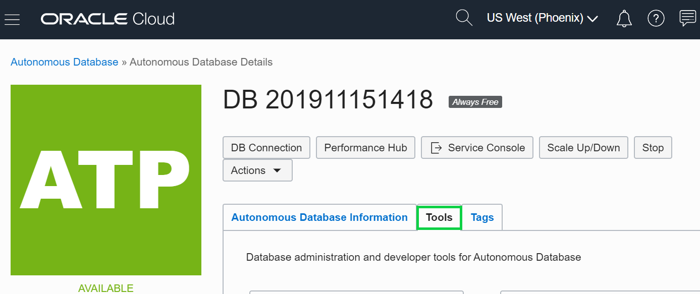
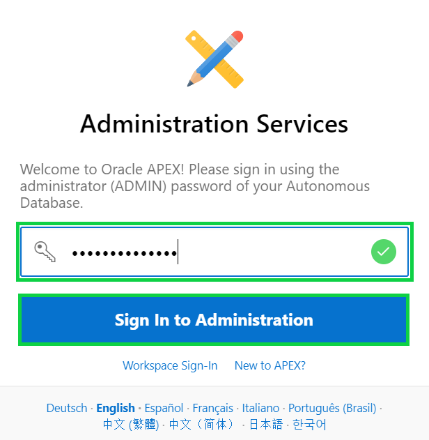
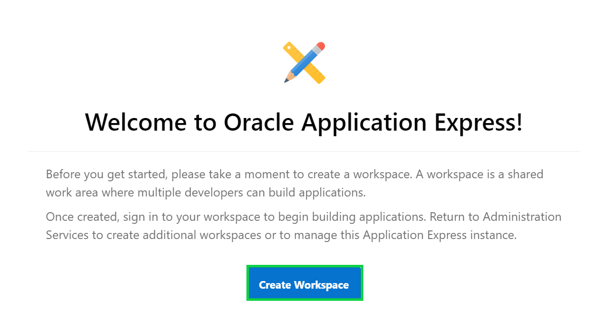
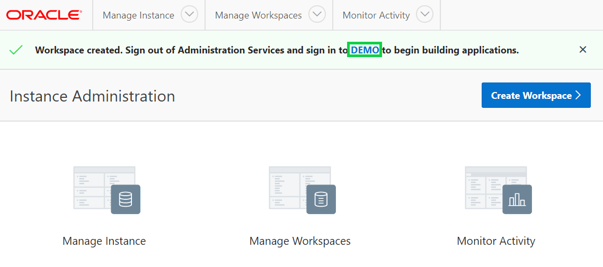

# Building an App from a Spreadsheet with Oracle Apex

This lab walks you through uploading a spreadsheet into an Oracle database table, and then creating an application based on this new table. You will then play with the Interactive Report and improve the attached form. Lastly, you will add a Calendar page and then link it to the existing form page.

*Rather than trying to email a spreadsheet to gather information from different people, simply create an app in minutes, and email the URL. This single source-of-truth, multi-user, secured, scalable app is so much better than having 20 (incomplete) spreadsheets!*

Please note this lab assumes that you already have the Autonomous Data Warehouse (ADW) or Autonomous Transaction Processing – Serverless (ATP-S) service provisioned. 

If you do not currently have a cloud service, sign up for a free trial account at https://cloud.oracle.com/try-autonomous-database

## Lab Objectives

* Obtain a Workspace
* Build your first app through uploading a Spreadsheet
* Improve the Interactive Report
* Add a Calendar

## Lab Modules

| # | Module | Est. Time |
| --- | --- | --- |
| 1 | [Creating an App from a Spreadsheet](1-building-your-first-app-creating-an-app-from-a-spreadsheet.md) | 4 min |
| 2 | [Improving the Report and Form](2-using-the-runtime-environment-improving-the-report-and-form.md) | 10 min |
| 3 | [Adding a Calendar](3-using-the-runtime-environment-adding-a-calendar.md) | 5 min |


### Parts
### **Part 1** - Acquire an Oracle Cloud trial account
If you already have an Oracle Cloud trial account, you may skip to the next part.

Please click this link to create your free account. When you complete the registration process you'll receive an account with a $300 credit that will enable you to complete the lab for free. You can then use any remaining credit to continue to explore the Oracle Cloud.

Soon after requesting your trial you will receive the following email. Once you receive this email you can proceed to Part 2.
    

### **Part 2** - Log in to your Oracle Cloud account
In this part, you will log into your Oracle Cloud account so that you can start working with various services.

1. You should have signed up for your Oracle Cloud trial account. If not, return to the Lab Introduction and complete Part 1.

2. Once you receive the **Get Started Now with Oracle Cloud** email, make note of your **Username**, **Password**, and **Cloud Account Name**.

3. From any browser go to https://cloud.oracle.com/en_US/sign-in.

4. Enter your **Cloud Account Name** in the input field and click the **Next** button.

    

5. Enter your **Username** and **Password** in the input fields and click **Sign In**.

    

### **Part 3** - Create an Autonomous Transaction Processing instance
In this part, you will create an instance of the Autonomous Transaction Processing database service.

1. From the Cloud Dashboard, select the navigation menu icon in the upper left-hand corner and then select **Autonomous Transaction Processing**.

    

2. Click **Create Autonomous Database**.

    

3. Select the **Always Free** option, enter **SecretPassw0rd** for the ADMIN password, then click **Create Autonomous Database**.

    
    
    

    After clicking **Create Autonomous Database, you will be redirected to the Autonomous Database Details page for the new instance. Continue to the next part when the status changes from:

    
    
    to:

    

### **Part 4** - Create a new workspace in APEX
When you first access APEX you will need to log in as an APEX instance administrator to create a workspace. A workspace is a logical domain where you define APEX applications. Each workspace is associated with one or more database schemas (database users) which are used to store the database objects, such as tables, views, packages, and more. These database objects are generally what APEX applications are built on top of.

1. Click the **Service Console** button.

    

2. Click **Development** option in the menu on the left, then click the **Oracle APEX** option. 

    

3. Enter the password for the Administration Services and click **Sign In to Administration**. The password is the same as the one entered for the ADMIN user when creating the ATP instance: **```SecretPassw0rd```**

    

4. Click **Create Workspace**.

    

5. Enter the following details and click **Create Workspace**.

    
    

6. Click the **DEMO** link in the success message. This will log you out of APEX administration so that you can log into your new workspace.

    

7. Enter **``SecretPassw0rd``** for the password, check the **Remember workspace and username** checkbox, and then click **Sign In**.

    
    
## Summary

At this point, you know how to create a new Autonomous Transaction Processing instance and create an APEX workspace within it. To be added. [Click here to navigate to Module 1](1-building-your-first-app-creating-an-app-from-a-spreadsheet.md)


