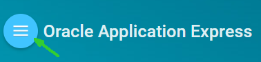

# Oracle APEX: Developing Database Web Applications

## Hands-On-Labs Guide

This series of hands-on labs are part of the course material **Oracle APEX: Developing Database Web Applications**. The labs are designed to teach you how to build applications using Oracle Application Express. The primary vehicle for teaching is a single use case which is expanded on with each lab.

## Prerequisites

The steps and screenshots in this hands-on-labs use Oracle APEX 19.1.

To run these hands-on-labs, you need to:

-   Obtain an Oracle Application Express Workspace and a Workspace Administrator /Developer user account. Select the most appropriate option from those listed below to obtain a Workspace:

    -   [apex.oracle.com](http://apex.oracle.com/) - Request a workspace on Oracle's free 'development only' service for evaluating the technology.

    -   [Oracle Database Cloud Service](https://cloud.oracle.com/database) - Request service on the Oracle Database Cloud Service. Once provisioned you will be provided access to your cloud service which includes an Oracle Application Express Workspace.

    -   [Oracle Database 11g Express Edition](http://www.oracle.com/technetwork/products/express-edition/overview/index.html) - Download Oracle XE and install on your laptop or desktop machine and then [download](http://www.oracle.com/technetwork/developer-tools/apex/downloads/index.html) and install the latest Oracle Application Express release.

    -   [Oracle VM Virtual Box](http://www.oracle.com/technetwork/database/enterprise-edition/databaseappdev-vm-161299.html) - Download Oracle VM Virtual Box and then import the [Database Application Development Appliance](http://www.oracle.com/technetwork/database/enterprise-edition/databaseappdev-vm-161299.html) which includes Oracle Database 12c, Application Express and a number of labs pre-installed.

-   Download the lab source files from [GitHub Page](https://github.com/ckoratam/OracleAPEX-Curriculum). Alternatively, download the **apex-curriculum-3681867.zip** file from [https://apex.oracle.com/education](http://www.oracle.com/technetwork/developer-tools/apex/learnmore/apex-education-2517914.html) and then extract the **apex-curriculum-labs** folder into your working directory. The apex-curriculum-3681867.zip file also includes the apex-curriculum-ppts folder. This folder contains the slide decks for all of the lessons in this course material. Note that the slide decks for the lessons are not hosted on this GitHub page.

## IMPORTANT: 
- The Lab documentation is **best viewed** by using the HOL's [GitHub Pages Website URL](https://oracle.github.io/learning-library/workshops/apex-en/). Once you are viewing the HOL's GitHub Pages website, you can see a list of Lab Guides at any time by clicking on the **Menu Icon**

    

- To view the Lab Guide source, go to the [github oracle](https://github.com/oracle/learning-library/tree/master/workshops/apex-en) repository.
- To log issues, go to the [github oracle](https://github.com/oracle/learning-library/tree/master/workshops/apex-en) repository and log an issue first.
- Steps to contribute translated material:
   1. Go to the [github oracle](https://github.com/oracle/learning-library/tree/master/workshops/apex-en) repository and log an issue first. See [Contributing guidelines](https://github.com/oracle/learning-library/blob/master/CONTRIBUTING.md). Alternatively, you can send an email to the mailing list:oracle-application-express_ww@oracle.com with the subject "Oracle APEX-GitHub Request".
   2. You are then added as a contributor to this [GitHub](https://github.com/ckoratam/OracleAPEX) repository.
   3. Upon acceptance, these contributions are pulled and merged with the [github oracle](https://github.com/oracle/learning-library/tree/master/workshops/apex-en) repository.

## Hands-on Overview

**Documentation**: [hol_overview](hol_overview)

## Unit 1: Getting Started with Oracle Application Express

**Documentation**: [hol_1.md](hol_1.md)

### Labs

- Log in to Oracle APEX environment
- Navigating through the Major Components of Oracle APEX
- Installing and Running a Packaged Application

## Unit 2: Using SQL Workshop

**Documentation**: [hol_2.md](hol_2.md)

### Labs

- HOL 2-1: Loading the Tables and Data
- HOL 2-2: Creating a Lookup Table

## Unit 3: Creating a Database Application

**Documentation**: [hol_3.md](hol_3.md)

### Labs

- HOL 3-1: Creating a Database Application from Scratch
- HOL 3-2: Creating a Database Application from a Spreadsheet

## Unit 4: Managing Pages in Page Designer

**Documentation**: [hol_4.md](hol_4_.md)

### Labs

- Creating a Dashboard
- Reviewing Page Designer
- Editing page components in Page Designer

## Unit 5:  Developing Reports

**Documentation**: [hol_5_.md](hol_5_.md)

### Labs

- HOL 5-1: Creating a Classic Report
- HOL 5-2: Creating an Interactive Report
- HOL 5-3: Creating an Interactive Grid

## Unit 6:  Managing and Customizing Interactive Reports

**Documentation**: [hol_6.md](hol_6.md)

### Labs

- HOL 6-1: Using an Interactive Report
- HOL 6-2: Customizing an Interactive Report as a Developer
- HOL 6-3: Customizing the Team Members Interactive Report
- HOL 6-4: Customizing the Projects Interactive Report
- HOL 6-5: Customizing the Milestones Interactive Report
- HOL 6-6: Customizing the Tasks Interactive Report

## Unit 7:  Managing and Customizing Interactive Grids

**Documentation**: [hol_7.md](hol_7.md)

### Labs

- HOL 7-1: Customizing an Interactive Grid as a Developer
- HOL 7-2: Customizing an Interactive Grid as an End User

## Unit 8:  Creating and Using Forms

**Documentation**: [hol_8.md](hol_8.md)

### Labs

- HOL 8-1: Updating the Form Pages in the Demo Projects Application
- HOL 8-2: Creating a Form on a Table and Linking a Report

## Unit 9:  Creating Application Page Controls

**Documentation**: [hol_9.md](hol_9.md)

### Labs

- HOL 9-1: Updating the Team Members Pages
- HOL 9-2: Updating the Projects Pages
- HOL 9-3: Updating the Milestones Pages
- HOL 9-4: Updating the Tasks Pages

## Unit 10:  Adding Computations, Processes, and Validations

**Documentation**: [hol_10.md](hol_10.md)

### Labs

- HOL 10-1: Implementing Validations on the Maintain Project Page
- HOL 10-2: Creating and Using a Computation
- HOL 10-3: Creating and Using a Process
- HOL 10-4: Creating and Using Validations

## Unit 11:  Implementing Navigation in your Application

**Documentation**: [hol_11.md](hol_11.md)

### Labs

- Updating the Breadcrumb Entries for the Team Members, Projects, Milestones, and Tasks pages
- Updating the Navigation Menu Entries and Including Icons

## Unit 12:  Using Themes and Themes Styles

**Documentation**: [hol_12.md](hol_12.md)

### Labs

- HOL 12-1: Updating the Team Members Pages
- HOL 12-2: Creating and Using Theme Styles

## Unit 13:  Implementing Security in your Application 

**Documentation**: [hol_13.md](hol_13.md)

### Labs

- HOL 13-1: Creating and Using an Authorization Scheme
- HOL 13-2: Creating and Using an Authentication Scheme
- HOL 13-3: Controlling User Access by Using the Access Control Administration

## Unit 14:  Adding Additional Pages to your Application 

**Documentation**: [hol_14.md](hol_14.md)

### Labs

- HOL 14-1: Creating and Customizing a Calendar
- HOL 14-2: Modifying the Dashboard Pages
- HOL 14-3: Updating the Project Tasks Chart
- HOL 14-4: Adding the Project Milestones Chart
- HOL 14-5: Adding the Project Status Chart
- HOL 14-6: Adding the Project Tree

## Unit 15:  Creating and Using Dynamic Actions and Plug-ins

**Documentation**: [hol_15.md](hol_15.md)

### Labs

- HOL 15-1: Creating and Using a Dynamic Action on the Maintain Project Page
- HOL 15-2: Creating and Using a Dynamic Action on the Maintain Task Page
- HOL 15-3: Creating and Using Dynamic Actions on the Project Tree Page
- HOL 15-4: Creating and Using a Plug-in
- HOL 15-5 Adding Additional Reports
- HOL 15-6 Updating the Reports Page
- HOL 15-7 Updating the Dashboard Page
- HOL 15-8: Updating the Home Page

## Unit 16:  Migrating Application Development Between Environments

**Documentation**: [hol_16.md](hol_16.md)

### Labs

- HOL 16-1: Importing an Application
- HOL 16-2: Migrating your Application Development Between Environments