# Unit 1: Getting Started with Oracle Application Express

To log in to Oracle Application Express, you need a Workspace name, username, and the password created for that Workspace. In this hands-on-lab, you log in to your Oracle Application Express Workspace. Once logged in, you navigate through the major components of Oracle Application Express. This lab also covers installing and running a packaged application.

1.	Log in to Oracle Application Express Workspace. Perform the following steps:

    a)	Open your browser and enter the URL to sign in to Application Express development environment. You can access the Oracle Application Express application with the URL: **http://< hostname >:< port >/apex**. Alternatively, if you have already signed up for a free Workspace on apex.oracle.com, use the URL: http://apex.oracle.com, then click the **Sign In** button (top right).

    b)	The login page appears. Enter the **Workspace name**, **username**, and **password**. Click **Sign In**. You may be prompted to change your Workspace password the first time you log in. This option is set when your username and password are created by the Oracle Application Express administrator. You can set your new password to be the same as your old password.

    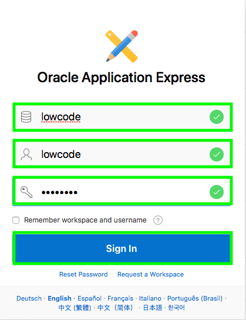

2.	The Workspace home page appears.
    Click **App Builder**.
    
    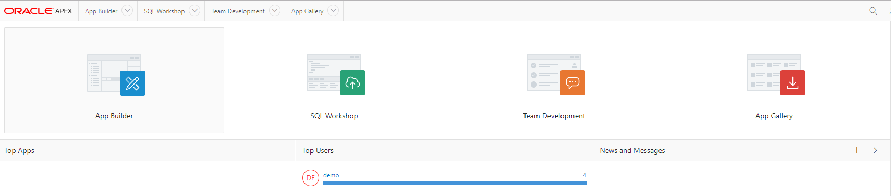

3. 	You do not have any applications listed right now. You can either create a new app or install a sample or productivity app. 
    Review the **components**.
    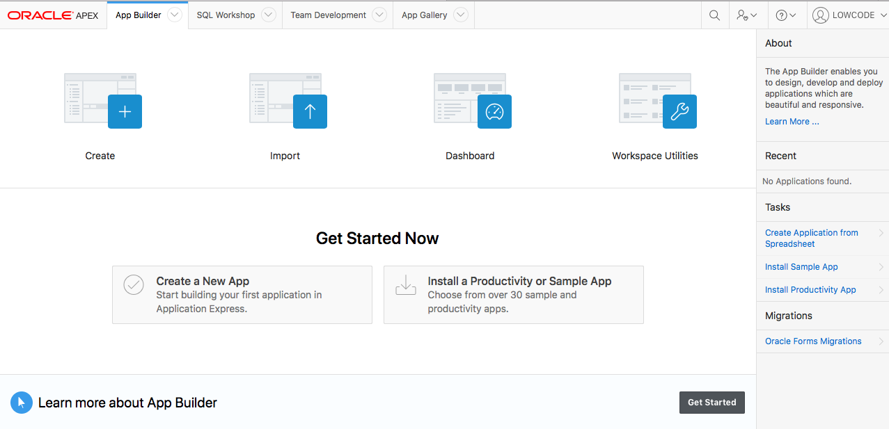

4. 	Click **SQL Workshop**.  
    The SQL Workshop home page appears. Review each of the SQL Workshop components.
    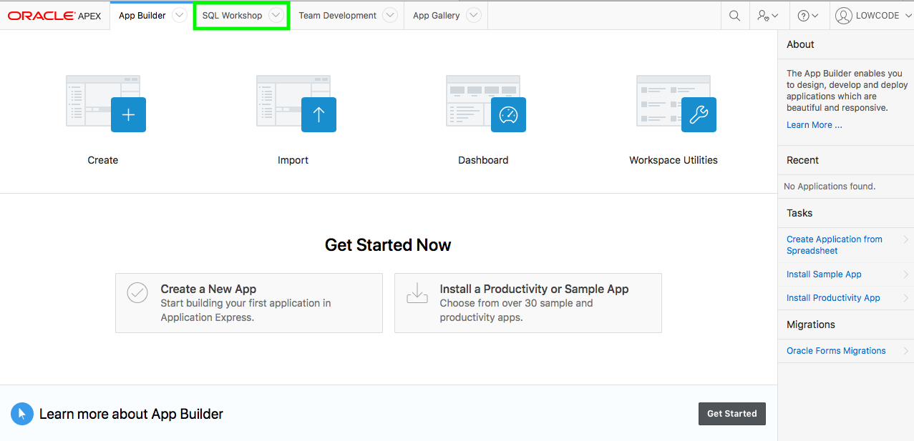

5.	Click **App Gallery**.
    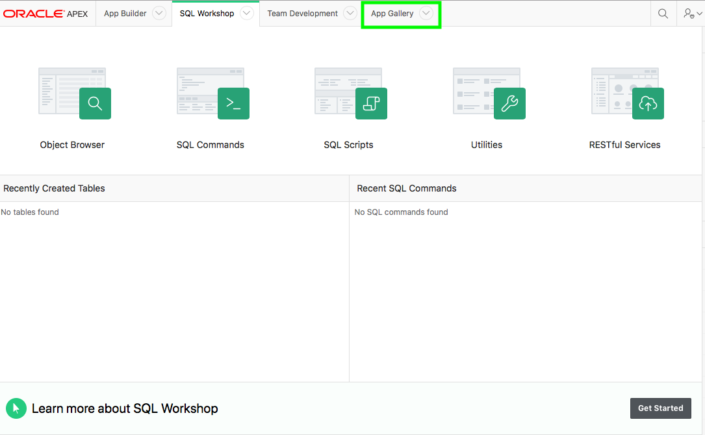

6.	The App Gallery page displays all of the Productivity and Sample applications.   
    Click **Sample**.
    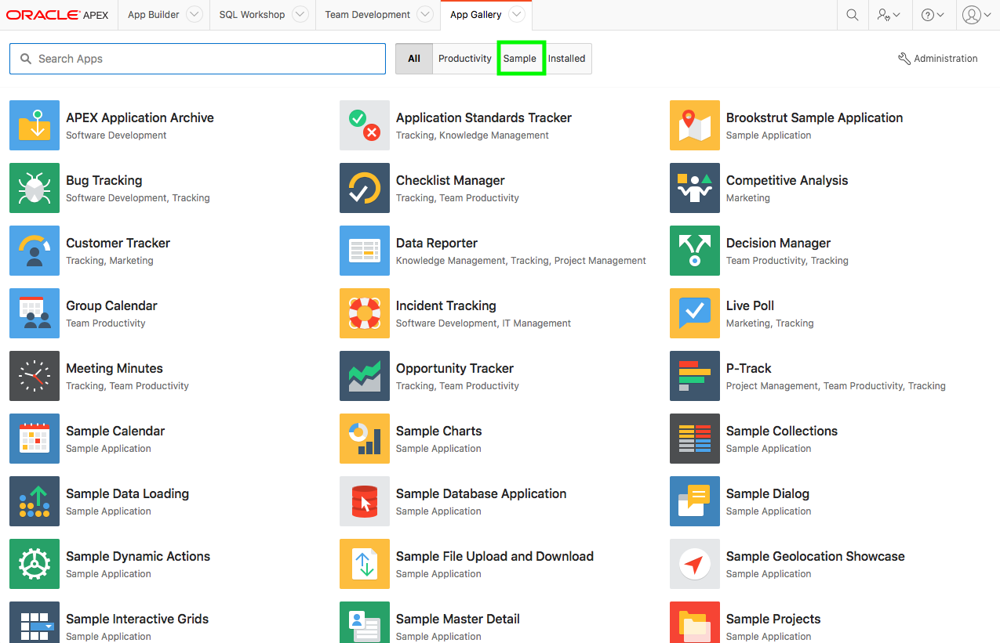

7.	Now, you install packaged applications.   
    Click **Sample Reporting**.
    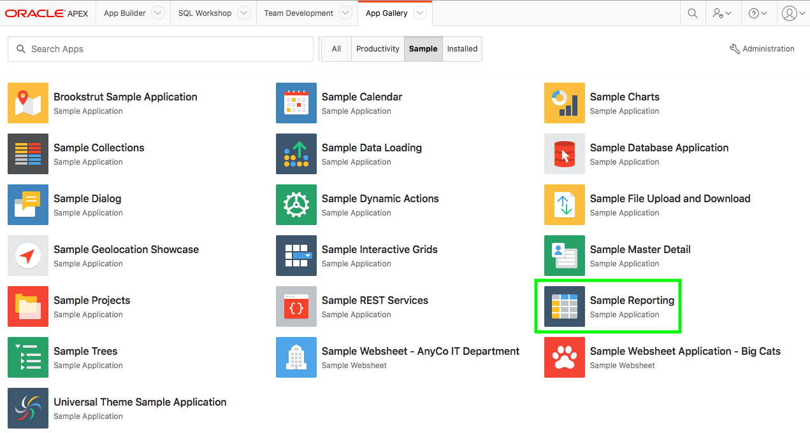

8.	Click **Install App**.
    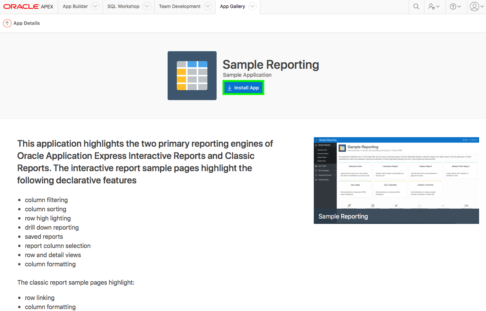

9.	Accept the defaults and click **Next**.
    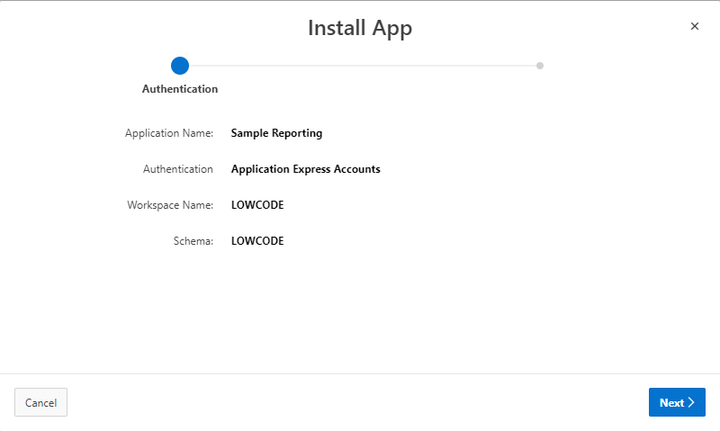

10.	Click **Install App**.
    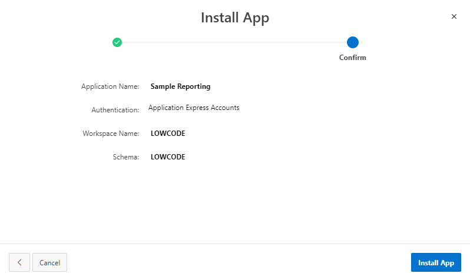

11.	Click the **Run** button.
    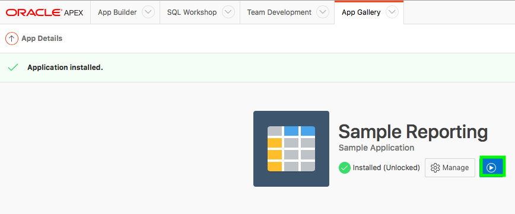

12.	Log in to the Sample Reporting application. Enter your Username and Password (same as your Workspace credentials) and click **Sign In**.
    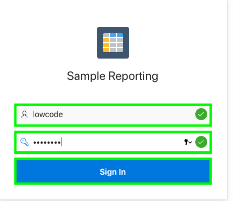

13.	You now see the Sample Reporting application home page.   
In the Runtime Developer Toolbar, click **Home**.
    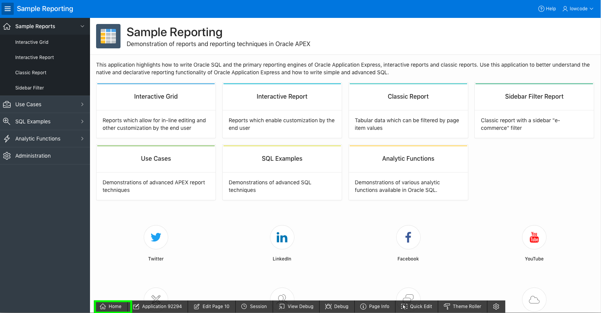

14.	Click **App Builder**. 
    
 15.	Toggle between the **View Icons** and the **View Report** buttons. You see that applications are displayed along with their icons and in report format.  
    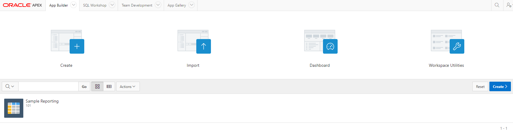
    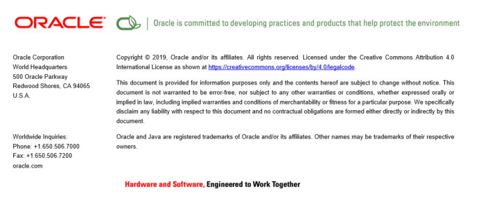

