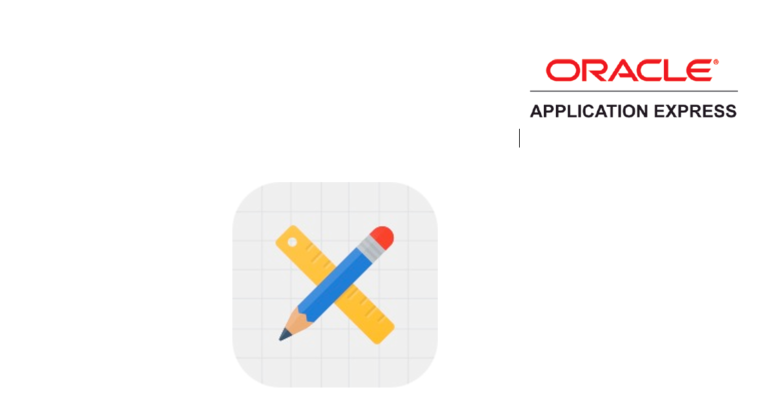

**Oracle Application Express: Developing Database Web Applications**

**Hands-On-Labs Guide**

*Unit 16: Migrating Application Development Between Environments*

This exercise includes two hands-on-labs and uses the Demo Projects application.

**HOL 16-1 Importing an Application**: In this lab, you import an application along with the underlying database objects and seed data.

**HOL 16-2 Migrating your Application Development Between Environments**: In this lab, you export an application and then use SQL Workshop to export database objects and seed data.

Steps 3 through 19 in this lab are optional. You need a target APEX environment to perform these steps. To test these steps you might want to use a different Workspace. If you want to import the application in to the same Workspace, then you might have to choose a different application ID. Installing database objects and seed data will still fail, as they are already created.

**HOL 16-1: Importing an Application**

In this lab, you import an application in to your Workspace. Along with the application definition, you also install the supporting objects.

This lab uses the application export file **demo projects app export-unit 15.sql** which is the application export file for HOL 15-8.
Note:
-  The steps in this lab assume that you are importing an application within the same Workspace that you used in the previous hands-on labs. If you are importing the application in to a different Workspace (either on the same or different instance), the steps might slightly differ.
-	This lab assumes that you want to reuse the same application ID from the export file.
-	The underlying database objects and seed data for this application are packaged along with the application definition in a single file. After installing the application, you can view the installation scripts for the database objects and data by clicking **Supporting Objects** on the application home page.
-	Installation of supporting objects and seed data may fail if you already have the database objects created in your schema. If you do not need your existing objects and seed data, then you can simply run the **drop_objects.sql** before proceeding with the steps in this lab. However, note that this script will completely delete all of your underlying database objects along with the data.
    **Note**: If you want to take a backup of your existing application along with the database objects and seed data, perform steps 1 and 2 in HOL 16-2.

1.	Navigate to **App Builder** and click **Import**.
    
    

2.	Click **Choose File**.
    Navigate to your working directory and double-click the **demo projects app export-unit 15.sql** file. Then, click **Next**.
    **Note**: To import any other APEX application export in to your Workspace, you select that file in this step.

    

3.	On the File Import Confirmation page, click **Next**.

4.	For Install As Application, choose **Auto Assign New Application ID**. 
    The steps might slightly differ if you select Reuse Application ID < n > option.
    Click **Install Application**.

    

5.	Click **Edit Application**.

    

6.	On the Supporting Objects page, click **Next**.

7.	On the Confirmation page, click **Install**.

8.	The application is successfully installed now. 
    Click **Run Application**.

    **Note**: The installation of database objects and seed data may succeed or fail, depending on what database objects are already created. If installation fails, click **Install Summary**, and review the errors. The errors should relate to objects already existing, such as ORA-00955: name is already used by an existing object.

**HOL 16-2: Migrating your Application Development between Environments** 

In this lab, you export an application definition, underlying database objects along with the seed data.
Steps 3 through 15 are optional. After exporting application from the current development environment, you log in to the target Application Express environment, import the application and then load the tables along with data.

1.	From your current development environment, export an application. Navigate to App Builder and in the report, select the application you want to export. In this lab, you export the Demo Projects application that you created until HOL 15-5. Alternatively, you can export the application that you imported in HOL 16-1.
    a)	On your application home page, click **Export / Import**.

    b)	Select **Export** and click Next.

    c)	Make sure you select **Yes** for Export Private Reports and Export with Original IDs.
    Click **Export**.

    d)	The application export file is saved in your local directory as a .sql file. You might want to rename the file.
    Note: Depending on the browser, if you see a Save dialog, click **Save**.

2.	Now, you export database objects and data. Perform the following steps:
    a)	In your Workspace, click **SQL Workshop > Utilities**.
    Under Utilities, select **Generate DDL**.

    b)	Click **Create Script**.

    c)	Verify the Schema and click **Next**.

    d)	For Output, select **Save As Script File**.
    For Object Type, select **Table** and click **Next**.

    e)	Select all of the relevant tables for this application. 
    Select the following tables:
        - **DEMO_PROJECTS**
        - **DEMO_PROJ_COMMENTS**
        - **DEMO_PROJ_CONSTRAINTS**
        - **DEMO_PROJ_MILESTONES**
        - **DEMO_PROJ_STATUS**
        - **DEMO_PROJ_TASKS**
        - **DEMO_PROJ_TASK_LINKS**
        - **DEMO_PROJ_TASK_TODOS**
        - **DEMO_PROJ_TEAM_MEMBERS**
    Click Generate **DDL**. 

    f)	For Script Name, enter a meaningful name, for example **Create Demo Project Tables**. Optionally enter a description.
    Click **Create Script**.

    g)	The DDL is now saved as a script under SQL Scripts. 
    Click the **Edit** icon (pencil) on the recently created script.

    h)	Click **Download**.

    i)	Click **Save**.

    j)	Now, create a script to include trigger definitions and then download the script.
    Repeat steps a through i and input the following:
    -	Select Trigger for Object Type
    -	Enter **Create Demo Projects Triggers** for script name.
    -	Select the following triggers:
        :heavy_check_mark:	biu_demo_proj_status
        :heavy_check_mark:	biu_demo_proj_team_members
        :heavy_check_mark:	biu_demo_projects
        :heavy_check_mark:	biu_demo_proj_milestones
        :heavy_check_mark:	biu_demo_proj_tasks
        :heavy_check_mark:	biu_demo_proj_task_todos
        :heavy_check_mark:	biu_demo_proj_task_links
        :heavy_check_mark:	biu_demo_proj_comments

    k)	Now that you have both the DDL scripts created and downloaded, you need to unload the table data. You use SQL Workshop > Object Browser to download the CSV files for your data.
    Click the SQL Workshop down arrow, select **Object Browser**.

    l)	Select the **DEMO_PROJECTS** table and click **Data**.

    m)	Click **Download**. Save the CSV file.

    n)	Repeat steps l and m until you unload data from all of the Demo Projects application tables.
   

3.	You have exported the application definition, database objects and data from your current development environment. Now first navigate to the target APEX environment and install the application definition.
    Log into your target Application Express development environment and perform the following steps:

    a)	Navigate to **App Builder** and click **Import**

    b)	Click **Choose File**. 
    Navigate to your working directory and double-click the application export file. Then, click Next.

    c)	On the File Import Confirmation page, click **Next**. 

    d)	For Install As Application, specify your choice for Application ID. The default is Auto Assign New Application ID.

    e)	Click **Install Application**. The application is successfully installed now.

4.	Log into your target Application Express development environment.

5.	Use SQL Workshop to load and run the script file, for creating the table and trigger definitions
    a)	Click SQL Workshop.

    b)	Click SQL Scripts.

6.	Upload the script to create the tables first. 
    a)	Click **Upload**. 

    b)	For File, click **Choose File**.  

    c)	In the operating system File Browser, navigate to the subdirectory where you saved the table script file. Locate **Create Demo Project Tables.sql**, and double-click the file.

    d)	Click **Upload**.

7.	Click the **Run** icon to the right of the script you uploaded.
    Click Run Now.

8.	Click the View Results icon for the script you just ran.

9.	To create triggers, repeat steps 5 through 8 and select the **Create Demo Projects Triggers.sql**.

10.	Currently the tables you created do not have any data. Use the CSV files you created to populate the tables.

    **Note**: The order in which the tables are populated is crucial, to ensure referential integrity does not prevent records loading. 
    For example, loading any records into DEMO_PROJECTS before loading the records into DEMO_PROJ_TEAM_MEMERS will fail, as the ASSIGNEE column in DEMO_PROJECTS must correspond to an existing record in DEMO_PROJ_TEAM_MEMBERS. 

11.	Click **SQL Workshop**. Then, click **Utilities**

12.	Click **Data Workshop**.

13.	Under Tasks, click **Load to Existing Table**.

14.	Select **Upload file (comma separated or tab delimited)**. Click **Next**.

15.	Verify the value for Schema is correct. For Table, select the table name for which you want to populate the data first in order. Select **DEMO_PROJ_TEAM_MEMBERS**.

16.	For File, click **Choose File**, locate the CSV file for the corresponding table that you selected in the above step, and double-click the file or click the file and then click Open. 

17.	Click **Load Data**.

18.	Load data for all of the Demo Projects tables. Repeat steps 11 through 17 for each of the table. 

19.	Now, you can run and review the application.

    
