# Unit 5: Developing Reports

This exercise includes three hands-on-labs.

**HOL 5-1 Creating a Classic Report**: In this hands-on-lab, you create a classic report region on the Dashboard page of the Demo Projects application.

**HOL 5-2 Creating an Interactive Report**: In this hands-on lab, you create a new database application and then using the Create Page wizard, you add an interactive report page.

**HOL 5-3 Creating an Interactive Grid**: In this hands-on lab, you use the Create Page wizard and add an interactive grid page in the Budget App application.

### HOL 5-1 Creating a Classic Report
In the Demo Projects application, you create a report that allows each Team Member to see their outstanding tasks.

1. View the Dashboard page in page designer. If you are on the Dashboard page, then click **Edit Page < n >** in the Developer Toolbar.
    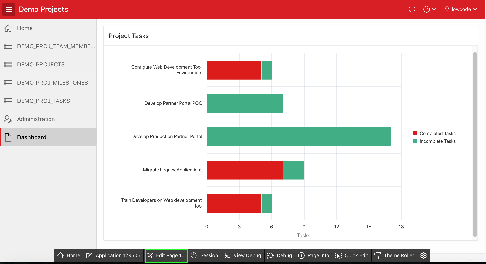

2. In the Rendering tree, right-click Content Body and select Create Region.
    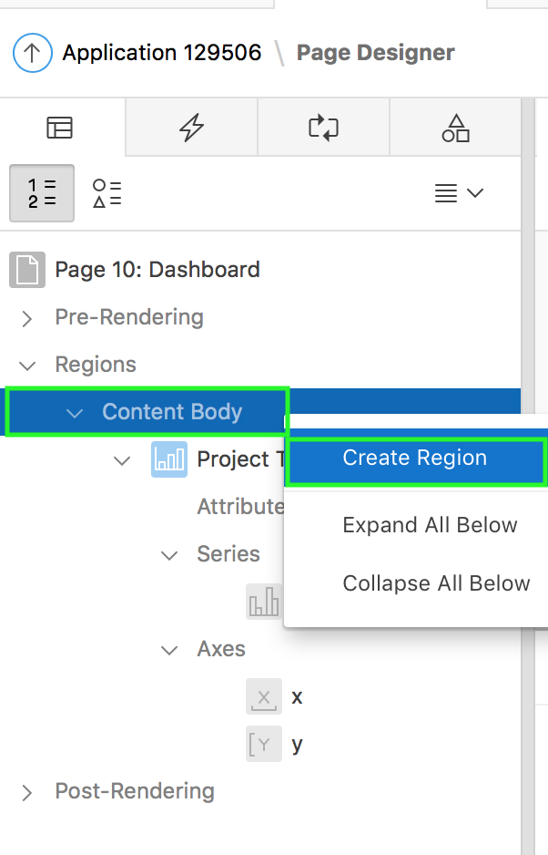

3. In the property editor, under Identification, enter **My Outstanding Tasks** for Title. Select **Classic Report** for Type.
    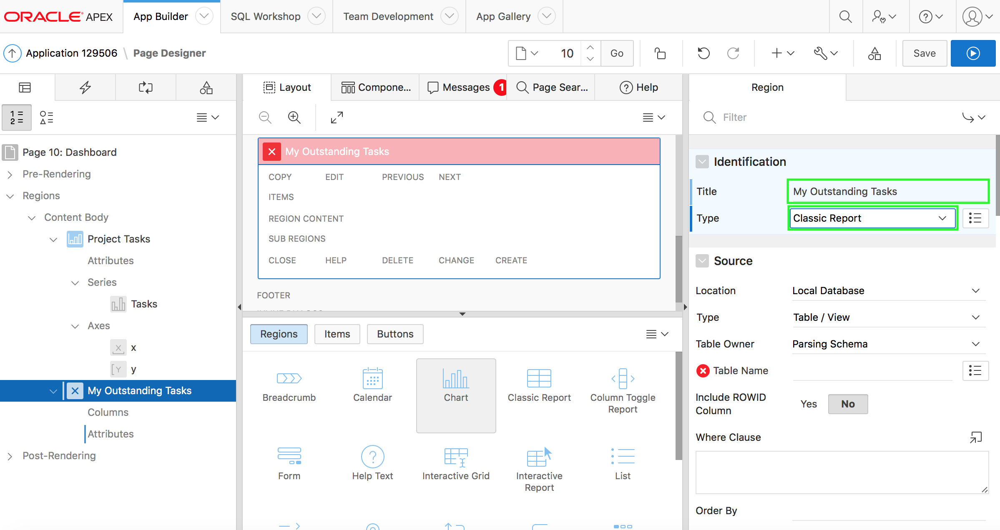

4. In the property editor, under Source, select SQL Query for Type.   
   Then, copy and paste the following code for SQL Query.
    ```
    select p.name project
    , t.name task
    , t.end_date
    from demo_proj_tasks t
    , demo_projects p
    , demo_proj_milestones m
    , demo_proj_team_members tm
    where p.id = t.project_id
    and m.id = t.milestone_id (+)
    and tm.id = t.assignee and nvl(t.is_complete_yn, 'N') = 'N'
    and upper(tm.username) = upper(:APP_USER)
    order by t.end_date
    ```
    **Note**: The where condition of username = :APP_USER restricts the records to those assigned to the person running the application.
    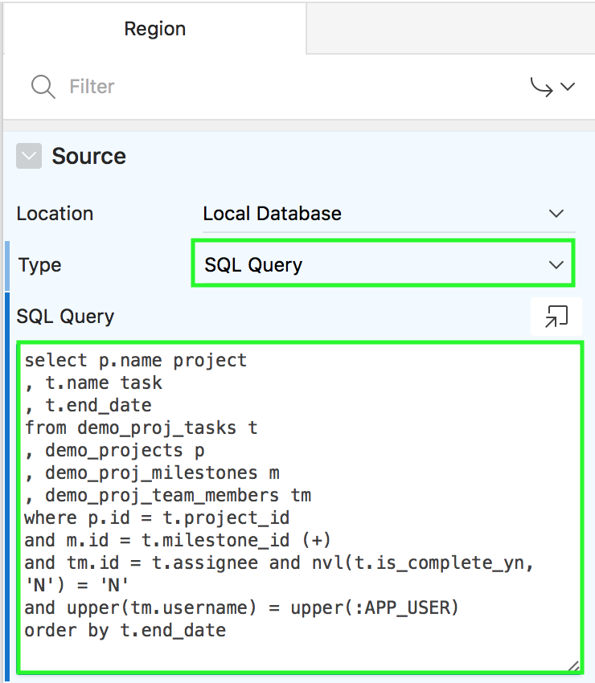

5. In the Property Editor, locate Appearance > Template Options and click **Use Template Defaults, Scroll - Default**.
    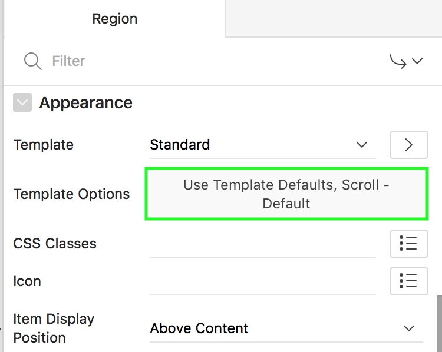

6. For General, enable **Remove Body Padding**, and for Body Height select **480px**. Click **OK**.
    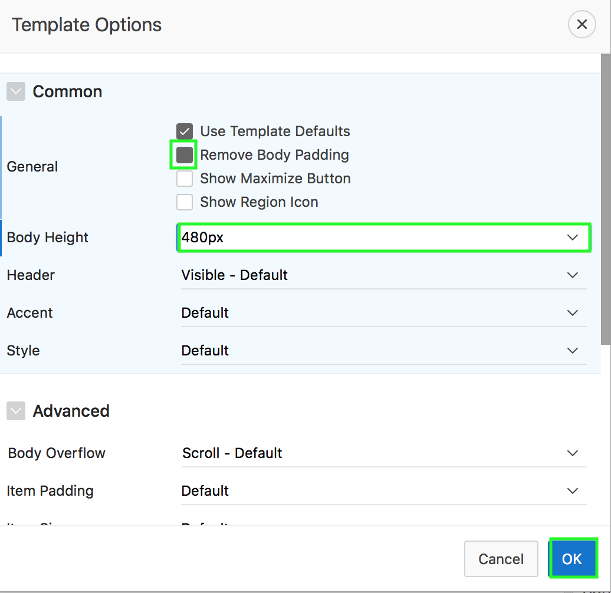

7. Locate the Rendering tree. Under the My Outstanding Tasks region, click **Attributes**.

8. Under Attributes, locate Appearance > Template Options and click **Use Template Defaults, Enable, Enable**.
    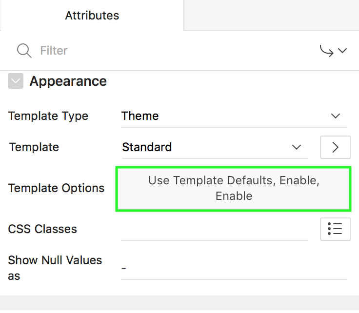

9.	For General, enable Stretch Report, and for Report Border, select No Outer Borders. Click **OK**.
**Note**: Region Template Options (such as Body Height, Header, Style and so on) alter the overall presentation of a region. However, Attribute Template Options (such as Stretch Report, Row Highlighting and so on) alter the way the records within a region display.
    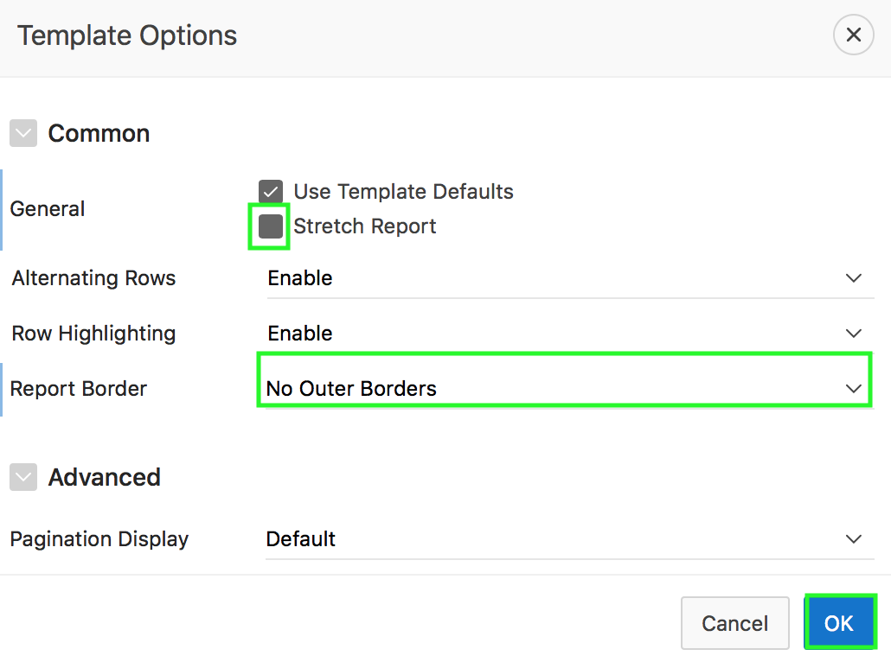

10.	Click**Save**. Run the application to see how the Home page looks now. Click **Save and Run Page**. Your Dashboard page might look like:
    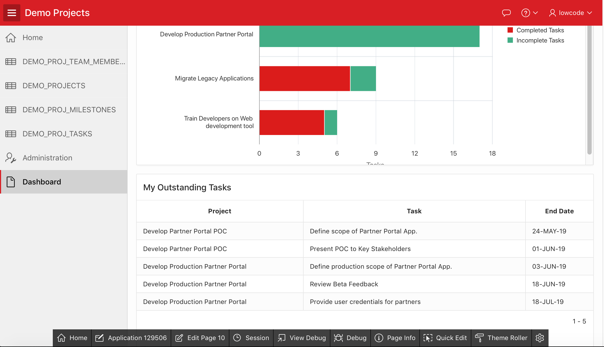

11.	In the Developer Toolbar, click **Home**.

### HOL 5-2 Creating an Interactive Report

In this lab, you create an interactive report on the HARDWARE table. You created this table in HOL 2-2. First, you create a database application and then you create the interactive report page.

1. Create a database application. Perform the following steps:
    a)	Navigate to App Builder. Click **Create**.
    b)	Click **New Application**.
    c)	Enter **Hardware** for Name, accept the remaining defaults and click **Create Application**. 

2. Now, create an interactive report on the HARDWARE table. On the application home page, click **Create Page**.
    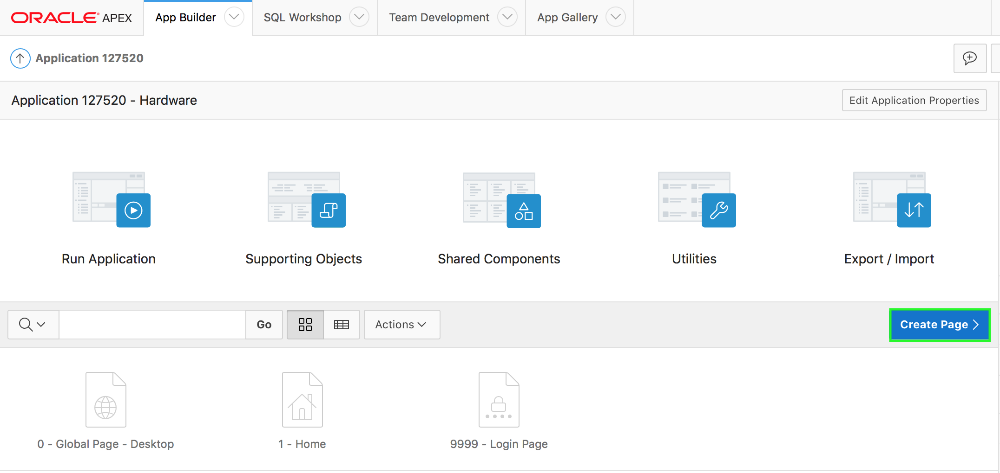

3. Select **Report** for Page Type, and click **Next**.
    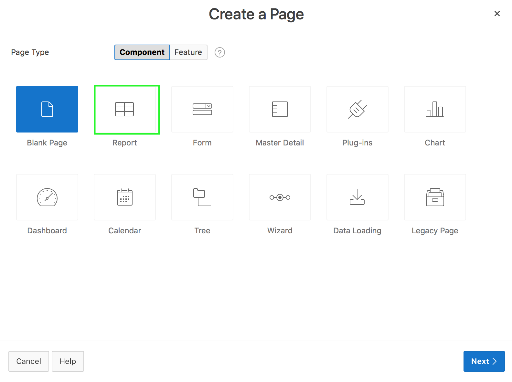

4. Select **Interactive Report** and click **Next**.
    

5. For Page Attributes:
    - Page Name: Enter **Hardware Interactive Report**
    - Breadcrumb: **Select Breadcrumb**
    - Parent Entry: **Home**
    Click **Next**.
    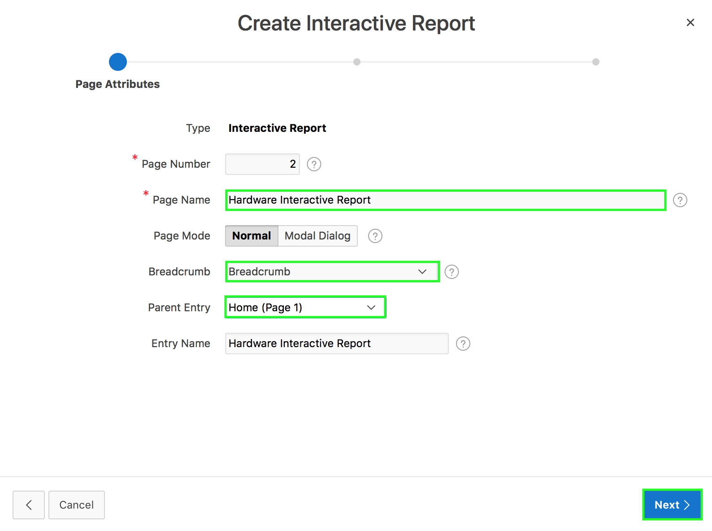

6. For Navigation Menu:
    - Navigation Preference: Select **Create a new navigation menu entry**
    - Parent Navigation Menu Entry: **Home**
    Click **Next**.

7. For Report Source > Table / View Name, select **HARDWARE** and click **Create**.
    

8. Click **Save and Run Page**. 

9. Enter your Workspace username and password. Click **Sign In**. Your interactive report might look like:
    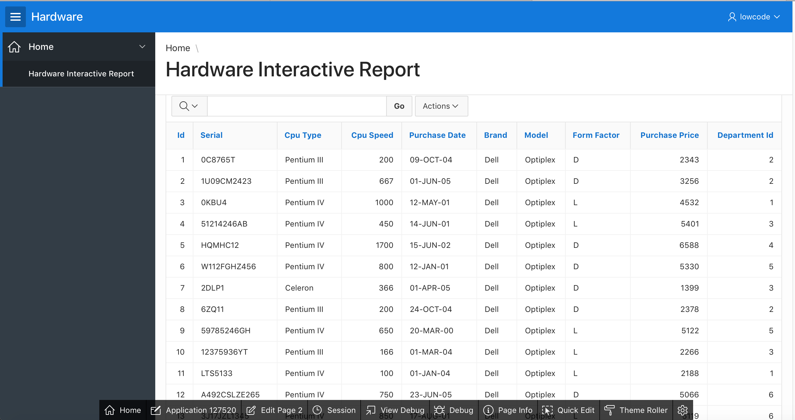

10.	In the Developer Toolbar, click **Home**.

### HOL 5-3 Creating an Interactive Grid

In this lab, you create an interactive grid on the PROJECT_BUDGET table. You already created the Budget App application in HOL 3-2. Now, you create an interactive grid in the Budget App application.

1. Navigate to **Application Builder**. Select **Budget App**. If you are in the View Report mode, select **Budget App** under Name.
    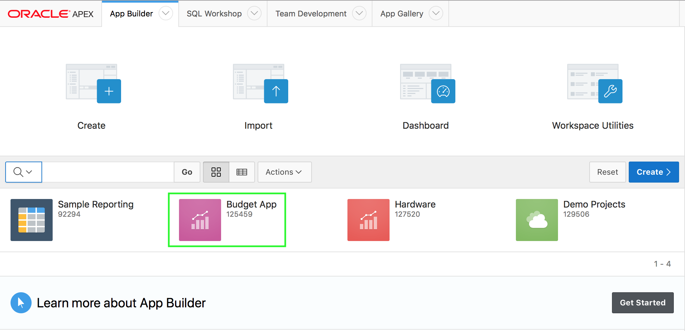

2. Click **Create Page**.
    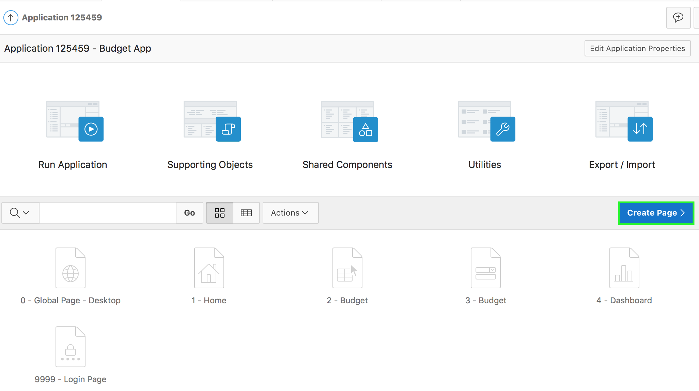

3. Select **Report** and click **Next**.

4. Select **Interactive Grid** and click **Next**.
    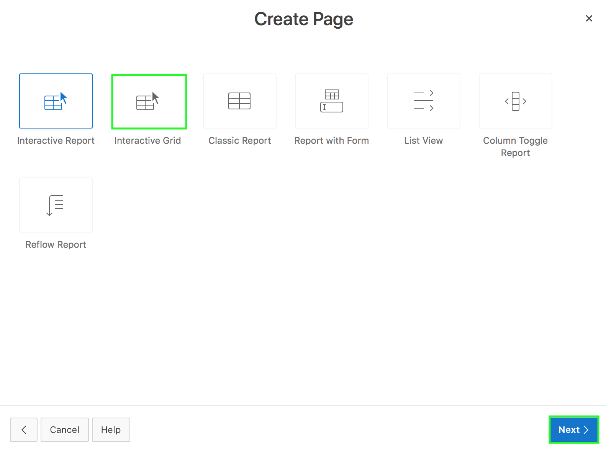

5. For Page Attributes, Enter **Project Budget Interactive Grid** for Page Name and click **Next**.

6. For Navigation Menu:
    - Navigation Preference: Select **Create a new navigation menu entry**
    - New Navigation Menu Entry: **Interactive Grid**
Click **Next**.

7. In the Report Source dialog, note that you can set the Editing Enabled to Yes or No. In this lab, you accept the default, **No**.  
Select **Project_Budget** for Table / View Name and click **Create**.
    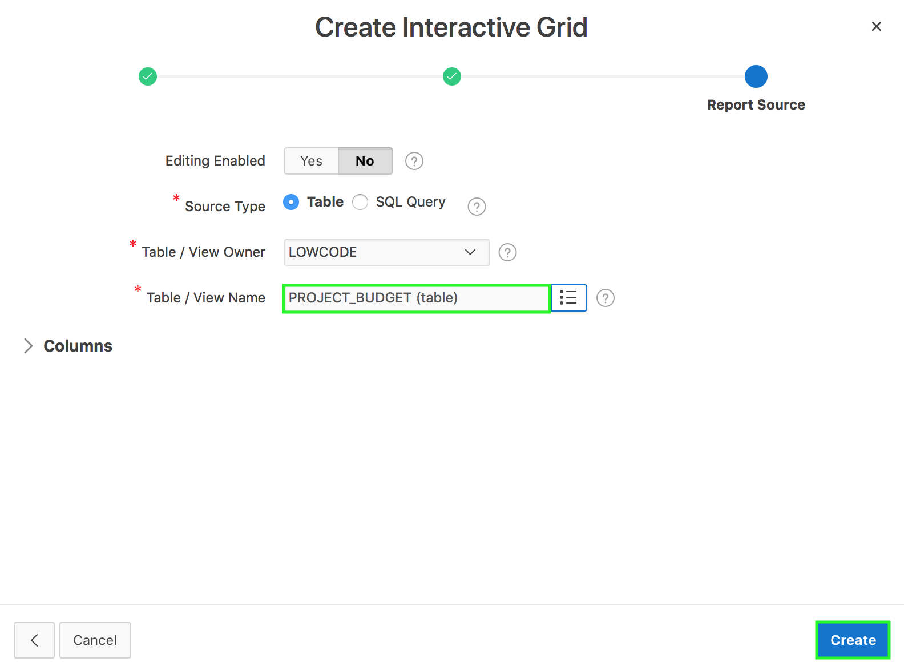

8. Click **Save and Run Page**. The interactive grid displays. Your screen might look like:
    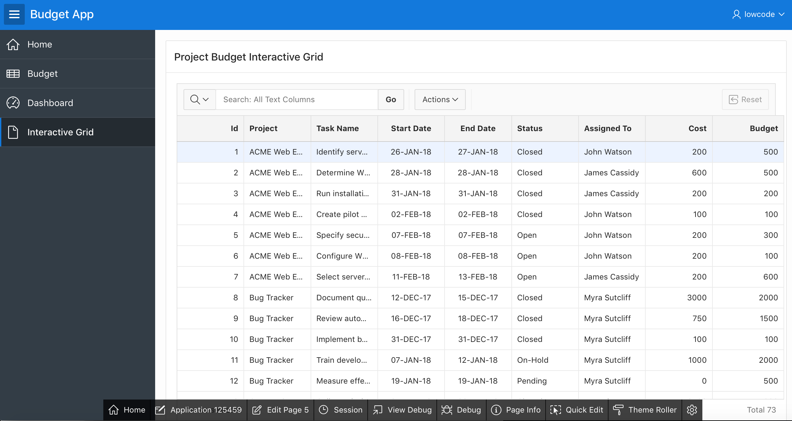

9.	In the Developer Toolbar, click **Home**.


    


