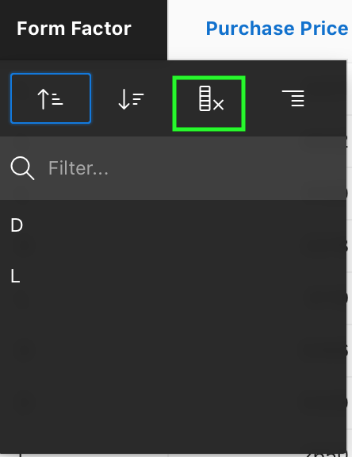
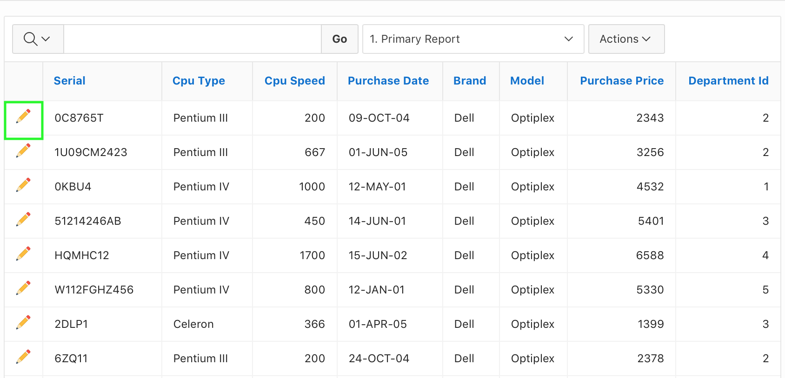
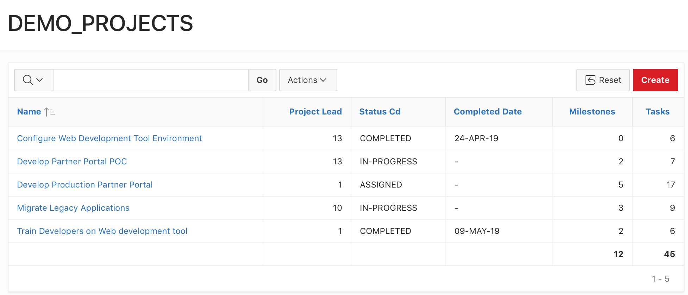
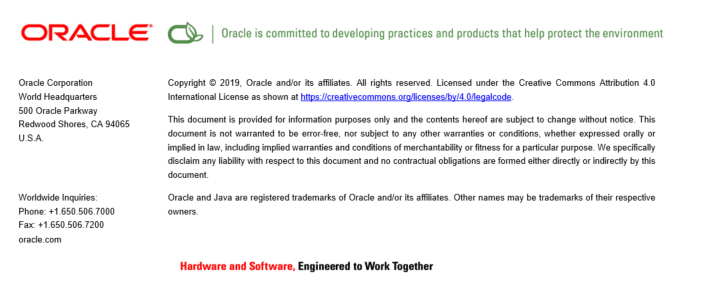

# Unit 6: Managing and Customizing Interactive Reports

This exercise includes two sets of hands-on-labs. Both HOL 6-1 and HOL 6-2 utilize the Hardware application that you created in HOL 5-2.


**HOL 6-1: Using an Interactive Report**: In this lab, you customize and use an interactive report as an end user.
 
**HOL 6-2: Customizing an Interactive Report as a Developer**: In this lab, as a developer, you customize an interactive report for your end users.

Labs HOL 6-3 through HOL 6-6 use the Demo Projects application. 

**HOL 6-3: Customizing the Team Members Interactive Report**: In this lab, you modify the source query, and customize the Demo Proj Team Members interactive report.
 
**HOL 6-4: Customizing the Projects Interactive Report**: In this lab, as a developer, you modify the source query, create a new column link, and customize the display of the Demo Projects interactive report.

**HOL 6-5: Customizing the Milestones Interactive Report**: In this lab, you modify the source query, and customize the Demo Proj Milestones interactive report.

**HOL 6-6: Customizing the Tasks Interactive Report**: In this lab, you customize the display of the Demo Proj Tasks interactive report.

 
### HOL 6-1: Using an Interactive Report

1. First, you run the Hardware application. To do this, navigate to **Application Builder**. In the report, click the **Run** button for **Hardware**.
    

2. In the navigation menu, click **Hardware Interactive Report**.


3. You do not want to display the Id and Form Factor columns in the report. Also, you want the Purchase Date column to display just before the Purchase Price column. Perform the following steps:

    a) Click **Actions** and select **Columns**.
    

    b)	The Select Columns dialog appears. The columns on the right are displayed, and the columns on the left are hidden. Select **Id** and **Form Factor** in Display in Report group, and click the **Remove** icon.
    

    c)	You can reorder the displayed columns using the arrows on the far right. Select **Purchase Date** in the Display in Report group, and click the **Down** arrow twice. Then, click **Apply**.
    

    d)	The changes you made to the interactive report display are reflected now.
    

4.	You want to create filters on the report. First, you want to filter the report to display rows which meet the criteria Purchase Price >= 5330. Within these filtered results, you then create another filter to display rows with Cpu Type is Pentium III. Perform the following steps:  
    a) Click **Actions** and select Filter.
    

    b) For Filter Type, select **Column**.  
    For Column, select **Purchase Price**, for Operator, select **>=** and select **5330** from the Expression list.  
    Notice that this list of values for Expression is determined automatically, based on all the values in the Purchase Price column.  
    Then, click **Apply**.
    

    c) The filter is applied now. You can have more than one filter on a report. If you decide that you want to disable a particular filter, you can click the check box to disable the filter.  
    In this lab, you want to add another filter on the Cpu Type column.   
    Click the **Actions** menu, and select **Filter**.
    

    d)	Select **Cpu Type** for Column, select = for Operator and select **Pentium III** from the Expression list.  
    Click **Apply**. 
    

    e)	Notice that two filters are applied now. The rows displayed are fewer now because they are only the rows that meet both the filter criteria. You can remove each filter by clicking the Remove Filter icon, next to the filter you want to remove.    
    Click the **Remove Filter** icon next to both the filters.
    

5. Both the filters are now removed, and you see that all the rows are displayed. You can also create a row filter.

    a) Click **Actions**, and select **Filter**.
    

    b)	You want to create a filter which selects a row when both the following conditions are true:   
    *Cpu Type = 'Pentium III'*   
    *Purchase Price >= 5330*   
    Select **Row** for Filter Type.   
    Enter **Row Filter** for Name.  
    Click **Cpu Type** under Columns and then click = from Functions / Operators. Enter **'Pentium III'**.  
    Click **AND** under Functions / Operators. Click **Purchase Price** under Columns and then click >= under Functions / Operators. Enter **5330**.  
    Click **Apply**.
    

    c) The row filter is applied now. Click the Remove Filter icon to remove the filter.
    

6. You want to sort the report on the Purchase Price column.

    a) Select **Actions > Data > Sort**.
      

    b) Select **Purchase Price** for Column and click **Apply**.
    

    c)	The report is now sorted in the ascending order of Purchase Price.   
    **Note**: The sort indicator is located next to the columns that are sorted.   
    The arrow indicates whether it is in ascending or descending order. To change the sort to descending order, you can click on the sort ascending icon in the header for Purchase Price and it will change to sort descending.
    

7. Create an aggregation against the Purchase Price column. You want to display the sum of the purchase price.  
    a) Select **Actions > Data > Aggregate**.  
    

    b)	In the Aggregate dialog, select **Sum** for Function, **Purchase Price** for Column. Click **Apply**.
    

    c)	The aggregate function is applied on the column. Notice that the sum of purchase price is displayed at the end of the report under the column.
    

8.	In the report, you want to include purchase price calculated with tax. The computation you want to make is Purchase Price * 1.05. You create a computed column in the interactive report.

    a) Select **Actions > Data > Compute**.
    

    b)	The Compute dialog appears.   
    For Column Heading, enter **Price with Tax** and select **$5,234.10** for Format Mask.  
    For Computation Expression, click **Purchase Price** under Columns. Click ****1.05** under Keypad.  
    Click **Apply**.
    

    c) The new computed column Price with Tax now appears in the report.
    

9. Create a Control Break on the Cpu Type column.
    a) Select **Actions > Format > Control Break**.
    

    b) In the Control Break dialog, select **Cpu Type** for Column, and click **Apply**.
    

    c) The control break is applied now. Notice that the aggregation that you created in a previous step appears at the end of each control break.
    

10.	You want to highlight those rows with Price with Tax values less than $2300. You add the highlighting to rows while continuing with the control break that you created in the previous step.

    a) Select **Actions > Format > Highlight**.
    

    b)	In the Highlight dialog, enter **Price with Tax less than $2400** for Name.  
    Select **yellow** for Background Color and **red** for Text Color.  
    For Highlight Condition: Select ****Price with Tax** column, and < Operator. Enter **2400** for Expression.  
    Click **Apply**.
    

    c) Notice that the rows that meet the condition are highlighted now.
    

11.	In your interactive report, you want to include a Chart to display the total Price with Tax for each Cpu Type. Your interactive report should include both the Report and Chart views to toggle.

    a) Select **Actions > Chart**.
    

    b) In the Chart dialog, select / enter the following:
    • Chart Type: **Bar**
    • Label: **Cpu Type**
    • Value: ****Price with Tax**
    • Function: **Sum**
    • Axis Title for Label: **Cpu Type**
    • Axis Title for Value: **Price with Tax**
    Click **Apply**.
    

    c) The chart is created. Toggle between the View Chart and View Report.
    

    d)	You want to remove the control break and the highlighting. Click the X icon for both the filters.
    

12.	Create a Group By report to display each Cpu Type with the total purchase price. Click **View Report**.
    a)	Select **Actions > Group By**.
    

    b) In the Group By dialog enter / select:
    - Group By Column: **Cpu Type**
    - Function: **Sum**
    - Column: **Purchase Price**
    - Label: **Total Price**
    - Format Mask: **$5,234.10**
    Select the **Sum** check box and click **Apply**.
    

    c) The Group By report is created. You also see the sum of the purchase price. Notice that the icon for View Group By is also added.
    

    d) Click the **X** to the right of Edit Group By to remove the filter.

13.	You want to display the count of each Cpu Type that are available with each department. The results should be in a crosstab format. Create a Pivot Report.

    a) Click **Actions > Pivot**.
    

    b) In the Pivot dialog enter / select:  
    - Pivot Column: **Cpu Type**  
    - Row Column: **Department Id**  
    - Functions: **Count**  
    - Column: **Cpu Type**  
    Click **Apply**. 
     

    c) The Pivot report is displayed and a View Pivot icon is created.  
     

14.	You want to save the report with all the customization.
    
    a) Select **Actions > Report > Save Report**.  
    

    b)	Enter **My Report** for Name and click **Apply**.

15.	A drop down list automatically appears with the report you just created being selected. You       can view the default primary report.   
    You want to reset the Primary Report back to the default settings and remove any customizations that you have made so far.
    a) Select **Primary Report** from the Reports drop down list. The primary report is now displayed. You can make any changes to this report and it will not be reflected in the 'My Report' private report you just created.

    b) Select **Actions >Report > Reset**.
    

    c) In the Reset dialog, click **Apply**.

    d) From the Reports drop down list, select **My Report**. 
    

16.	You want to download the customized report as a CSV.

    a) Click **View Report**.
    

    b) Select **Actions > Download**.
    

    c) In the Download dialog, select **CSV**.
    

    d) The report is now downloaded as a CSV.
    

17.	You want to make some more customization to your interactive report. From the Reports drop down list, select **Primary Report**.
    

18.	To customize the report, you now use the column heading menu instead of using the Actions menu. The report is currently sorted in ascending order of Purchase Price. You want to the report to be sorted in the descending order of Department Id.
    a) Click the **Department Id** header and select **Sort Descending**.
    

    b) The report is now sorted in the descending order of Department Id.
    

19.	You do not want the Id and Form Factor columns in the report.
    a) Click the **Id** header and select **Hide Column**.
    

    b) Click the **Form Factor** header and select **Hide Column**.
    

    c) Your report now looks like:
    

20.	Create a control break on the Department Id.

    a) Click the **Department Id** header and select **Control Break**.
    

    b) The control break is now applied.
    

21.	You want to save the customizations made from step 18 through 20. You save the report as a Named Report.

    a) Select **Actions > Report > Save Report**.

    b) The Save Report dialog appears. For Save, select **As Named Report** and enter **Departments Hardware Report** for Name. Click **Apply**.
    

    c) The report is saved and is now available in the Reports drop down list.
    

22.	You want to reset the primary report to default settings now.
    a) From the Reports down list, select **Primary Report**.
    b) Select **Actions > Report > Reset**.
    c) In the Reset dialog, click **Apply**.
    d) The primary report is now restored to default settings. The customizations you made to your private reports are available.
    

### HOL 6-2: Customizing an Interactive Report as a Developer

In this lab, you edit an interactive report in page designer and customize it for end users.

1. First, view the interactive report in page designer. In the Developer Toolbar, click **Edit Page 2**.
    

2. You do not want the Id and Form Factor columns to be displayed in the interactive report for end users. Modify the report source query.
    a) In the page designer, under **Rendering > Regions**, select **Hardware Interactive Report**. In the property editor, locate **Source**. The Source is Table / View. Change the Type to **SQL Query**.
    

    b) Copy and paste the following SQL in to SQL Query.
    ```
    select SERIAL,
           CPU_TYPE,
           CPU_SPEED,
           PURCHASE_DATE,
           BRAND,
           MODEL,
           PURCHASE_PRICE,
           DEPARTMENT_ID
      from HARDWARE
    ```
    c) Click **Save**. Then, click **Save and Run Page**.

    d) Your interactive report now looks like:
    

3. When the end users click an edit icon for a specified row, they should be directed to a page      which shows the column values for that row. The interactive report currently does not have a      link column. Modify your interactive report to have a link to single row view.  
    In the Developer Toolbar, click **Edit Page 2**.

    a) Under Rendering, navigate to **Hardware Interactive Report** and select **Attributes**.
    

    b) The attributes are now listed in the property editor. Under Link, for Link Column, select **Link to Single Row View**. Click **Save**. Then, click **Save and Run Page**.
    

    c) In the report, click the edit icon (pencil) for any row.
    

    d) The single row view is displayed. Click **Report View** button to return to the report.
    

4.	The current pagination type of the interactive report is Row Ranges X to Y. You want this to be changed for the end users’ display of the report. In the Developer Toolbar, click Edit Page 2.

    a) Under Rendering, navigate to **Hardware Interactive Report** and select **Attributes**.

    b) In the property editor, locate **Pagination**. For Type, select **Row Ranges X to Y of Z**.
    

5. You want to customize the display of Search Bar. End users should be able to select the           display of desired number of rows per page.  
    In the property editor, locate Search Bar. For Rows Per Page Selector, select **Yes**.  
    Enter **10** for Maximum Rows Per Page.  
    

6. Currently your interactive report allows end users to save the report as private. However, you    also want to make sure that they can save a report as public. Enable this option in the           Actions menu.  
    In the property editor, locate **Actions Menu**. For Save Public Report, select **Yes**.  
    

7. You want to disable the Email and RTF formats in the Download option of the Actions menu. In      the property editor, navigate to **Download**. Deselect **Email** and **RTF** download            formats.
    

8. Now that you finished the customization for end users, click **Save**. Then, click **Save and     Run Page**.

9. Notice that the row selector and the new pagination type are available on the report.
    

10.	Select **Actions > Report > Save Report**.

11.	The Save Report dialog displays. Notice that the Public check box is now available. 
    For Save, select **As Named Report**, enter **Departments Public Report** for Name. Select the **Public** check box and click **Apply**.
    

12.	This report is now saved as a public report and is available in the Reports drop down list.
    

13.	Click **Actions > Download**.

14.	Notice that the Email and RTF formats are no longer available. Click **Cancel**.
    

15.	From the Reports drop down list, select **Primary Report**.


### HOL 6-3: Saving the Team Members Interactive Report

In this lab, you save the default settings of the interactive report.

1. Navigate to **App Builder** and run the **Demo Projects** application.

2. In the navigation menu, select **Demo Proj Team Members**.  
    

3. You want to save the default report settings for all the users. Click **Actions** and select      **Report > Save**.
    

4. In the Save Report dialog, for Save, select **As Default Report Settings**.
    

5. Select **Primary** for Default Report Type and click **Apply**.
    
    The default report is now saved for all users.

### HOL 6-4: Customizing the Projects Interactive Report

In this lab, you update the report source query and remove the column link defined on the ID column. Then, you customize the interactive grid by hiding the columns that need not be displayed, and creating an aggregation on the Tasks column. You save these customizations for all the users. Navigating back to the page designer, you define a column link on the NAME column.

1. If you are in the application runtime environment, click **Demo Projects** in the navigation      menu. Then, in the Developer Toolbar, click **Edit Page 4**.  
    

2. Modify the existing Demo Projects Interactive Report (Page 4) and update the SQL Query            associated with the report to add summations for milestones and tasks. Under **Rendering >        Regions**, click the **Demo Projects** region.

3. In the Property Editor, under Source, change the Type to **SQL Query**.
    

4. Click the **Code Editor: SQL Query** button, and copy and paste the following SQL:
    ```
    select
    "ID" ,
    "NAME",
    "DESCRIPTION",
    "PROJECT_LEAD",
    "COMPLETED_DATE",
    "STATUS_CD",
    "CREATED",
    "CREATED_BY",
    "UPDATED",
    "UPDATED_BY",
    (select count('x')
     from demo_proj_milestones m
     where m.project_id = p.id
    ) milestones,
    (select count('x')
     from demo_proj_tasks t
     where t.project_id = p.id
    ) tasks
    from "DEMO_PROJECTS" p
    ```
    Then, click **OK**.   
    

5. Click **Save**. Then, click **Save and Run Page**.

6. You are now in the application runtime environment. Click **Actions > Columns**.
    

7. In the Select Columns dialog, under Display in Report, select **Description** and click <.

8. Under Do not Display, select **Project Lead** and click >. 

9. Under Display in Report, select Project Lead and click the **Up** arrow four times so that        you now see Project Lead immediately after Name.  
    Then, click **Apply**.
    

10.	The interactive report would now look like:
        

11.	You want to define aggregations on the Milestones and Tasks columns. Select **Actions > Data      > Aggregate**.
    

12.	In the Aggregate dialog, for column, select **Milestones**, for Function, select **Sum**, and click **Apply**.
    

13.	Again, select **Actions > Data > Aggregate**.

14.	In the Aggregate dialog, for column, select **Tasks**, for Function, select **Sum**, and          click **Apply**.

15.	You want to save the changes made to the primary interactive grid. Select **Actions > Report      > Save**.   
    For Save, select **As Default Report Settings**.   
    Select **Primary** for Default Report Type. Click **Apply**. The default report is now saved for all users.

16.	Navigate to page designer. In the Developer Toolbar, click **Edit Page 4**. 

17.	Under Rendering > Demo Projects, select **Attributes**.

18.	In the Property Editor, under Link Column, for Link, select **Exclude Link Column**.
    

19.	Click **Save**. Then, click **Save and Run Page**.

20.	In the Developer Toolbar, click **Edit Page 4**.
    

21.	You want to define a column link on the NAME column. Under Rendering > Regions > Demo Projects region, expand the **Columns** node. Select **NAME**.  

22.	In the property editor, under Identification, select **Link** for Type.   
    

23.	Under Link > Target, click **No Link Defined**.  
    

24.	In the Link Builder – Target dialog:
    • Page - enter **5**
    • Name - select **P5_ID**
    • Value - select **#ID#**
    • Clear Cache - enter **5**
    Click **OK**.
    

25.	Click **Save**. Then, click **Save and Run Page**. The Demo Projects interactive report might now look like:
    

### HOL 6-5 Customizing the Milestones Interactive Report

In this lab, you modify the interactive grid source query. Then, you customize the interactive grid by hiding columns that need not be displayed, and sorting the interactive grid on the Due Date column. You also create an aggregation on the Tasks column and save the customizations made to the Primary interactive grid.

1. You are in the application runtime environment. In the navigation menu, click **Demo Proj Milestones**. In the Developer Toolbar, click **Edit Page 6**.

2. Modify the existing Milestones Interactive Report and update the SQL Query associated with the report to add a new column. Under **Rendering > Regions**, click the **Demo Proj Milestones** region.

3. In the Property Editor, under Source, for Type, select **SQL Query**.

4. In the Property Editor, click the **Code Editor: SQL Query** button, and copy and paste the following SQL:
    ```
    select
    "ID" ,
    "PROJECT_ID",
    "NAME",
    "DESCRIPTION",
    "DUE_DATE",
    "CREATED",
    "CREATED_BY",
    "UPDATED",
    "UPDATED_BY",
    (select count('x')
     from demo_proj_tasks t
     where t.milestone_id = m.id
    ) tasks
    from "DEMO_PROJ_MILESTONES" m
    ```

5. Click **OK**.
    

6. Click **Save**. Then, click **Save and Run Page**.

7. Reconfigure which columns are to be displayed in the interactive report. In the Interactive Report runtime window, click **Actions** and select **Columns**.

8. In the Select Columns dialog, under Do not Display, select **Project ID** and click >.

9. Then, under Display in Report, select **Description** and click <.

10.	Under Display in Report, select Project ID and click the Up arrow thrice so that it appears before **Name**.  
Then, click **Apply**.
    

11.	Sort the report by Due Date in ascending order. Click the **Due Date** column and in the column heading, click the **Sort Ascending** button.
    

12.	Make the interactive report functional by adding an aggregation. Create an aggregation on the Tasks column.  
Click the **Actions** menu and select **Data > Aggregate**. 

13.	In the Aggregate dialog, Select **Tasks** for Column, and **Sum** for Function. Click **Apply**.
    

14.	You want to save the changes made to the primary interactive grid. **Select Actions > Report > Save**.   
For Save, select **As Default Report Settings**.   
Select **Primary** for Default Report Type. Click **Apply**. The default report is now saved for all users.   

### HOL 6-6 Customizing the Tasks Interactive Report

In this lab, you reconfigure which columns are to be displayed in the Demo Proj Tasks interactive report. Then, you create control break on two columns, and sort the rows in the ascending order of Start Date. Finally, you save the default report for all users.

1. You are in the application runtime environment. In the navigation menu, click **Demo Proj Tasks**.

2. Reconfigure which columns are to be displayed in the interactive report. Click **Actions > Columns**.

3. In the Select Columns dialog, under Do not Display, select **Assignee, Project ID, Milestone ID** and click >.  
Use the Ctrl key to select multiple columns.

4. Under Display in Report, select **Description** and click <.

5. Under Display in Report, the columns should be in the following order:
    • Project Id  
    • Milestone Id  
    • Assignee  
    • Name  
    • Start Date  
    • End Date  
    • Is Complete  
    Make sure to click the up and down buttons to set them accordingly:  
    Click **Apply**.
    

6. Group the records by project and milestones.
    a)	Select **Actions > Format > Control Break**.
    b)	In the Control Break dialog, for Column 1, select **Project ID**.
    c)	For Column 2, select **Milestone ID**.
    d) Click **Apply**.
    

7. Order the records in the ascending order of start date. Select **Actions > Data > Sort**.

8. In the Sort dialog, select **Start Date** for Column 1 and click **Apply**.

9. You want to save the changes made to the primary interactive grid. **Select Actions > Report > Save**.   
For Save, select **As Default Report Settings**.   
Select **Primary** for Default Report Type. Click **Apply**. The default report is now saved for all users.
    


