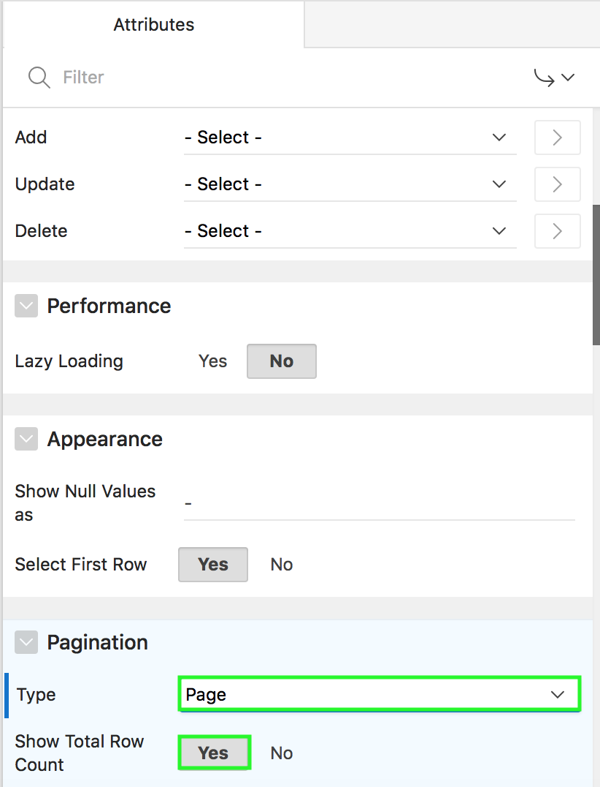
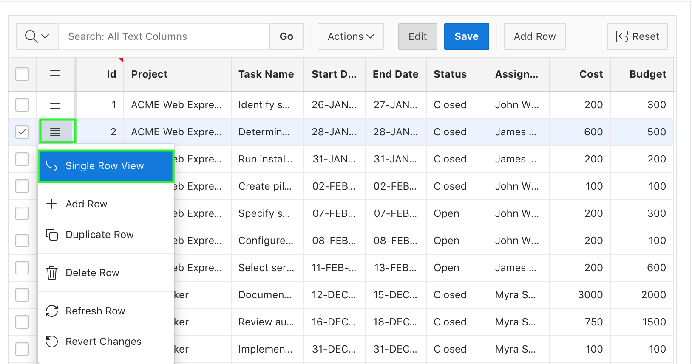
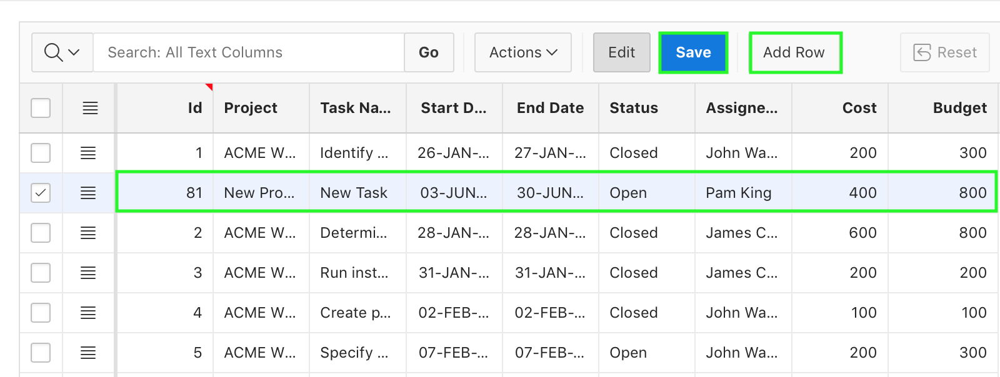

**Oracle Application Express: Developing Database Web Applications**

**Hands-On-Labs Guide**

*Unit 7: Managing and Customizing Interactive Grids*

This exercise includes two hands-on-labs.

Labs HOL 7-1 and HOL 7-2 use the Budget App application.

**HOL 7-1: Customizing an Interactive Grid as a Developer**: In this lab, you customize the Project Budget Interactive Grid for your end users.

**HOL 7-2: Customizing an Interactive Grid as an End User**: In this lab, you use and customize the display of your Project Budget Interactive Grid.

### HOL 7-1: Customizing an Interactive Grid as a Developer

This lab uses the Budget App application. In this lab, you customize the interactive grid for end users. You create column groups, set pagination type, and set the report downloadable formats that should be available for end users. You also enable end users to save the report as Public interactive grids and convert a read only interactive grid to an editable interactive grid.

1. Navigate to **App Builder** and run the **Budget App** application.
    

2. In the navigation menu, click **Interactive Grid**. You want to customize the display of this interactive grid for your end users. In the Developer Toolbar, click **Edit Page 5**.
    

3. Add column group headers to the interactive grid as:
    - Work Breakdown: Project, Task_Name columns
    - Schedule: Start_Date, End_Date columns
    -	Project Financing: Cost, Budget columns
    a) In the page designer, under Rendering > Regions, navigate to Project Budget Interactive Grid region and right-click **Attributes**. Select Create **Column Group**.
    
    b) In the Property Editor, enter **Work Breakdown** for Heading.
    
    c) Repeat the above two steps a and b to create column groups: **Schedule** and **Project Financing**.
    d) Now that you created column groups, you need to assign columns to them. Expand **Columns** and select **Project** and **Task_Name** columns.
    e) In the property editor, under Layout, select **Work Breakdown** for Group.
    
    f) Then, select Start_Date and End_Date columns. In the property editor, under Layout, select **Schedule** for Group.
    g) Finally, select Cost, and Budget columns. In the property editor, under Layout, select **Project Financing** for Group.
    Click **Save**. Then, click **Save and Run Page**.
    
    h) The interactive grid now displays column groups.
    

4. Rearrange the columns in the interactive grid. You want to display the column groups Work Breakdown, Schedule, and Project Financing display in order followed by Status and Assigned To.

    a)	Hover the mouse over the Project Financing column group header to display the drag handle. Your mouse cursor also changes when it comes into contact with the drag handle. Click and hold the drag handle.
    b)	Then, drag the column group to the Status column location. The heading shifts out of place in the row. The Project Financing column group should be followed by the Status column. Release the mouse. The Project Financing column group drops into place.
    

5. Resize the width of the **Id** column. Click and hold the edge of the column heading and adjust with the mouse.
    

6. You want to ensure that end users can save Public interactive grids. You want to exclude HTML from the download formats available to end users. In the Developer Toolbar, click **Edit Page < n >**.
    a)	Under Rendering, select **Attributes** under the Project Budget Interactive Grid region.
    
    b)	In the property editor, under Attributes, navigate to Enable Users To. Select **Yes** for Save Public Report.
    
    c)	Under Download, deselect the **HTML** check box.
    

7. Convert this read only interactive grid in to an editable interactive grid. Then, reset the pagination as Page type displaying the total row count.
    a) Under Rendering, select **Attributes** under the Project Budget Interactive Grid region.
    b) In the property editor, navigate to Edit. For Enabled, select **Yes**.
    c) Under Pagination, select **Page** for Type and select **Yes** for Show Total Row Count.
    

8. Delete the column groups in the interactive grid. Under Rendering > Project Budget Interactive Grid > Attributes, expand Column Groups. Right-click **Project Financing** and click **Delete**. Similarly, delete the Schedule and Work Breakdown column groups.
    

9. You want to exclude the ID column from DML operations. Under Page Rendering > Project Budget Interactive Grid, expand Columns and select **ID**.
    

10.	In the Property Editor, scroll down to Source. For Query Only, select **Yes**.
    

11.	Click Save. Then, click **Save and Run Page**.

### HOL 7-2: Customizing an Interactive Grid as an End User

In this lab, you use and customize the display of your interactive grid. You also edit an editable interactive grid.

1. Notice that the interactive grid is editable now. You see the Edit, Save, and Add Row buttons. Also, the pagination type that you have set is displayed now. Perform a non-case-sensitive search for ‘server’ on the entire interactive grid. To do this, enter **server** in the search bar text area and click **Go**. 
    

2. Remove the filter by clicking the **X** icon. 
Now, in the search bar, click the magnifying glass and select **Task Name** column.
    

3. Enter **server** in the text area and click **Go**. Notice that the search is now restricted only to the Task Name column.
    

4. Remove the filter by clicking the **X** icon. You want to update the budget for the Project with Id 1. Click the field and replace the existing value with **300**.
    

5. The changes are not saved yet. Click the **Save** button.  
The changes are saved now.
    

6. You want to update another row. This time, click the row header for the project with Id 2 and select **Single Row View**.
    

7. You are now in the single row view of the project with Id 2. Click **Edit**.
    

8. Replace the existing value for Budget with **800** and click **Save**.   
Then, click **Report View**.
    

9. The row now displays 800 for Budget. 
    

10.	Click **Add Row**. Enter values for all the columns.   
Click **Save**.
    

11.	Click the row header for the row that you just added and select **Delete Row**.
Then, click **Save**.
    

12.	You want to review the data that existed few minutes ago. Select **Actions > Data > Flashback**.
    

13.	Enter 5 for Minutes ago and click **Save**.
    

14.	Notice the budget values for projects with Id’s 1 and 2.  
Click **X** to remove flashback.

15.	You want to create a control break on the Project column. Click **Actions > Format > Control Break**.
    
 
16. In the Control Break dialog, enter **Project** for Column and click **Save**.

17.	The control break is now applied. You want to highlight rows that meet a condition. Select **Actions > Format > Highlight**.
    

18.	In the Highlight dialog:  
    - Name: Project costing greater than 750  
    - Background Color: Click **Colors** and select **Yellow**.  
    - Text Color: Click **Colors** and select **Red**.  
    - Column: Select **Cost**  
    - Operator: Select **greater than**  
    - Value: Enter **750**
    Click **Save**.
    

19.	Notice the rows with cost greater than 750 are highlighted. 
    

20.	You want to save the changes made to the interactive grid. Select **Actions > Report > Save As**.
    

21.	In the Report – Save As dialog, select **Private** for Type. Enter **My Private Report** for Name.  
Click **Save**.

22.	Notice that the Primary interactive grid and the interactive grid you saved now are available in the Reports drop down list.  
You want to return back to the Primary interactive grid. Click **Primary Report** in the Reports drop down list.
    

23.	You want to make few more customizations and save the interactive grid as another Private report. You do not want the Start Date, End Date, and Assigned To columns to be displayed in the report.   
Click the **Start Date** column header and then click **Hide**.
    

24.	Resize the columns’ width using the mouse.

25.	You want to add a chart to the interactive grid. Select **Actions > Chart**.
    

26.	In the Chart dialog:
    - Type: Select **Bar** 
    - Label: Select **Project**
    - Value: Select **Cost**
    - Aggregation: Select **Sum**
    Click **Save**.
    

27. The chart is displayed. You want to save the customization made to the interactive grid. Select **Actions > Report > Save As**.  
    

28.	In the Report – Save As dialog, select **Private** for Type. Enter **My Custom Report** for Name. Then, click **Save**.

29.	The report is now saved under Private in the Reports drop down list. Click the **Grid** icon.
    

30.	You want to download the report. Select **Actions > Download**.
     

31.	Note that the HTML download option is no longer available. Select **CSV** and click **Download**.
    

32.	The report is now downloaded as CSV.
    
    

